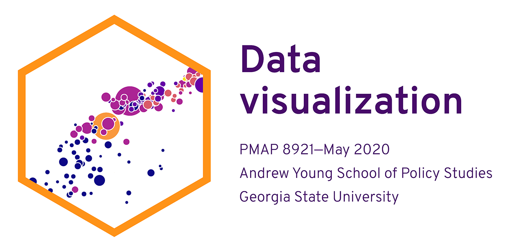

# Program Evaluation for Public Service (PMAP 8521—Spring 2020)

## Theme

This site uses the [Academic Hugo theme](https://sourcethemes.com/academic/), with some slight template modifications found in `/assets/` and `layouts/`. The theme is included as a submodule, so when when cloning for the first time, use this command to get the theme too:

    git clone --recursive https://github.com/gcushen/hugo-academic.git

To get the theme later, use this command:

    git submodule add \
      https://github.com/gcushen/hugo-academic.git \
      themes/hugo-academic

To update to the latest version of the theme, use:

    git submodule update --recursive --remote
