```{r setup, include=FALSE}
knitr::opts_chunk$set(warning = FALSE, message = FALSE, 
                      fig.retina = 3, fig.align = "center")
```

```{r packages-data, include=FALSE}
library(tidyverse)
```

class: center middle main-title section-title-4

# Truth, beauty,<br>and data

.class-info[

**Session 1**

.light[PMAP 8921: Data Visualization with R<br>
Andrew Young School of Policy Studies<br>
May 2020]

]

---

name: outline
class: title title-inv-7

# Plan for today

--

.box-2.medium.sp-after-half[Facts, truth, and beauty]

--

.box-3.medium.sp-after-half[Data, truth, and beauty]

--

.box-6.medium.sp-after-half[Beautiful visualizations]

--

.box-7.medium[Class details]


---

layout: false
name: facts-truth-beauty
class: center middle section-title section-title-2 animated fadeIn

# Facts, truth, and beauty

---

layout: true
class: title title-2

---

# What is truth?

.box-inv-2.medium[Core principles of the universe?]

--

.box-inv-2.medium[Underlying trends in society?]

--

.box-inv-2.medium[Something transcendental?]

--

.box-inv-2.medium[Reality?]

---

# How do we find truth?

.box-inv-2.medium[Science!]

.center[
<figure>
  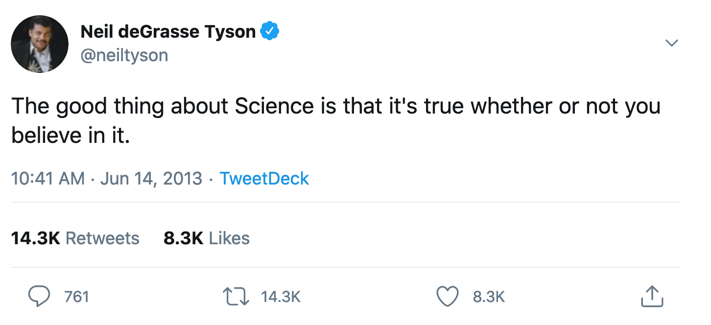
</figure>
]

???

[Original tweet](https://twitter.com/neiltyson/status/345551599382446081)

---

# But wait!

.box-inv-2.medium.sp-after[Beware of scientism!]

.box-2["… promotion of science as the best or only<br>objective means by which society should determine<br>normative and epistemological values"]

???

[Wikipedia](https://en.wikipedia.org/wiki/Scientism)

---

# Science is not the only way

.box-inv-2.medium[Art]

.box-inv-2.medium[Music]

.box-inv-2.medium[Literature]

.box-inv-2.medium[Religion]

.box-inv-2.medium[Nature]

???

None of these methods deal with raw facts, though!

---

# Nothing here is factual…

.box-inv-2[…but it all reveals truth]

.pull-left[

.pull-left[
<figure>
  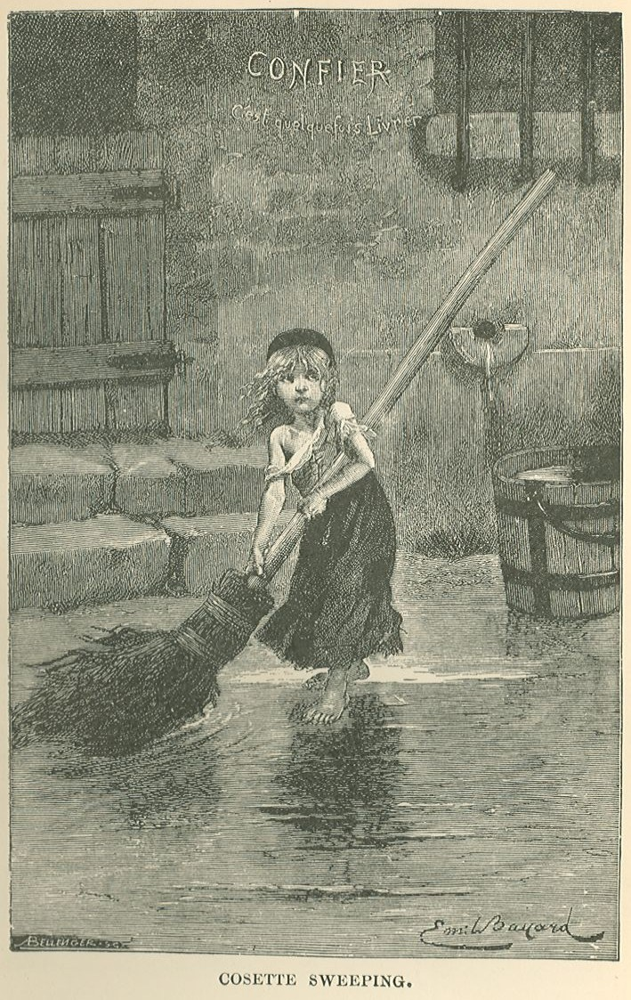
  <figcaption>Cosette</figcaption>
</figure>
]

.pull-right[
<figure>
  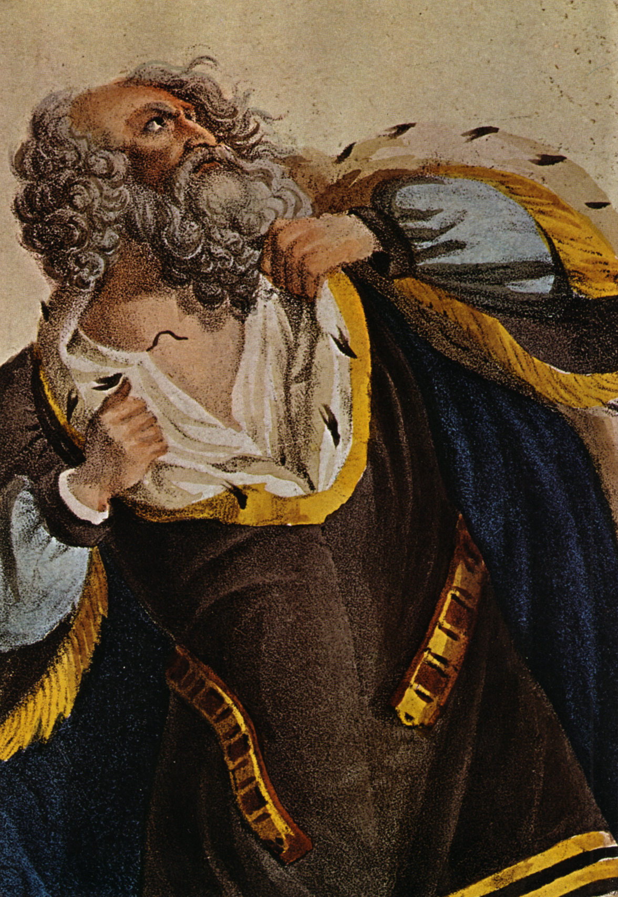
  <figcaption>King Lear</figcaption>
</figure>
]

]

.pull-right[
<figure>
  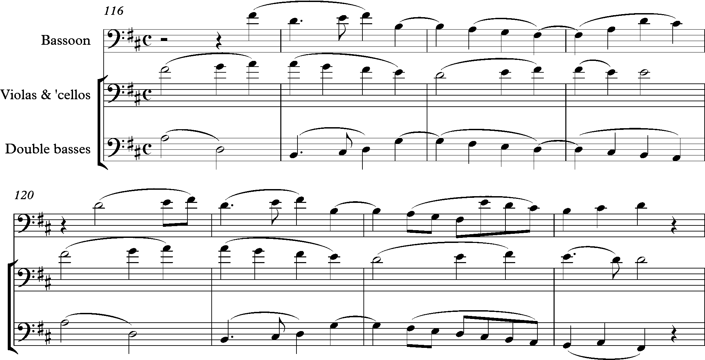
  <figcaption>Beethoven's 9th symphony</figcaption>
</figure>
]

???

Sources: 

- [Cosette](https://commons.wikimedia.org/wiki/File:Cosette-sweeping-les-miserables-albert-bellenger-1886.jpg)
- [King Lear](https://commons.wikimedia.org/wiki/File:King_Lear.jpg)
- [Beethoven](https://commons.wikimedia.org/wiki/File:Beethoven,_Symphony_No._9,_finale,_bars_116-123.png)

---

layout: false
class: middle

.box-2.huge[Facts ≠ truth]

---

class: middle

.box-2.large.sp-after[Where does truth come when<br>there are no facts?]

--

.box-inv-2.huge[Beauty]


---

layout: true
class: title title-2

---

# Beauty in science

.pull-left.center[

<figure>
  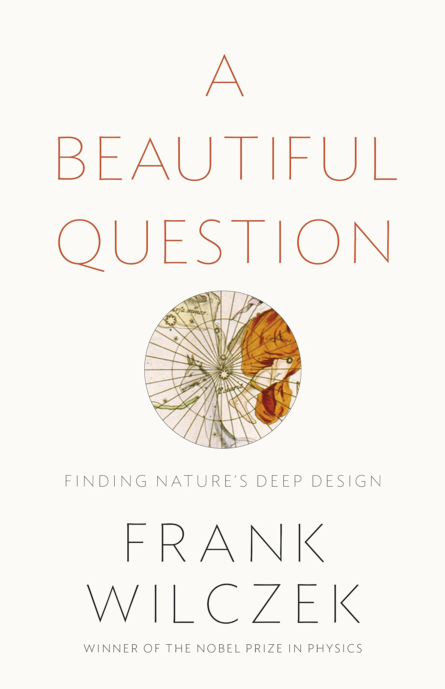
</figure>

]

.box-inv-2.medium[This is also true for science and math<br>and other more<br>factual realms]

---

# Rhetoric and beauty

.box-inv-2[λόγος&emsp;•&emsp;λέξις]

.box-inv-2.tiny.sp-after[Logos&emsp;•&emsp;Lexis]

.box-inv-2[Res&emsp;•&emsp;Verba]

.box-inv-2[Essence&emsp;•&emsp;Structure]

.box-inv-2.sp-after[Content&emsp;•&emsp;Form]

.box-2.medium[Truth&emsp;•&emsp;Beauty]

???

One is the underlying metaphysical meaning—what the author or artist intends. The other is *how* they convey that message—what it looks like, what they used, etc.

---

# Content + form

.box-inv-2.large[Art is how we translate core,<br>essential **content** (or truth!)<br>to different **forms**<br>for specific **audiences**.]

---

# Truth is beautiful

.box-inv-2.medium[Truth ≠ facts]

.box-inv-2.medium.sp-after[Truth comes from aesthetic<br>combination of content and form]

.box-2.medium[Facts require beauty to be true]

---

layout: false
name: data-truth-beauty
class: center middle section-title section-title-3 animated fadeIn

# Data, truth, and beauty

---

layout: true
class: title title-3

---

# Just show me the data!

```{r load-datasaurus-dozen, echo=FALSE}
dozen <- read_tsv("data/DatasaurusDozen.tsv")
my_data <- dozen %>% 
  filter(dataset == "dino") %>% 
  select(x, y)
```

--

.pull-left-3.small-code[
```{r head-datasaurus}
head(my_data, 10)
```
]

--

.pull-middle-3.small-code[
```{r summary-datasaurus, highlight.output=1}
mean(my_data$x)
mean(my_data$y)
cor(my_data$x, my_data$y)
```
]

--

.pull-right-3[
&nbsp;

.box-inv-3[Seems reasonable]

&nbsp;

.box-inv-3[Seems reasonable]

&nbsp;

.box-inv-3[No correlation]
]

---

# oh no

.center[
<figure>
  
  <figcaption><a href="https://www.autodeskresearch.com/publications/samestats" target="_blank">The Datasaurus Dozen</a></figcaption>
</figure>
]

---

# Raw data is not enough

.box-inv-3.small[Each of these has the same mean, standard deviation, variance, and correlation]

```{r plot-full-dozen, echo=FALSE, fig.dim=c(10, 4), out.width="100%"}
ggplot(filter(dozen, dataset != "bullseye"), aes(x = x, y = y)) +
  geom_point(size = 1) +
  facet_wrap(vars(dataset))
```


---

# Humans love patterns

.center[
<figure>
  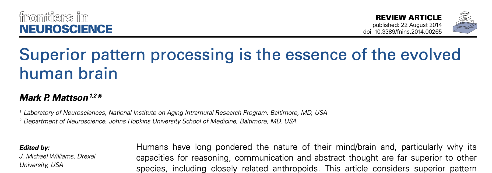
  <figcaption><a href="https://doi.org/10.3389/fnins.2014.00265" target="_blank">https://doi.org/10.3389/fnins.2014.00265</a></figcaption>
</figure>
]

---

# (Sometimes we love them too much)

--

.center[
.box-inv-3.sp-after[**Pareidolia**: seeing patterns that aren't there.]
]

--

.pull-left-3[

]

--

.pull-middle-3[
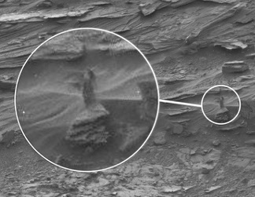
]

--

.pull-right-3[

]

---

# Beauty is necessary to see patterns

.pull-left[

<figure>
  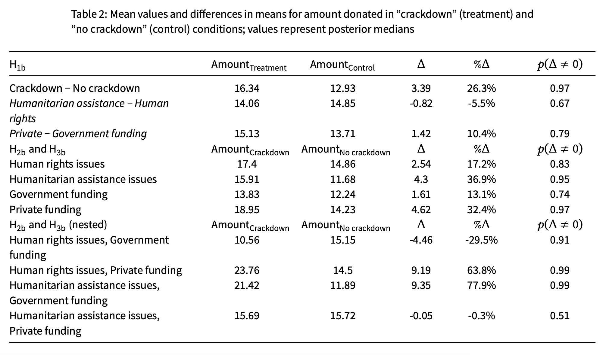
</figure>

]

--

.pull-right.center[

<figure>
  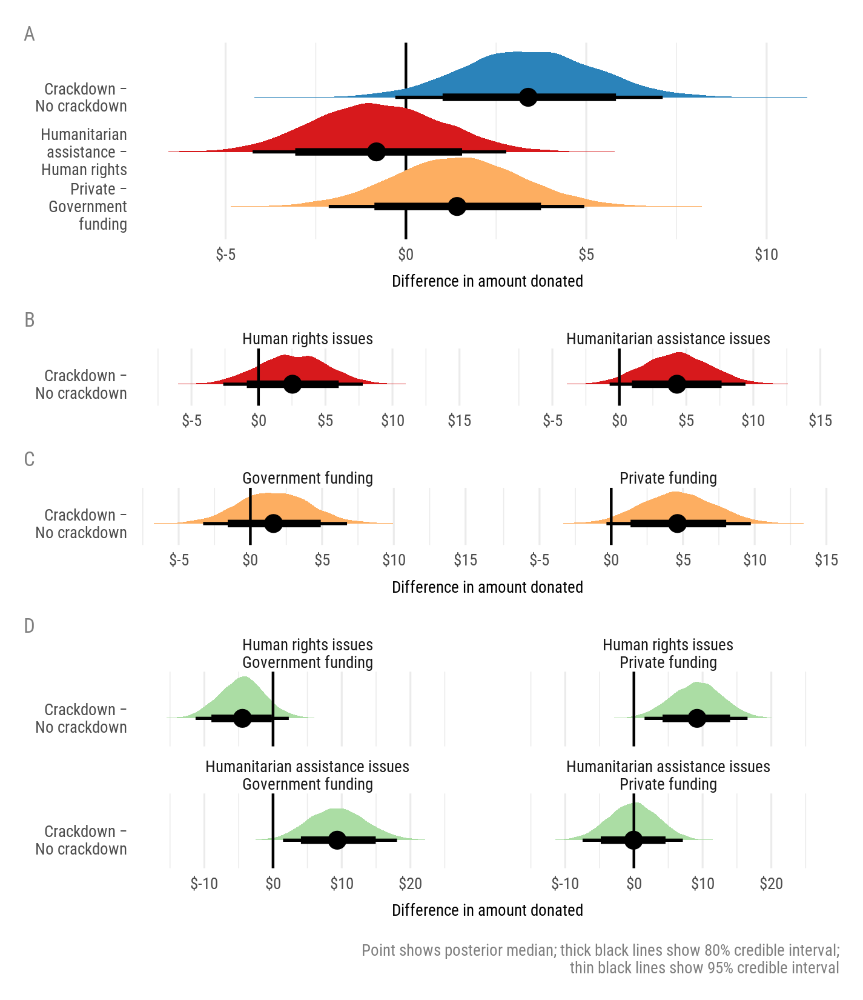
</figure>

]

---

layout: false
name: beautiful-visualizations
class: center middle section-title section-title-6 animated fadeIn

# Beautiful visualizations

---

layout: true
class: title title-6

---

# What makes a great visualization?

.box-inv-6.medium[Truthful]

.box-inv-6.medium[Functional]

.box-inv-6.medium[Beautiful]

.box-inv-6.medium[Insightful]

.box-inv-6.medium[Enlightening]

.box-6.tiny[Alberto Cairo, *The Truthful Art*]

???

Alberto Cairo, *The Truthful Art*:

> 1. It is truthful, as it’s based on thorough and honest research.
> 
> 2. It is functional, as it constitutes an accurate depiction of the data, and it’s built in a way that lets people do meaningful operations based on it (seeing change in time).
> 
> 3. It is beautiful, in the sense of being attractive, intriguing, and even aesthetically pleasing for its intended audience—scientists, in the first place, but the general public, too.
> 
> 4. It is insightful, as it reveals evidence that we would have a hard time seeing otherwise.
> 
> 5. It is enlightening because if we grasp and accept the evidence it depicts, it will change our minds for the better.

---

# What makes a great visualization?

.box-inv-6["Graphical excellence is the **well-designed presentation of interesting data**—a matter of substance, of statistics, and of design … [It] consists of complex ideas communicated with clarity, precision, and efficiency. … [It] is that which **gives to the viewer the greatest number of ideas in the shortest time with the least ink in the smallest space** … [It] is nearly always multivariate … And graphical excellence requires **telling the truth about the data**."]

.box-6.tiny[Edward Tufte, *The Visual Display of Quantitative Information*, p. 51]

---

# What makes a great visualization?

.box-inv-6.medium[Good aesthetics]

--

.box-inv-6.medium[No substantive issues]

--

.box-inv-6.medium[No perceptual issues]

--

.box-inv-6.medium[Honesty + good judgment]

.box-6.tiny[Kieran Healy, *Data Visualization: A Practical Introduction*]

---

# What's wrong?

.center[
<figure>
  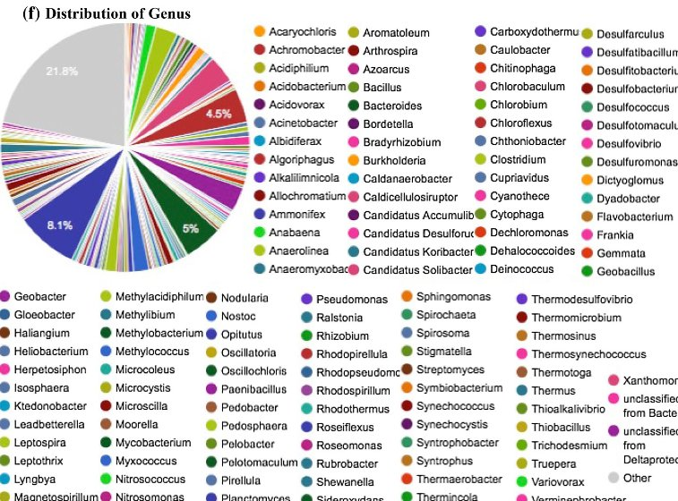
</figure>
]

???

- Aesthetic issues
- Substantive issues
- Perceptual issues
- Honesty + judgment issues

---

# What's wrong?

.center[
<figure>
  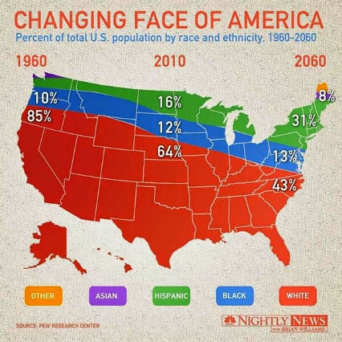
</figure>
]

???

- Aesthetic issues
- Substantive issues
- Perceptual issues
- Honesty + judgment issues

---

# What's wrong?

.center[
<figure>
  
</figure>
]

???

- Aesthetic issues
- Substantive issues
- Perceptual issues
- Honesty + judgment issues

---

# What's right?

.pull-left[

```{r flatten-the-curve, echo=FALSE, fig.dim=c(4.8, 3.75), out.width="100%"}
high_mean <- 12
high_sd <- 4
flat_mean <- 35
flat_sd <- 12

ggplot(tibble(x = c(0, 70)), aes(x = x)) +
  stat_function(geom = "area", fun = dnorm, n = 1000, 
                args = list(mean = high_mean, sd = high_sd),
                fill = "#FF4136", alpha = 0.8) +
  stat_function(geom = "area", fun = dnorm, n = 1000, 
                args = list(mean = flat_mean, sd = flat_sd),
                fill = "#0074D9", alpha = 0.8) +
  geom_hline(yintercept = dnorm(flat_mean, flat_mean, flat_sd), 
             linetype = "61", color = "grey75") +
  annotate(geom = "text", x = qnorm(0.5, high_mean, high_sd), 
           y = dnorm(qnorm(0.5, high_mean, high_sd), high_mean, high_sd) / 2, 
           label = "Without\nprotective\nmeasures", color = "white", size = 3,
           family = "Fira Sans Condensed", fontface = "bold") +
  annotate(geom = "text", x = qnorm(0.5, flat_mean, sd = flat_sd), 
           y = dnorm(qnorm(0.5, flat_mean, sd = flat_sd), flat_mean, sd = flat_sd) / 2, 
           label = "With protective\nmeasures", color = "white", size = 3,
           family = "Fira Sans Condensed", fontface = "bold") +
  annotate(geom = "text", x = 45, y = dnorm(flat_mean, flat_mean, sd = flat_sd), 
           label = "Healthcare system capacity", vjust = -0.5, hjust = 0, size = 3,
           family = "Fira Sans Condensed", fontface = "bold") +
  labs(x = "Time since first case", 
       y = "# of\ncases",
       title = "Flatten the curve!", 
       subtitle = "Slow down community spread by social distancing",
       caption = "Adapted from the CDC and The Economist\nVisit flattenthecurve.com") +
  scale_x_continuous(expand = c(0, 0)) +
  scale_y_continuous(expand = c(0, 0)) +
  theme_minimal(base_family = "Fira Sans Condensed Light") +
  theme(panel.grid = element_blank(),
        axis.line = element_line(color = "black"),
        axis.text = element_blank(),
        axis.title = element_text(family = "Fira Sans Condensed", face = "bold"),
        axis.title.y = element_text(angle = 0, vjust = 0.5),
        plot.title = element_text(family = "Fira Sans Condensed", face = "bold", size = rel(1.7)),
        plot.subtitle = element_text(size = rel(1.2), color = "grey50"),
        plot.caption = element_text(color = "grey50"))
```

]

???

- Aesthetic issues
- Substantive issues
- Perceptual issues
- Honesty + judgment issues

--

.pull-right.center[

<figure>
  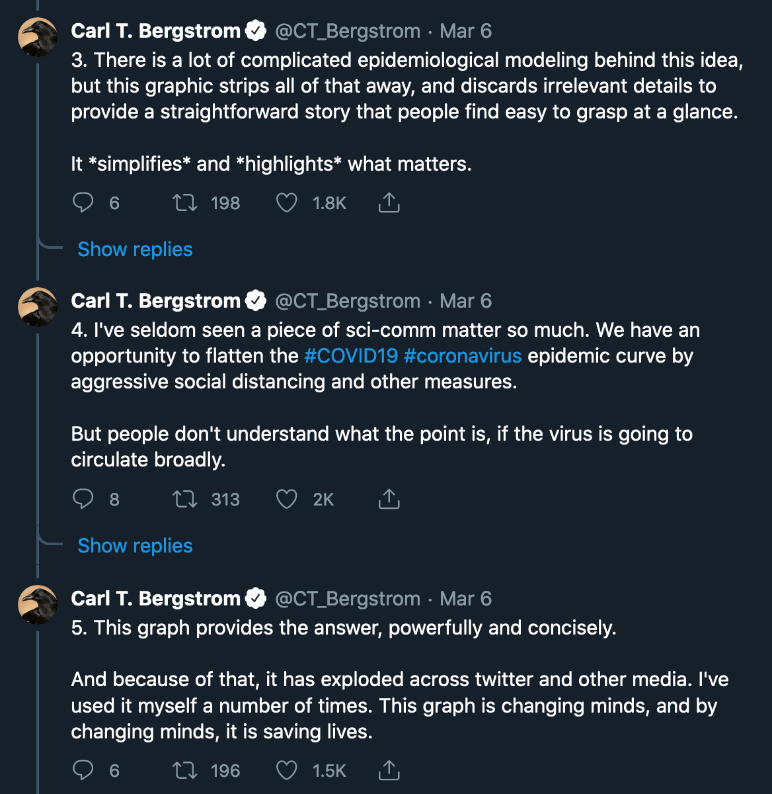
  <figcaption><a href="https://twitter.com/CT_Bergstrom/status/1235865328074153986" target="_blank">Thread by Carl T. Bergstrom</a></figcaption>
</figure>

]

???

[Carl Bergstrom on the flatten the curve visualization](https://twitter.com/CT_Bergstrom/status/1235865328074153986)

---

layout: false
name: class-details
class: center middle section-title section-title-7 animated fadeIn

# Class details

---

layout: true
class: title title-7

---

# Goal for the class

.center[
.box-inv-7.huge[Recognize and create beautiful and truthful visualizations with real world data]
]

---

# Plan for the class

&nbsp;

.center[
<figure>
  
</figure>
]

---

# Class technology

.center[
<figure>
  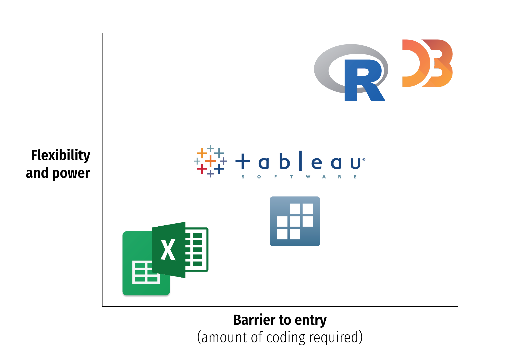
</figure>
]

---

# Class technology

.pull-left-3.center[

<figure>
  
</figure>

<figure>
  
</figure>

]

--

.pull-middle-3[

<figure>
  
</figure>

]

--

.pull-right-3[

&nbsp;

<figure>
  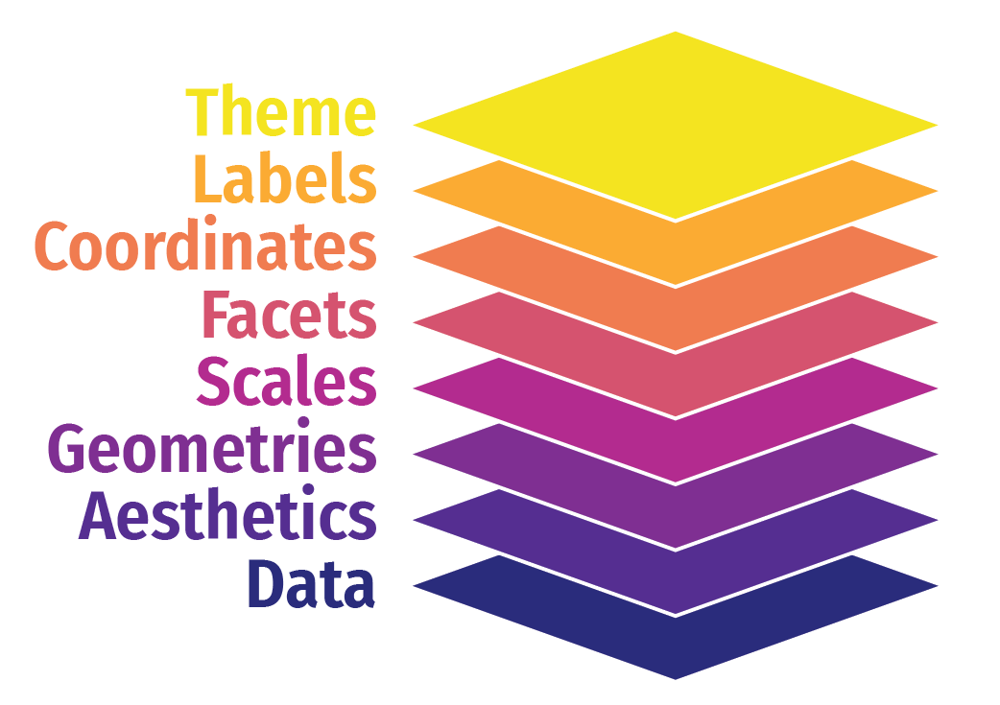
</figure>

]

---

# The tidyverse

.center[
<figure>
  
</figure>
]

---

# Sucking

.center[
.box-inv-7.medium[“There is no way of knowing nothing about a subject to knowing something about a subject without going through a period of much frustration and suckiness.”]

.box-inv-7.medium[**“Push through. You’ll suck less.”**]

.box-inv-7.tiny[Hadley Wickham, author of **ggplot2**]
]

???

[Source for quote](https://twitter.com/Akbaritabar/status/1022057084802748416)

---

# Sucking

&nbsp;

.pull-left[
<figure>
  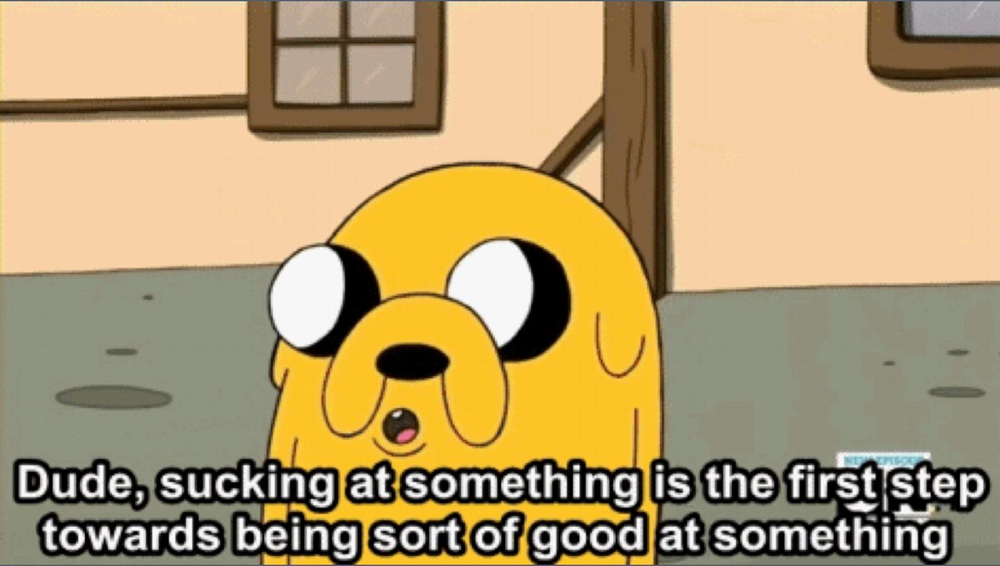
</figure>
]

--

.pull-right[
<figure>
  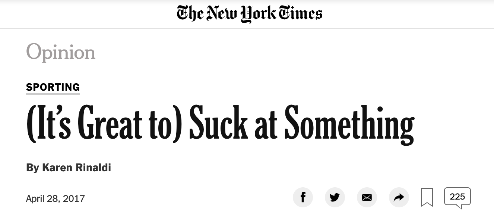
  <figcaption><a href="https://www.nytimes.com/2017/04/28/opinion/its-great-to-suck-at-surfing.html" target="_blank">Karen Rinaldi, "(It's Great to) Suck at Something"</a></figcaption>
</figure>
]
