```{r setup, include=FALSE}
knitr::opts_chunk$set(warning = FALSE, message = FALSE, 
                      fig.retina = 3, fig.align = "center")
```

```{r packages-data, include=FALSE}
library(tidyverse)
library(scales)
library(broom)
library(albersusa)
library(sf)
```

class: center middle main-title section-title-4

# Graphic Design

.class-info[

**Session 2**

.light[PMAP 8921: Data Visualization with R<br>
Andrew Young School of Policy Studies<br>
May 2020]

]

---

name: outline
class: title title-inv-7

# Plan for today

--

.box-3.medium.sp-after-half[Truth, beauty, stories, design]

--

.box-7.medium[Graphic design and CRAP]

--

.pull-left.float-right[
.box-1[Contrast]

.box-inv-4[Repetition]
]

.pull-right.float-left.sp-after-half[
.box-inv-1[Alignment]

.box-4[Proximity]
]

--

.box-5.medium[Image types]


---

name: truth-beauty-design
class: center middle section-title section-title-3 animated fadeIn

# Truth, beauty, stories, design

---

layout: true
class: title title-3

---

# Why even care about design?

.center[
<figure>
  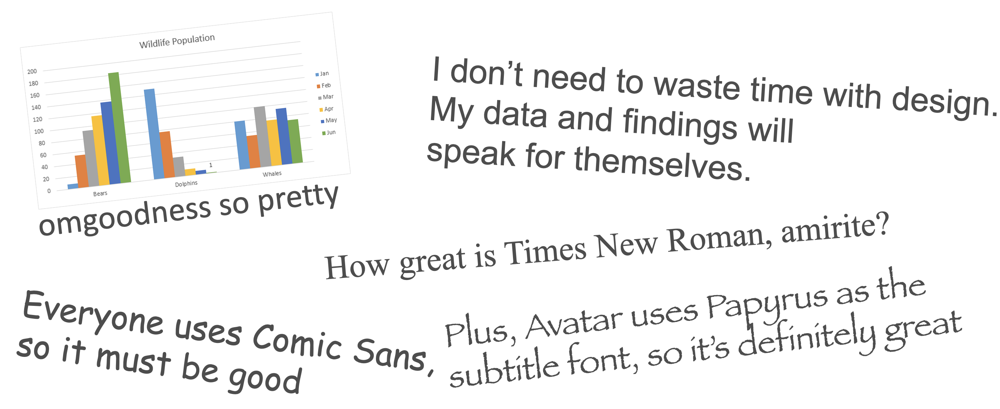
</figure>
]

---

# Content + form

.box-inv-3.large[Art is how we translate<br>core, essential **content**<br>to different **forms**<br>for specific **audiences**.]

---

# Stories + content + form

.box-inv-3.large[**Stories** are an art form for<br>translating core, essential **content**<br>to different **forms**<br>for specific **audiences**.]

---

# Stories

.box-inv-3.medium[“A need to tell and hear stories is essential to the species *Homo sapiens*—second in necessity apparently after nourishment and before love and shelter.”]

.box-3.small[—Reynolds Price, from *A Palpable God*]

---

# Beauty, stories, and truth

.box-inv-3[Truth comes from **aesthetic** combination of content and form.]

--

.box-inv-3[Raw facts must be communicated through some form.]

--

.box-inv-3.sp-after[**Beauty** shapes that form.]

--

.box-3.medium[There are aesthetic principles we can<br>follow to create beauty—and truth.]

---

name: design-crap
layout: false
class: center middle section-title section-title-7 animated fadeIn

# Graphic design and CRAP

---

layout: true
class: title title-7

---

# Principles of design

--

.box-inv-7.medium[There are thousands of books and<br>centuries of debate and theory about<br>what makes good design.]

--

.box-7.medium[For this class, the easiest<br>and most memorable distillation<br>of these principles is **CRAP**.]

---

# CRAP

.pull-left[

.box-7[Use these principles as a checklist when creating and critiquing designed objects:]

.box-1[Contrast]

.box-inv-4[Repetition]

.box-inv-1[Alignment]

.box-4[Proximity]

]

.pull-right.center[
<figure>
  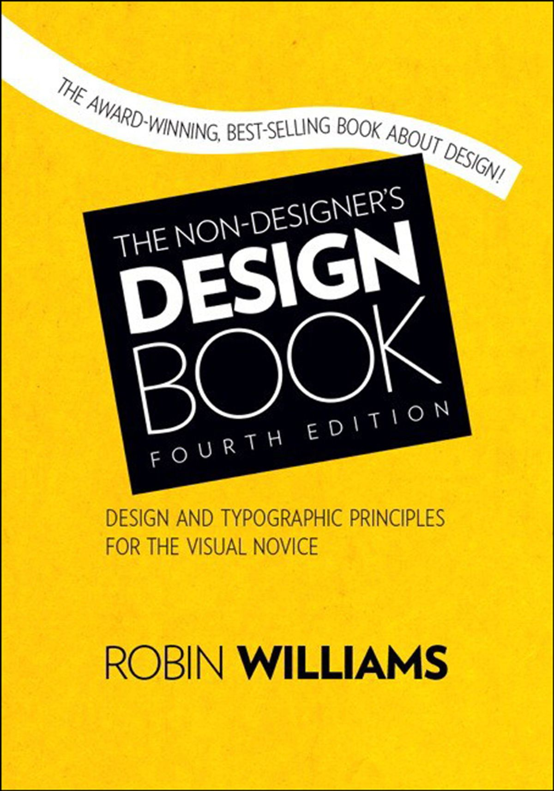
  <figcaption>Buy this book and your life will change forever.</figcaption>
</figure>
]

---

layout: true
class: title title-1

---

name: contrast

# Contrast

.box-inv-1.large[If two items are not exactly<br>the same, make them different.<br>Really different.]

--

.box-7.large[**Don't be a wimp.**]

---

# Typographic contrast: Family

.box-inv-1[Use contrasting type families]

.box-1.small[<span style="font-family: 'EB Garamond'">Serif</span> + <span style="font-family: 'Oswald'">Sans serif</span>&emsp;&emsp;<span style="font-family: 'Dancing Script'">Script</span> + <span style="font-family: 'EB Garamond'">Serif</span>&emsp;&emsp;<span style="font-family: 'Alfa Slab One'">Slab</span> + <span style="font-family: 'Oswald'">Sans serif</span>&emsp;&emsp;etc.]

<table>
  <tr>
    <td class="cell-left">Serif</td>
    <td class="cell-left" style="font-family: 'EB Garamond'">Sphinx of black quartz, judge my vow</td>
  </tr>
  <tr>
    <td class="cell-left">Sans serif</td>
    <td class="cell-left" style="font-family: 'Oswald'">Sphinx of black quartz, judge my vow</td>
  </tr>
  <tr>
    <td class="cell-left">Slab serif</td>
    <td class="cell-left" style="font-family: 'Alfa Slab One'">Sphinx of black quartz, judge my vow</td>
  </tr>
  <tr>
    <td class="cell-left">Script</td>
    <td class="cell-left" style="font-family: 'Dancing Script'">Sphinx of black quartz, judge my vow</td>
  </tr>
  <tr>
    <td class="cell-left">Monospaced&emsp;</td>
    <td class="cell-left" style="font-family: 'Inconsolata'">Sphinx of black quartz, judge my vow</td>
  </tr>
</table>

---

# Typographic constrast: Family

.box-inv-1[Add contrast in family]

.pull-left.frame[

<span style="font-size: 1em; font-family: 'EB Garamond';">Here’s a heading</span>

<span style="font-size: 0.9em; font-family: 'Times', serif;">Lorem ipsum dolor sit amet, consectetur adipisicing elit, sed do eiusmod tempor incididunt ut labore et dolore magna aliqua.</span>

]

--

.pull-right.frame[

<span style="font-size: 1.1em; font-family: 'Alfa Slab One'; font-weight: 600;">Here’s a heading</span>

<span style="font-size: 0.9em; font-family: 'Source Sans Pro'; font-weight: 300;">Lorem ipsum dolor sit amet, consectetur adipisicing elit, sed do eiusmod tempor incididunt ut labore et dolore magna aliqua.</span>

]

---

# Typographic contrast: Weight

.box-inv-1[Use contrasting weights in same type family]

.box-1.small[<span style="font-family: 'Source Sans Pro'; font-weight: 700;">Bold</span> + <span style="font-family: 'Source Sans Pro'; font-weight: 400;">Regular</span>&emsp;&emsp;<span style="font-family: 'Source Sans Pro'; font-weight: 400;">Regular</span> + <span style="font-family: 'Source Sans Pro'; font-weight: 200;">Extra light</span>&emsp;&emsp;<span style="font-family: 'Source Sans Pro'; font-weight: 900;">Black</span> + <span style="font-family: 'Source Sans Pro'; font-weight: 300;">Light</span>&emsp;&emsp;etc.]

<table>
  <tr>
    <td class="cell-left">Extra light&emsp;</td>
    <td class="cell-left" style="font-family: 'Source Sans Pro'; font-weight: 200;">Sphinx of black quartz, judge my vow</td>
  </tr>
  <tr>
    <td class="cell-left">Light</td>
    <td class="cell-left" style="font-family: 'Source Sans Pro'; font-weight: 300;">Sphinx of black quartz, judge my vow</td>
  </tr>
  <tr>
    <td class="cell-left">Regular</td>
    <td class="cell-left" style="font-family: 'Source Sans Pro'; font-weight: 400;">Sphinx of black quartz, judge my vow</td>
  </tr>
  <tr>
    <td class="cell-left">Semi bold</td>
    <td class="cell-left" style="font-family: 'Source Sans Pro'; font-weight: 600;">Sphinx of black quartz, judge my vow</td>
  </tr>
  <tr>
    <td class="cell-left">Bold&emsp;</td>
    <td class="cell-left" style="font-family: 'Source Sans Pro'; font-weight: 700;">Sphinx of black quartz, judge my vow</td>
  </tr>
  <tr>
    <td class="cell-left">Black</td>
    <td class="cell-left" style="font-family: 'Source Sans Pro'; font-weight: 900;">Sphinx of black quartz, judge my vow</td>
  </tr>
</table>

---

# Typographic constrast: Weight

.box-inv-1[Add contrast in weight]


.pull-left.frame[

<span style="font-size: 1em;">Here’s a heading</span>

<span style="font-size: 0.9em;">Lorem ipsum dolor sit amet, consectetur adipisicing elit, sed do eiusmod tempor incididunt ut labore et dolore magna aliqua.</span>

]

--

.pull-right.frame[

<span style="font-size: 1.3em; font-family: 'Source Sans Pro'; font-weight: 600;">Here’s a heading</span>

<span style="font-size: 0.9em; font-family: 'Source Sans Pro'; font-weight: 200;">Lorem ipsum dolor sit amet, consectetur adipisicing elit, sed do eiusmod tempor incididunt ut labore et dolore magna aliqua.</span>

]

---

# Size contrast

.box-inv-1[Use contrasting sizes]

&nbsp;

--

.box-1[<span style="font-size: 3em;">Huge</span>&emsp;&emsp;<span style="font-size: 2em;">Big</span>&emsp;&emsp;Regular&emsp;&emsp;<span style="font-size: 0.7em;">Small</span>&emsp;&emsp;<span style="font-size: 0.3em;">Tiny</span>]

---

# Color contrast

.box-inv-1[Color theory]

.box-1.tiny[[color.adobe.com](https://color.adobe.com)]

.pull-left[
<figure>
  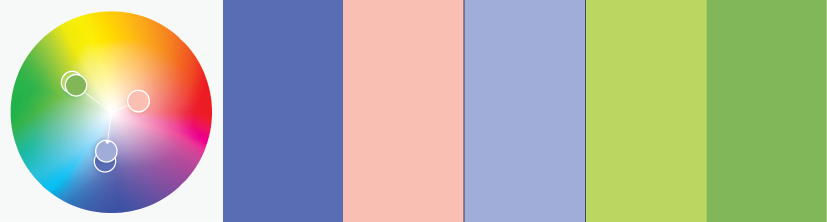
  <figcaption>Triad</figcaption>
</figure>

<figure>
  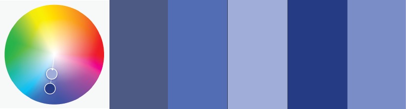
  <figcaption>Monochromatic</figcaption>
</figure>
]

.pull-right[
<figure>
  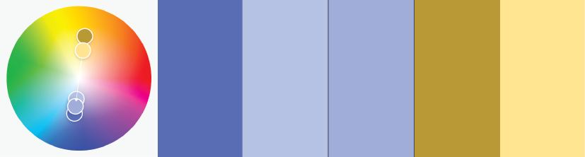
  <figcaption>Complementary</figcaption>
</figure>

<figure>
  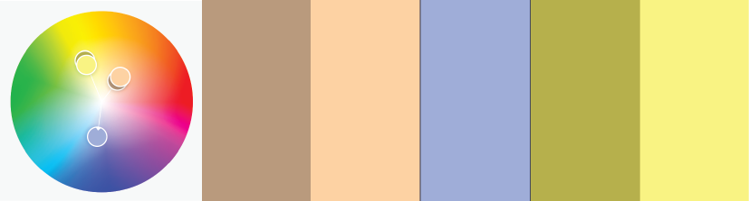
  <figcaption>Split complementary</figcaption>
</figure>
]

---

# Color contrast

.center[
<figure>
  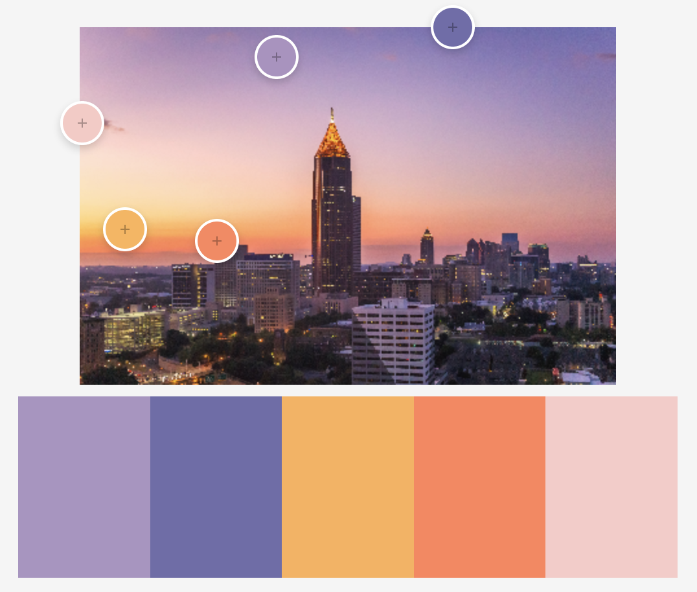
  <figcaption>Colors extracted from an image at <a href="https://color.adobe.com">color.adobe.com</a></figcaption>
</figure>
]

???

Photo by [Brad Huchteman](https://unsplash.com/photos/sR1Kz2auNJE) on Unsplash

---

# Usability and accessibility

.box-inv-1.medium[Perceptually uniform colors]

.box-1[Values close to each other use similar colors,<br>and values far from each other use different colors]

--

.box-inv-1.medium[Colorblind-safe colors]

.box-1[8% of men & 0.05% of women have some form of color blindness]

.box-1[Colors should be distinguishable by people<br>with common forms of color blindness]

---

# Perceptually uniform colors

.pull-left[
<figure>
  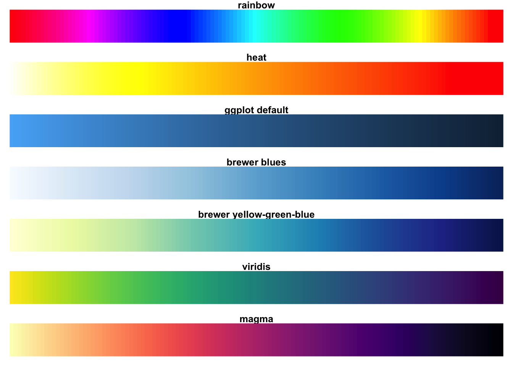
  <figcaption>Traditional palettes vs. viridis</figcaption>
</figure>
]

--

.pull-right[
<figure>
  
  <figcaption>Traditional palettes vs. viridis as seen with deuteranopia</figcaption>
</figure>
]

---

# Perceptually uniform colors

```{r echo=FALSE}
counties_ga <-  counties_sf("longlat") %>% 
  filter(iso_3166_2 == "GA")
```

.pull-left-3[
<figure>
```{r ga1, echo=FALSE, fig.width=5, fig.height=6}
ggplot(counties_ga) +
  geom_sf(aes(fill = census_area)) + 
  scale_fill_gradientn(colors = rainbow(5), guide = FALSE) +
  theme_void()
```

<figcaption>Georgia counties filled by area, rainbow palette (NOT GOOD)</figcaption>
</figure>
]

--

.pull-middle-3[
<figure>
```{r ga2, echo=FALSE, fig.width=5, fig.height=6}
ggplot(counties_ga) +
  geom_sf(aes(fill = census_area)) + 
  scale_fill_viridis_c(guide = FALSE) +
  theme_void()
```

<figcaption>Georgia counties filled by area, viridis::viridis palette</figcaption>
</figure>
]

--

.pull-right-3[
<figure>
```{r ga3, echo=FALSE, fig.width=5, fig.height=6}
ggplot(counties_ga) +
  geom_sf(aes(fill = census_area)) + 
  scale_fill_viridis_c(option = "inferno", guide = FALSE) +
  theme_void()
```

<figcaption>Georgia counties filled by area, viridis::inferno palette</figcaption>
</figure>
]

---

layout: true
class: title title-inv-4

---

name: repetition

# Repetition

&nbsp;

.box-4.large[Repeat some aspect<br>of the design throughout<br>the entire piece.]

---

# Things to repeat

.box-4.medium[Colors]

--

.box-4.medium[Fonts]

.box-inv-4.sp-after[Families, weights, sizes]

--

.box-4.medium[Graphical elements]

--

.box-4.medium[Alignments]

---

layout: false
class: bg-full
background-image: url("img/02/oxfam-annual-report.jpg")

???

Source: Pages 5 and 9 from Oxfam's 2019 Annual Report/: https://assets.oxfamamerica.org/media/documents/2019_Oxfam_America_Annual_Report_web.pdf

If you want to see generally great examples of public sector designs, search for "<big charity or think tank name> annual report", like "red cross annual report" or "urban institute annual report"

---

layout: true
class: title title-inv-1

---

name: alignment

# Alignment

&nbsp;

.box-1.large[Every item should have a<br>visual connection with<br>something else on the page.]

---

# Alignment

.pull-left[
<figure>
  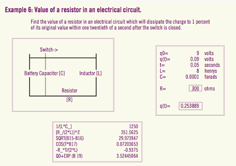
  <figcaption>Bad alignment</figcaption>
</figure>
]

--

.pull-right[
<figure>
  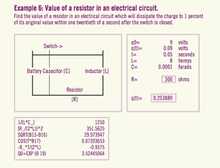
  <figcaption>Good alignment—everything is connected to something</figcaption>
</figure>
]

???

Source: Robin Williams, *The Non-Designer's Design Book*

---

# Alignment + repetition


.box-1[Share lines and repeat alignments where possible.]

.pull-left[
<figure>
  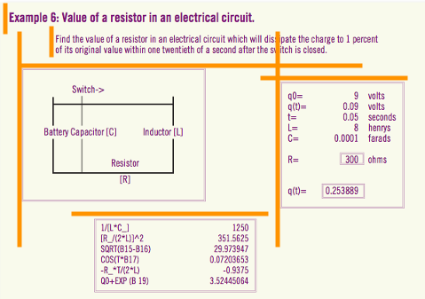
  <figcaption>4 horizontal alignments; 3 vertical alignments</figcaption>
</figure>
]

.pull-right[
<figure>
  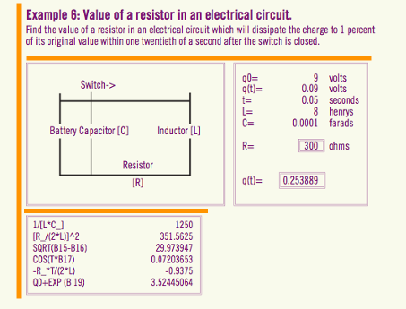
  <figcaption>1 shared horizontal alignment; 2 vertical alignments</figcaption>
</figure>
]

---

# Alignment + contrast

.box-1[Center + left is super common, but has weak contrast]

.box-inv-1[Mixing left and right alignment provides stronger contrast]

.pull-left.frame[

<p style="font-size: 0.7em; text-align: center; font-weight: bold;">Chapter 1</p>

<p style="font-size: 0.9em; text-align: center; margin-bottom: 1.5em;">Here’s a title</p>

<p style="font-size: 0.65em;">Lorem ipsum dolor sit amet, consectetur adipisicing elit, sed do eiusmod tempor incididunt ut labore et dolore magna aliqua.</p>

]

--

.pull-right.frame[

<p style="font-size: 0.7em; text-align: right; font-weight: bold;">Chapter 1</p>

<p style="font-size: 0.9em; text-align: right; margin-bottom: 1.5em">Here’s a title</p>

<p style="font-size: 0.65em; text-align: justify; hyphens: manual;">Lorem ipsum dolor sit amet, con&shy;sec&shy;tetur adi&shy;pis&shy;icing elit, sed do eiusmod tempor in&shy;ci&shy;di&shy;dunt ut labore et dolore magna aliqua.</p>

]

---

layout: true
class: title title-4

---

name: proximity

# Proximity

&nbsp;

.box-inv-4.large[Group related items together.]

---

# Proximity

.box-inv-4[Use white space, color, location, contrast, repetition,<br>alignment, etc. to make visually distinct groupings]

--

.pull-left[
<figure>
  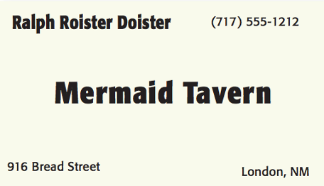
  <figcaption>Bad proximity; no logical groupings</figcaption>
</figure>
]

--

.pull-right[
<figure>
  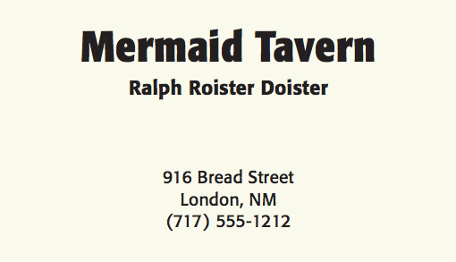
  <figcaption>Good proximity; information visually grouped</figcaption>
</figure>
]

???

Source: Robin Williams, *The Non-Designer's Design Book*

---

layout: true
class: title title-7

---

# CRAP review

.pull-left[
.pull-left[

.box-1[Contrast]

<figure>
  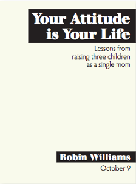
</figure>
]

.pull-right[

.box-inv-4[Repetition]

<figure>
  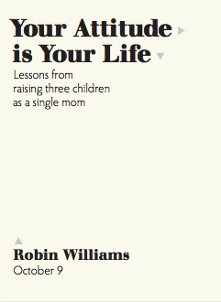
</figure>
]
]

.pull-right[
.pull-left[

.box-inv-1[Alignment]

<figure>
  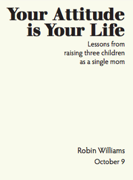
</figure>
]

.pull-right[

.box-4[Proximity]

<figure>
  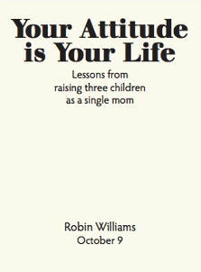
</figure>
]
]

---

name: image-types
layout: false
class: center middle section-title section-title-5 animated fadeIn

# Image types

---

layout: true
class: title title-5

---

# Image types

.pull-left[

.box-inv-5.medium[Bitmaps]

.center[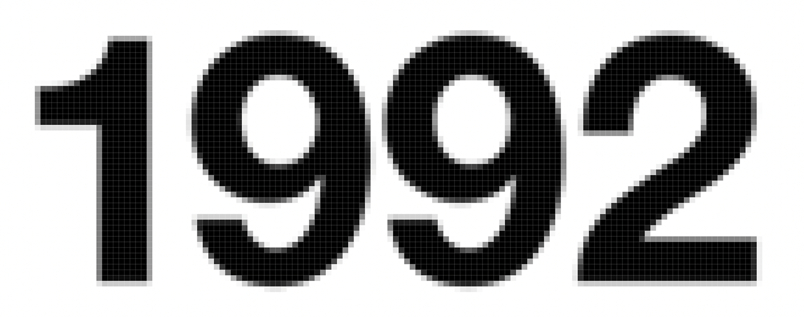]

.box-5.small[**JPEG**: Photographs]

.box-5.small[**PNG/GIF**: Images<br>with limited colors]

]

--

.pull-right[

.box-inv-5.medium[Vectors]

.center[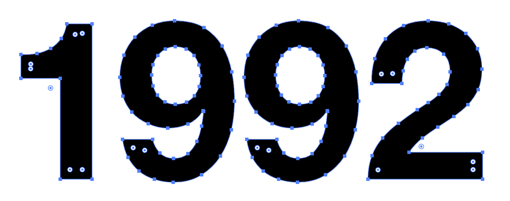]

.box-5.small[**PDF (or EPS)**:<br>Anything vector based]

.box-5.small[**SVG**: Vectors online]

]

---

layout: false

.box-5.small[PNG • 130 KB]

.center[
<figure>
  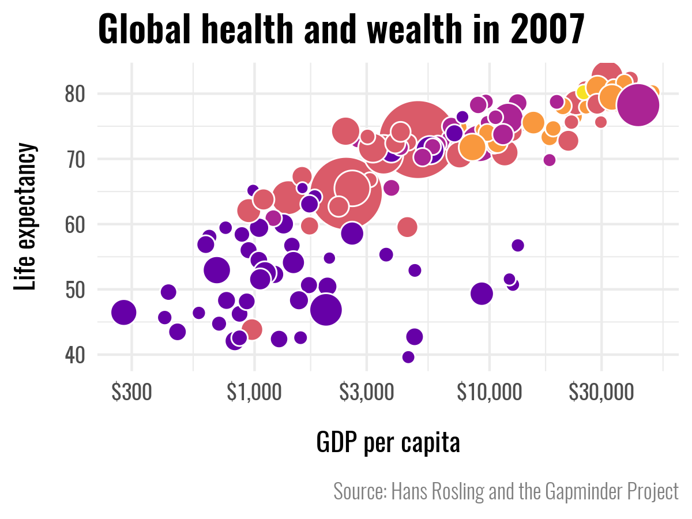
</figure>
]

---

.box-5.small[PNG • 130 KB • Zoomed]

.center[
<figure>
  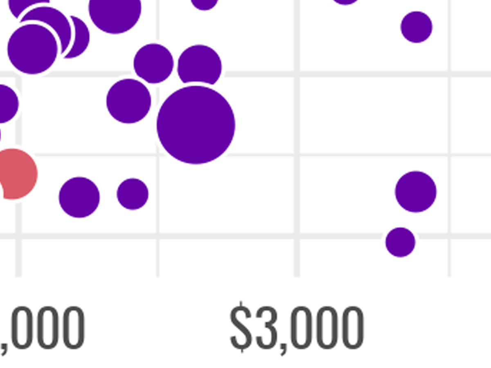
</figure>
]

---

.box-5.small[JPG • 75% quality • 161 KB]

.center[
<figure>
  
</figure>
]

---

.box-5.small[JPG • 75% quality • 161 KB • Zoomed]

.center[
<figure>
  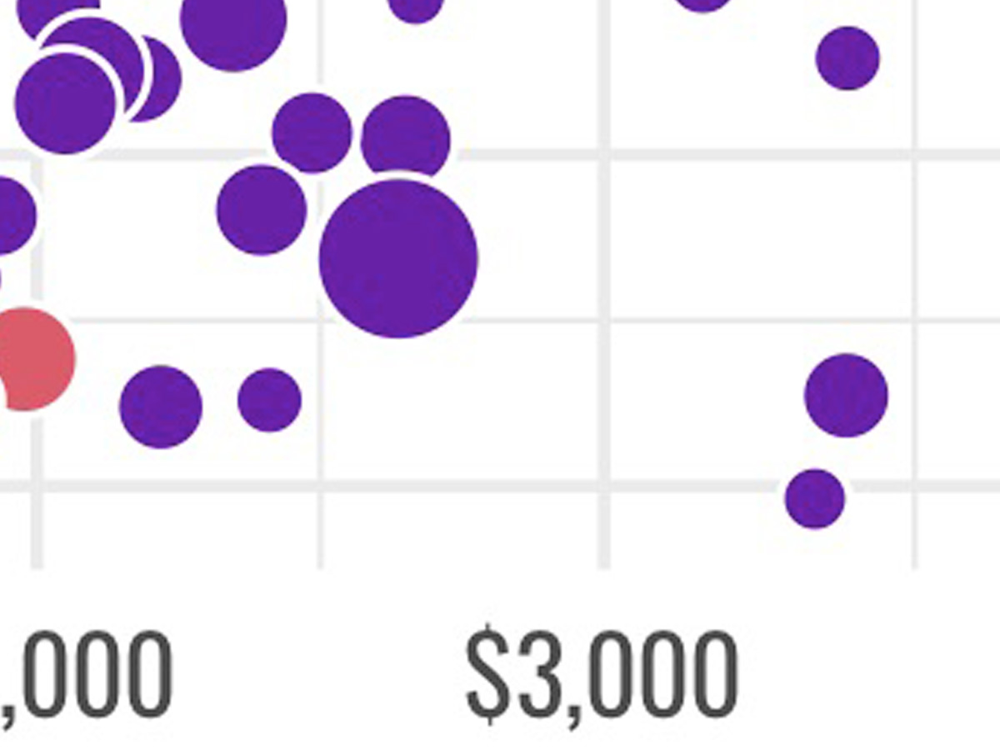
</figure>
]

---

.box-5.small[JPG • 10% quality • 88 KB]

.center[
<figure>
  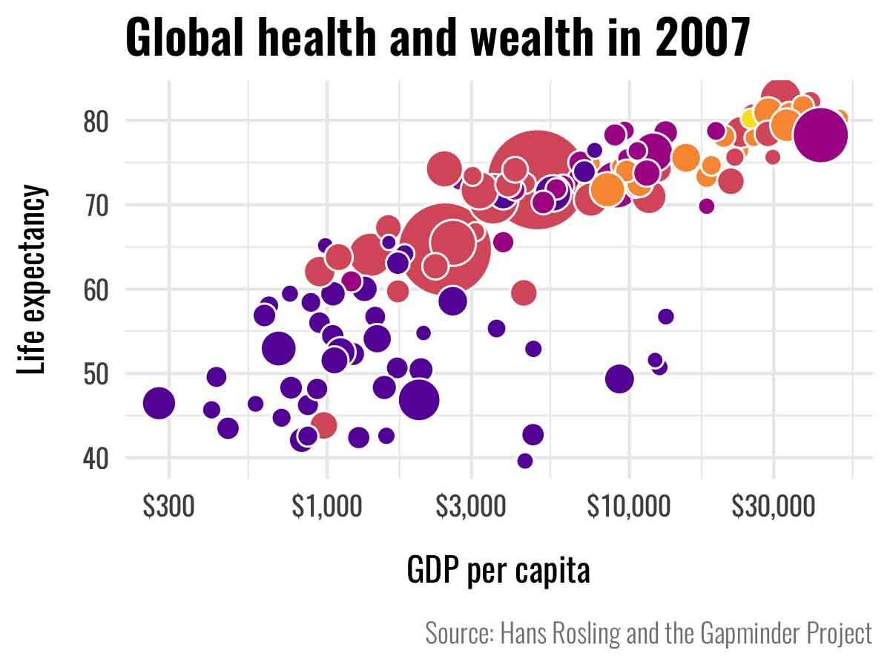
</figure>
]

---

.box-5.small[JPG • 10% quality • 88 KB • Zoomed]

.center[
<figure>
  
</figure>
]

---

class: center middle

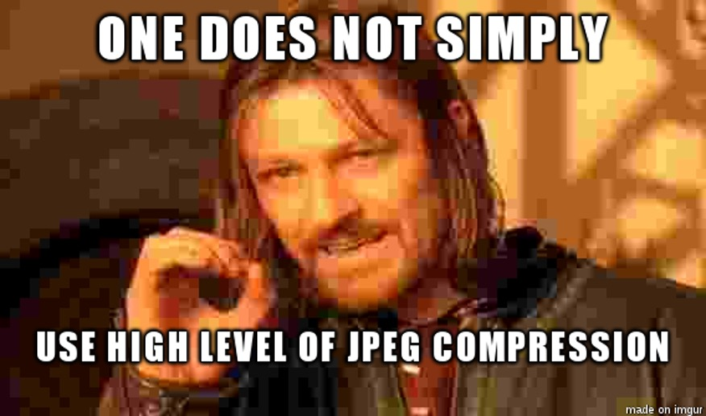

---

class: center middle

<figure>
  
</figure>

???

<https://xkcd.com/1683/>

---

class: title title-5

# In defense of the JPG

.pull-left.center[
<figure>
  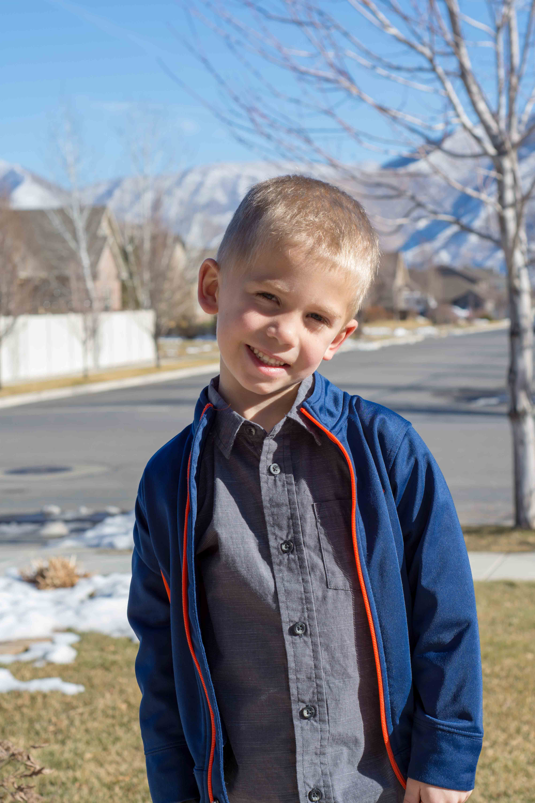
  <figcaption>Benjamin, December 2017</figcaption>
</figure>
]

.pull-right[

.box-inv-5[**RAW**<br>No compression • 27.1 MB 😱]

.box-inv-5[**JPG**<br>75% quality • 3.2 MB]

.box-inv-5[**JPG**<br>10% quality • 654 KB]

.box-inv-5[**PNG**<br>32.9 MB 😱]

]

---

class: title title-5

# Use the right file type

.pull-left[

.center[
<figure>
  
</figure>
]

.box-inv-5[Photographs]

.pull-left[
.box-5[Web]

.box-inv-5[JPG]
]

.pull-right[
.box-5[Print]

.box-inv-5[JPG]
]

]

.pull-right[

.center[
<figure>
  
</figure>
]

.box-inv-5[Graphs & logos]

.pull-left[
.box-5[Web]

.box-inv-5[PNG or SVG]
]

.pull-right[
.box-5[Print]

.box-inv-5[PDF]
]

]

???

Photo by [Brad Huchteman](https://unsplash.com/photos/sR1Kz2auNJE) on Unsplash

---

class: title title-5

# What programs do I use?

--

.pull-left-3.center[

## Photos/bitmaps

<figure>
  <a href="https://www.adobe.com/products/photoshop.html" target=”_blank”></a>
  <figcaption>Adobe Photoshop</figcaption>
</figure>

.pull-left[
<figure>
  <a href="https://www.gimp.org/" target=”_blank”></a>
  <figcaption>GIMP</figcaption>
</figure>
]

.pull-right[
<figure>
  <a href="https://www.canva.com/" target=”_blank”></a>
  <figcaption>Canva</figcaption>
</figure>
]

]

--

.pull-middle-3.center[

## Vectors

<figure>
  <a href="https://www.adobe.com/products/illustrator.html" target=”_blank”></a>
  <figcaption>Adobe Illustrator</figcaption>
</figure>

.pull-left[
<figure>
  <a href="https://inkscape.org/" target=”_blank”></a>
  <figcaption>Inkscape</figcaption>
</figure>
]

.pull-right[
<figure>
  <a href="https://www.designer.io/en/" target=”_blank”>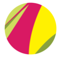</a>
  <figcaption>Gravit Designer</figcaption>
</figure>
]

]

--

.pull-right-3.center[

## Documents

<figure>
  <a href="https://www.adobe.com/products/indesign.html" target=”_blank”>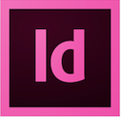</a>
  <figcaption>Adobe InDesign</figcaption>
</figure>

.pull-left[
<figure>
  <a href="https://www.scribus.net/" target=”_blank”></a>
  <figcaption>Scribus</figcaption>
</figure>
]

.pull-right[
<figure>
  <a href="https://www.canva.com/" target=”_blank”></a>
  <figcaption>Canva</figcaption>
</figure>
]

]
