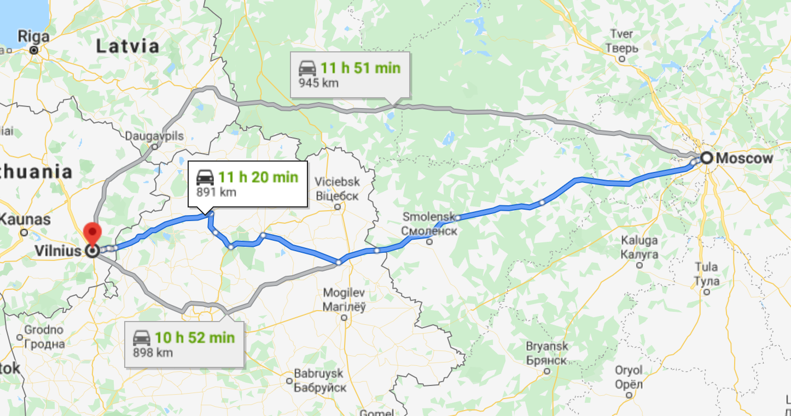
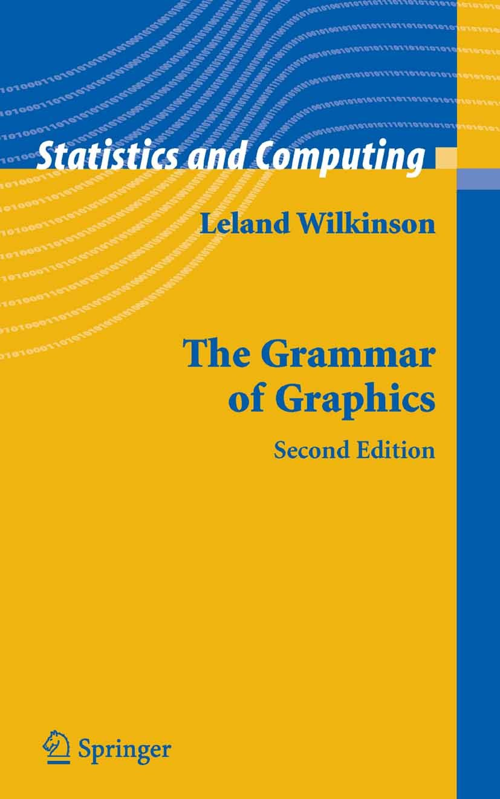
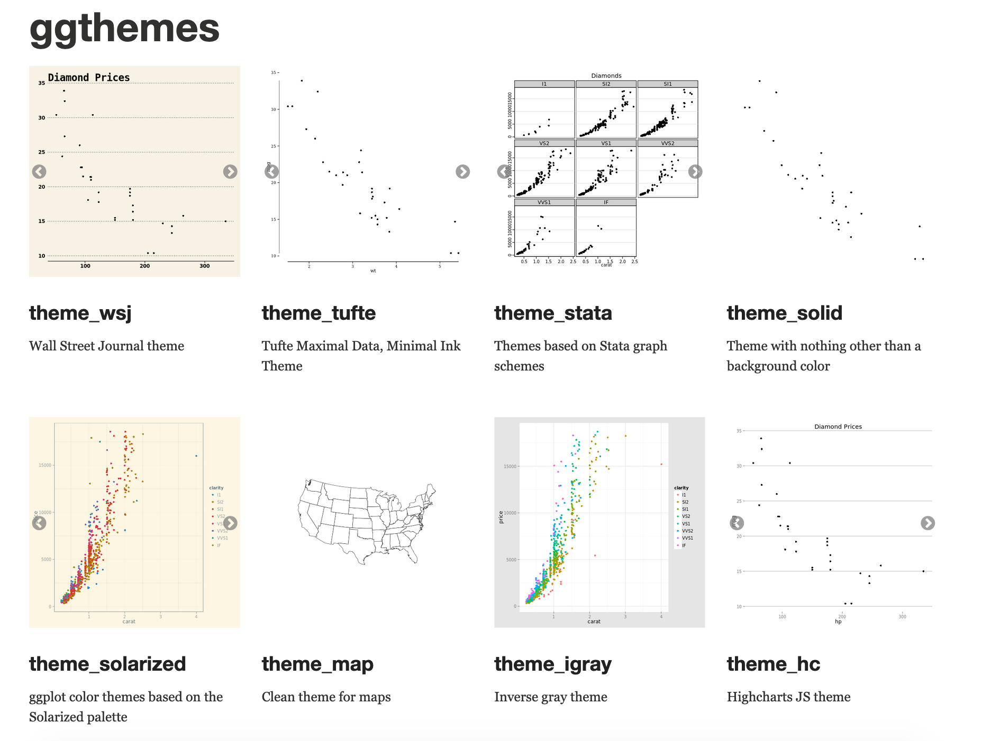
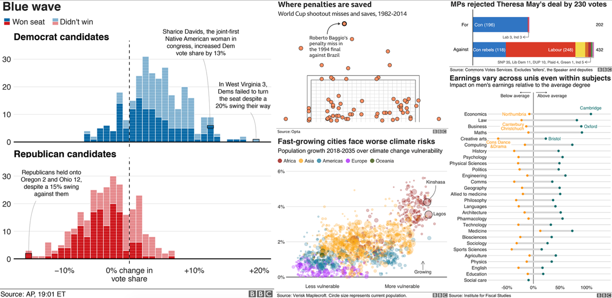
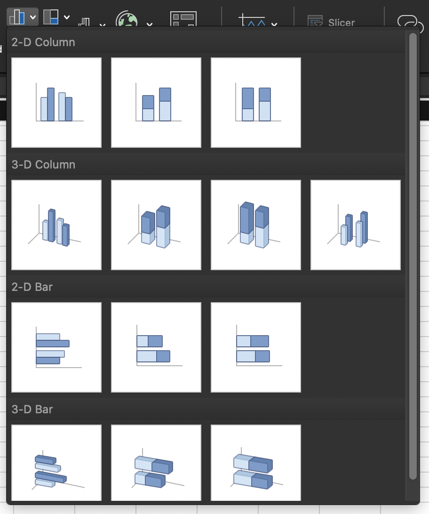
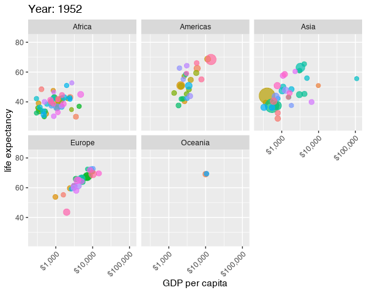
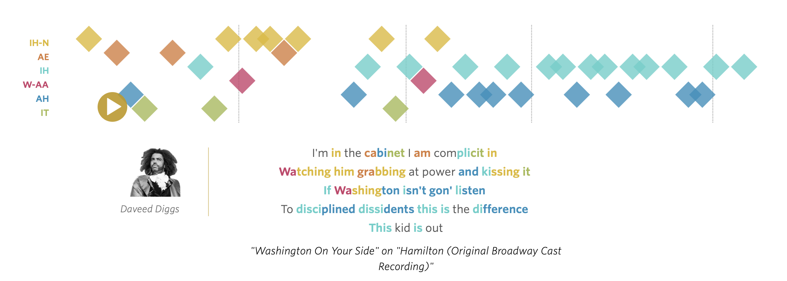
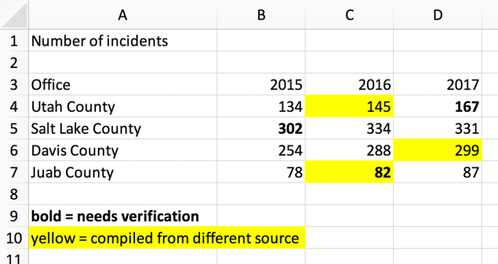
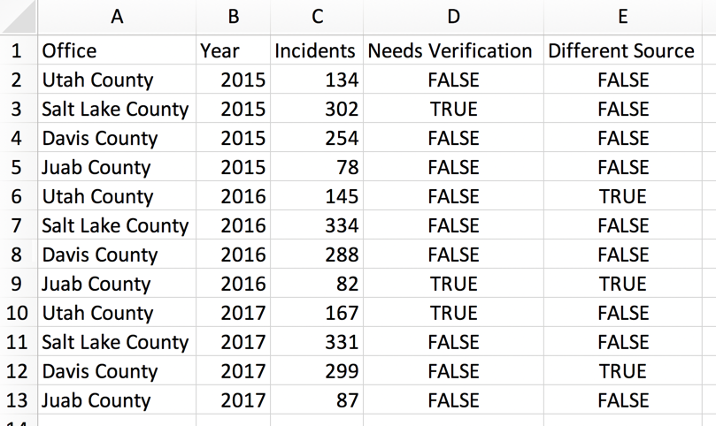

```{r setup, include=FALSE}
knitr::opts_chunk$set(warning = FALSE, message = FALSE, 
                      fig.retina = 3, fig.align = "center")
```

```{r packages-data, include=FALSE}
library(tidyverse)
library(ggthemes)
library(flair)
library(gapminder)
```

class: center middle main-title section-title-4

# Mapping Data<br>to Graphics

.class-info[

**Session 3**

.light[PMAP 8921: Data Visualization with R<br>
Andrew Young School of Policy Studies<br>
May 2020]

]

---

name: outline
class: title title-inv-7

# Plan for today

--

.box-4.medium.sp-after-half[Data, aesthetics, & the grammar of graphics]

--

.box-2.medium.sp-after-half[Grammatical layers]

--

.box-3.medium.sp-after-half[Aesthetics in extra dimensions]

--

.box-6.medium[Tidy data]


---

name: grammar-of-graphics
class: center middle section-title section-title-4 animated fadeIn

# Data, aesthetics,<br>& the grammar of graphics

---

class: bg-full bg-y-75
background-image: url("img/03/napoleon-retreat.jpg")

???

Source: [Wikipedia](https://en.wikipedia.org/wiki/File:National_Museum_in_Poznan_-_Przej%C5%9Bcie_przez_Berezyn%C4%99.JPG)

---

layout: true
class: title title-4

---

# Long distance!

.center[
<figure>
  
  <figcaption>Moscow to Vilnius</figcaption>
</figure>
]

---

# Very cold!

```{r minard-temps, echo=FALSE, warning=FALSE, fig.width=12, fig.height=6.5}
# https://github.com/vincentarelbundock/Rdatasets/tree/master/csv/HistData
minard_temps <- read_csv("data/Minard.temp.csv") %>% 
  uncount(days) %>% 
  mutate(day_index = 1:n())

ggplot(minard_temps, aes(x = day_index, y = temp)) +
  geom_line(color = "#4472C4", size = 3) + 
  labs(x = "Days since retreat from Moscow", y = "°C") +
  theme_gdocs(base_size = 30)
```

---

# Lots of people died!

```{r minard-deaths, echo=FALSE, fig.height=6.5, fig.width=6.5}
minard_deaths <- tribble(
  ~status, ~count,
  "Died", 422000,
  "Survived", 10000
)

ggplot(minard_deaths, aes(x = "", y = count, fill = status)) +
  geom_col() + 
  coord_polar(theta = "y") +
  scale_fill_manual(values = c("#FFC000", "#4472C4"), name = NULL) +
  labs(title = "Napoleon’s Grande Armée") +
  theme_void(base_family = "sans", base_size = 30) +
  theme(legend.position = "bottom")
```

---

layout: false
class: bg-full
background-image: url("img/03/minard.png")

???

Source: [Wikimedia Commons](https://upload.wikimedia.org/wikipedia/commons/2/29/Minard.png)

---

layout: true
class: title title-4

---

# Mapping data to aesthetics

.pull-left.center[

<figure>
  
</figure>

]

.pull-right[

.box-inv-4.medium[Aesthetic]

.box-4[Visual property of a graph]

.box-4.sp-after[Position, shape, color, etc.]

.box-inv-4.medium[Data]

.box-4[A column in a dataset]

]

---

# Mapping data to aesthetics

<table>
  <tr>
    <th class="cell-left">Data</th>
    <th class="cell-left">Aesthetic</th>
    <th class="cell-left">Graphic/Geometry</th>
  </tr>
  <tr>
    <td class="cell-left">Longitude</td>
    <td class="cell-left">Position (x-axis)&emsp;</td>
    <td class="cell-left">Point</td>
  </tr>
  <tr>
    <td class="cell-left">Latitude</td>
    <td class="cell-left">Position (y-axis)</td>
    <td class="cell-left">Point</td>
  </tr>
  <tr>
    <td class="cell-left">Army size</td>
    <td class="cell-left">Size</td>
    <td class="cell-left">Path</td>
  </tr>
  <tr>
    <td class="cell-left">Army direction&emsp;</td>
    <td class="cell-left">Color</td>
    <td class="cell-left">Path</td>
  </tr>
  <tr>
    <td class="cell-left">Date</td>
    <td class="cell-left">Position (x-axis)</td>
    <td class="cell-left">Line + text</td>
  </tr>
  <tr>
    <td class="cell-left">Temperature</td>
    <td class="cell-left">Position (y-axis)</td>
    <td class="cell-left">Line + text</td>
  </tr>
</table>

---

# Mapping data to aesthetics

<table>
  <tr>
    <th class="cell-left">Data</th>
    <th class="cell-left"><code class="remark-inline-code">aes()</code></th>
    <th class="cell-left"><code class="remark-inline-code">geom</code></th>
  </tr>
  <tr>
    <td class="cell-left">Longitude</td>
    <td class="cell-left"><code class="remark-inline-code">x</code></td>
    <td class="cell-left"><code class="remark-inline-code">geom_point()</code></td>
  </tr>
  <tr>
    <td class="cell-left">Latitude</td>
    <td class="cell-left"><code class="remark-inline-code">y</code></td>
    <td class="cell-left"><code class="remark-inline-code">geom_point()</code></td>
  </tr>
  <tr>
    <td class="cell-left">Army size</td>
    <td class="cell-left"><code class="remark-inline-code">size</code></td>
    <td class="cell-left"><code class="remark-inline-code">geom_path()</code></td>
  </tr>
  <tr>
    <td class="cell-left">Army direction&emsp;</td>
    <td class="cell-left"><code class="remark-inline-code">color</code>&emsp;</td>
    <td class="cell-left"><code class="remark-inline-code">geom_path()</code></td>
  </tr>
  <tr>
    <td class="cell-left">Date</td>
    <td class="cell-left"><code class="remark-inline-code">x</code></td>
    <td class="cell-left"><code class="remark-inline-code">geom_line() + geom_text()</code></td>
  </tr>
  <tr>
    <td class="cell-left">Temperature</td>
    <td class="cell-left"><code class="remark-inline-code">y</code></td>
    <td class="cell-left"><code class="remark-inline-code">geom_line() + geom_text()</code></td>
  </tr>
</table>

---

# `ggplot()` template

```{r show-ggplot-template, echo=FALSE, tidy=FALSE}
decorate('
ggplot(data = DATA) +
  GEOM_FUNCTION(mapping = aes(AESTHETIC MAPPINGS))
', eval = FALSE) %>% 
  flair("DATA", background = "#CBB5FF", before = "<b>", after = "</b>") %>% 
  flair("GEOM_FUNCTION", background = "#FFDFD1", before = "<b>", after = "</b>") %>% 
  flair("AESTHETIC MAPPINGS", background = "#FFD0CF", before = "<b>", after = "</b>") %>% 
  knit_print.with_flair()
```

--

```{r ggplot-template-example, echo=FALSE}
decorate('
ggplot(data = troops) +
  geom_path(mapping = aes(x = longitude,
                          y = latitude,
                          color = direction,
                          size = survivors))
', eval = FALSE) %>%
  flair("troops", background = "#CBB5FF", before = "<b>", after = "</b>") %>% 
  flair("geom_path", background = "#FFDFD1", before = "<b>", after = "</b>") %>% 
  flair_rx("x = longitude|y = latitude|color = direction|size = survivors", 
           background = "#FFD0CF", before = "<b>", after = "</b>") %>% 
  knit_print.with_flair()
```

---

layout: false

```{r minard-troops, echo=FALSE, warning=FALSE}
# https://github.com/vincentarelbundock/Rdatasets/tree/master/csv/HistData
troops <- read_csv("data/Minard.troops.csv") %>% 
  select(longitude = long, latitude = lat, direction, survivors)
```

.box-4[This is a dataset named `troops`:]

.small[

```{r head-troops, echo=FALSE}
troops %>% 
  slice(1:2) %>% 
  mutate_all(as.character) %>% 
  bind_rows(tibble(longitude = "…", latitude = "…", direction = "…", survivors = "…")) %>% 
  knitr::kable(format = "html")
```

]

--

```{r ggplot-template-example1, echo=FALSE}
decorate('
ggplot(data = troops) +
  geom_path(mapping = aes(x = longitude,
                          y = latitude,
                          color = direction,
                          size = survivors))
', eval = FALSE) %>%
  flair("troops", background = "#CBB5FF", before = "<b>", after = "</b>") %>% 
  flair("geom_path", background = "#FFDFD1", before = "<b>", after = "</b>") %>% 
  flair_rx("x = longitude|y = latitude|color = direction|size = survivors", 
           background = "#FFD0CF", before = "<b>", after = "</b>") %>% 
  knit_print.with_flair()
```

---

```{r show-basic-minard, echo=FALSE, fig.width=16, fig.height=8, out.width="100%"}
ggplot(data = troops,
       mapping = aes(x = longitude,
                     y = latitude,
                     color = direction,
                     size = survivors)) +
  geom_path(lineend = "round", linejoin = "mitre") + 
  scale_size_continuous(range = c(1, 20),
                        labels = scales::comma) +
  theme_gray(base_size = 20)
```

---

class: bg-full
background-image: url("img/03/rosling-tedx.jpg")

???

Source: [New York Times](https://www.nytimes.com/2017/02/09/world/europe/hans-rosling-dead-statistician.html)

---

class: bg-full
background-image: url("img/03/gapminder-screenshot.png")

???

Source: [Gapminder](https://www.gapminder.org/tools/#$chart-type=bubbles)

---

layout: true
class: title title-4

---

# Mapping data to aesthetics

<table>
  <tr>
    <th class="cell-left">Data</th>
    <th class="cell-left"><code class="remark-inline-code">aes()</code></th>
    <th class="cell-left"><code class="remark-inline-code">geom</code></th>
  </tr>
  <tr>
    <td class="cell-left">Wealth (GDP/capita)</td>
    <td class="cell-left"><code class="remark-inline-code">x</code></td>
    <td class="cell-left"><code class="remark-inline-code">geom_point()</code></td>
  </tr>
  <tr>
    <td class="cell-left">Health (Life expectancy)&emsp;</td>
    <td class="cell-left"><code class="remark-inline-code">y</code></td>
    <td class="cell-left"><code class="remark-inline-code">geom_point()</code></td>
  </tr>
  <tr>
    <td class="cell-left">Continent</td>
    <td class="cell-left"><code class="remark-inline-code">color</code></td>
    <td class="cell-left"><code class="remark-inline-code">geom_point()</code></td>
  </tr>
  <tr>
    <td class="cell-left">Population</td>
    <td class="cell-left"><code class="remark-inline-code">size</code>&emsp;</td>
    <td class="cell-left"><code class="remark-inline-code">geom_point()</code></td>
  </tr>
</table>

---

layout: false

```{r gapminder-data, echo=FALSE, warning=FALSE}
gapminder_2007 <- gapminder %>% 
  filter(year == 2007) %>% 
  select(country, continent, gdpPercap, lifeExp, pop)
```

.box-4[This is a dataset named `gapminder_2007`:]

.small[

```{r head-gapminder, echo=FALSE}
gapminder_2007 %>% 
  slice(1:2) %>% 
  mutate_all(as.character) %>% 
  bind_rows(tibble(country = "…", continent = "…", gdpPercap = "…", lifeExp = "…", pop = "…")) %>% 
  knitr::kable(format = "html", align = "ccccc")
```

]

--

```{r gapminder-example, echo=FALSE}
decorate('
ggplot(data = gapminder_2007,
       mapping = aes(x = gdpPercap,
                     y = lifeExp,
                     color = continent,
                     size = pop)) +
  geom_point() +
  scale_x_log10()
', eval = FALSE) %>%
  flair("gapminder_2007", background = "#CBB5FF", before = "<b>", after = "</b>") %>% 
  flair("geom_point", background = "#FFDFD1", before = "<b>", after = "</b>") %>% 
  flair_rx("x = gdpPercap|y = lifeExp|color = continent|size = pop", 
           background = "#FFD0CF", before = "<b>", after = "</b>") %>% 
  knit_print.with_flair()
```

---

layout: true
class: title title-4

---

# Health and wealth

```{r show-basic-gapminder, echo=FALSE, fig.width=12, fig.height=5.5, out.width="100%"}
ggplot(data = gapminder_2007,
       mapping = aes(x = gdpPercap,
                     y = lifeExp,
                     color = continent,
                     size = pop)) +
  geom_point() +
  scale_x_log10() +
  scale_size_continuous(range = c(1, 15),
                        labels = scales::comma) +
  theme_gray(base_size = 20)
```

---

layout: false
name: grammatical-layers
class: center middle section-title section-title-2 animated fadeIn

# Grammatical layers

---

layout: true
class: title title-2

---

# Grammar components as layers

.pull-left[
.box-inv-2[So far we know about data, aesthetics, and geometries]

.box-inv-2[Think of these<br>components as **layers**]

.box-inv-2[Add them to foundational `ggplot()` with `+`]
]

.pull-right[

&nbsp;


]

???

Layer analogy borrowed from [Thomas Lin Pedersen](https://www.data-imaginist.com/) and his ["Drawing Anything with ggplot2" workshop](https://github.com/thomasp85/ggplot2_workshop).

---

# Possible aesthetics

.pull-left-3[

.box-inv-2.small[`color` (discrete)]

```{r aes-color-discrete, echo=FALSE, fig.dim=c(4, 2), out.width="100%"}
eg <- tribble(
  ~x, ~y, ~size, ~x1,
  "A", 1, 5, 1,
  "B", 1, 10, 2,
  "C", 1, 15, 3
)

# Color, discrete
ggplot(eg, aes(x = x, y = y, color = x)) +
  geom_point(size = 30) +
  guides(color = FALSE) +
  theme(axis.text.y = element_blank(),
        axis.ticks = element_blank())
```

.box-inv-2.small[`color` (continuous)]

```{r aes-color-continuous, echo=FALSE, fig.dim=c(4, 2), out.width="100%"}
# Color, continuous
ggplot(eg, aes(x = x1, y = y, color = x1)) +
  geom_point(size = 30) +
  guides(color = FALSE) +
  coord_cartesian(xlim = c(0.5, 3.5)) +
  theme(axis.text.y = element_blank(),
        axis.ticks = element_blank())
```
]

.pull-middle-3[

.box-inv-2.small[`size`]

```{r aes-size, echo=FALSE, fig.dim=c(4, 2), out.width="100%"}
# Size
ggplot(eg, aes(x = x, y = y, size = x)) +
  geom_point() +
  scale_size_discrete(range = c(2, 30)) +
  guides(size = FALSE) +
  theme(axis.text.y = element_blank(),
        axis.ticks = element_blank())
```

.box-inv-2.small[`fill`]

```{r aes-fill, echo=FALSE, fig.dim=c(4, 2), out.width="100%"}
# Fill
ggplot(eg, aes(x = x, y = y, fill = x)) +
  geom_point(size = 30, pch = 21, stroke = 5) +
  guides(fill = FALSE) +
  theme(axis.text.y = element_blank(),
        axis.ticks = element_blank())
```
]

.pull-right-3[

.box-inv-2.small[`shape`]

```{r aes-shape, echo=FALSE, fig.dim=c(4, 2), out.width="100%"}
# Shape
ggplot(eg, aes(x = x, y = y, shape = x)) +
  geom_point(size = 30) +
  guides(shape = FALSE) +
  theme(axis.text.y = element_blank(),
        axis.ticks = element_blank())
```

.box-inv-2.small[`alpha`]

```{r aes-alpha, echo=FALSE, fig.dim=c(4, 2), out.width="100%"}
# Alpha
ggplot(eg, aes(x = x, y = y, alpha = x)) +
  geom_point(size = 30) +
  guides(alpha = FALSE) +
  theme(axis.text.y = element_blank(),
        axis.ticks = element_blank())
```
]

---

# Possible geoms

<table>
  <tr>
    <th class="cell-left"></th>
    <th class="cell-left">Example geom</th>
    <th class="cell-left">What it makes</th>
  </tr>
  <tr>
    <td class="cell-left"></td>
    <td class="cell-left"><code class="remark-inline-code">geom_col()</code></td>
    <td class="cell-left">Bar charts</td>
  </tr>
  <tr>
    <td class="cell-left"></td>
    <td class="cell-left"><code class="remark-inline-code">geom_text()</code></td>
    <td class="cell-left">Text</td>
  </tr>
  <tr>
    <td class="cell-left"></td>
    <td class="cell-left"><code class="remark-inline-code">geom_point()</code></td>
    <td class="cell-left">Points</td>
  </tr>
  <tr>
    <td class="cell-left"></td>
    <td class="cell-left"><code class="remark-inline-code">geom_boxplot()</code>&emsp;</td>
    <td class="cell-left">Boxplots</td>
  </tr>
  <tr>
    <td class="cell-left"></td>
    <td class="cell-left"><code class="remark-inline-code">geom_sf()</code></td>
    <td class="cell-left">Maps</td>
  </tr>
</table>

---

# Possible geoms

.box-inv-2[There are dozens of possible geoms and<br>each class session will cover different ones.]

.box-2[See [the **ggplot2** documentation](https://ggplot2.tidyverse.org/reference/index.html#section-layer-geoms) for<br>complete examples of all the different geom layers]

---

# Additional layers

.pull-left[
.box-inv-2[There are many of other grammatical layers we can use to describe graphs!]

.box-inv-2[We sequentially add layers onto the foundational `ggplot()` plot to create complex figures]
]

.pull-right[

]

---

# Scales

.box-inv-2[Scales change the properties of the variable mapping]

<table>
  <tr>
    <th class="cell-left">Example layer</th>
    <th class="cell-left">What it does</th>
  </tr>
  <tr>
    <td class="cell-left"><code class="remark-inline-code">scale_x_continuous()</code></td>
    <td class="cell-left">Make the x-axis continuous</td>
  </tr>
  <tr>
    <td class="cell-left"><code class="remark-inline-code">scale_x_continuous(breaks = 1:5)&ensp;</code></td>
    <td class="cell-left">Manually specify axis ticks</td>
  </tr>
  <tr>
    <td class="cell-left"><code class="remark-inline-code">scale_x_log10()</code></td>
    <td class="cell-left">Log the x-axis</td>
  </tr>
  <tr>
    <td class="cell-left"><code class="remark-inline-code">scale_color_gradient()</code></td>
    <td class="cell-left">Use a gradient</td>
  </tr>
  <tr>
    <td class="cell-left"><code class="remark-inline-code">scale_fill_viridis_d()</code></td>
    <td class="cell-left">Fill with discrete viridis colors</td>
  </tr>
</table>

---

# Scales

.pull-left[

.box-inv-2.small[`scale_x_log10()`]

```{r scale-example-1, echo=FALSE, fig.dim=c(4.8, 3.75), out.width="100%"}
ggplot(gapminder_2007, aes(x = gdpPercap, y = lifeExp, color = continent, size = pop)) +
  geom_point() +
  scale_x_log10()
```
]

--

.pull-right[

.box-inv-2.small[`scale_color_viridis_d()`]

```{r scale-example-2, echo=FALSE, fig.dim=c(4.8, 3.75), out.width="100%"}
ggplot(gapminder_2007, aes(x = gdpPercap, y = lifeExp, color = continent, size = pop)) +
  geom_point() +
  scale_x_log10() +
  scale_color_viridis_d()
```
]

---

# Facets

.box-inv-2[Facets show subplots for different subsets of data]

<table>
  <tr>
    <th class="cell-left">Example layer</th>
    <th class="cell-left">What it does</th>
  </tr>
  <tr>
    <td class="cell-left"><code class="remark-inline-code">facet_wrap(vars(continent))</code></td>
    <td class="cell-left">Plot for each continent</td>
  </tr>
  <tr>
    <td class="cell-left"><code class="remark-inline-code">facet_wrap(vars(continent, year))</code>&emsp;</td>
    <td class="cell-left">Plot for each continent/year</td>
  </tr>
  <tr>
    <td class="cell-left"><code class="remark-inline-code">facet_wrap(..., ncol = 1)</code></td>
    <td class="cell-left">Put all facets in one column</td>
  </tr>
  <tr>
    <td class="cell-left"><code class="remark-inline-code">facet_wrap(..., nrow = 1)</code></td>
    <td class="cell-left">Put all facets in one row</td>
  </tr>
</table>

---

# Facets

.pull-left[

.box-inv-2.small[`facet_wrap(vars(continent))`]

```{r facet-example-1, echo=FALSE, fig.dim=c(4.8, 3.75), out.width="100%"}
ggplot(gapminder_2007, aes(x = gdpPercap, y = lifeExp, color = continent, size = pop)) +
  geom_point() +
  scale_x_log10() +
  facet_wrap(vars(continent))
```
]

--

.pull-right[

.box-inv-2.small[`facet_wrap(vars(continent, year))`]

```{r facet-example-2, echo=FALSE, fig.dim=c(4.8, 3.75), out.width="100%"}
ggplot(filter(gapminder, year %in% c(2002, 2007)), 
       aes(x = gdpPercap, y = lifeExp, color = continent, size = pop)) +
  geom_point() +
  scale_x_log10() +
  facet_wrap(vars(year, continent), nrow = 2)
```
]

---

# Coordinates

.box-inv-2[Change the coordinate system]

<table>
  <tr>
    <th class="cell-left">Example layer</th>
    <th class="cell-left">What it does</th>
  </tr>
  <tr>
    <td class="cell-left"><code class="remark-inline-code">coord_cartesian()</code></td>
    <td class="cell-left">Plot for each continent</td>
  </tr>
  <tr>
    <td class="cell-left"><code class="remark-inline-code">coord_cartesian(ylim = c(1, 10))</code>&emsp;</td>
    <td class="cell-left">Zoom in where y is 1–10</td>
  </tr>
  <tr>
    <td class="cell-left"><code class="remark-inline-code">coord_flip()</code></td>
    <td class="cell-left">Switch x and y</td>
  </tr>
  <tr>
    <td class="cell-left"><code class="remark-inline-code">coord_polar()</code></td>
    <td class="cell-left">Use circular polar system</td>
  </tr>
</table>

---

# Coordinates

.pull-left[

.box-inv-2.small[`coord_cartesian(ylim = c(70, 80), xlim = c(10000, 30000))`]

```{r coord-example-1, echo=FALSE, fig.dim=c(4.8, 3.25), out.width="100%"}
ggplot(gapminder_2007, aes(x = gdpPercap, y = lifeExp, color = continent, size = pop)) +
  geom_point() +
  scale_x_log10() +
  coord_cartesian(ylim = c(70, 80), xlim = c(10000, 30000))
```
]

--

.pull-right[

.box-inv-2.small[`coord_flip()`]

```{r coord-example-2, echo=FALSE, fig.dim=c(4.8, 3.75), out.width="100%"}
ggplot(gapminder_2007, aes(x = gdpPercap, y = lifeExp, color = continent, size = pop)) +
  geom_point() +
  scale_x_log10() + 
  coord_flip()
```
]

---

# Labels

.box-inv-2[Add labels to the plot with a single `labs()` layer]

<table>
  <tr>
    <th class="cell-left">Example layer</th>
    <th class="cell-left">What it does</th>
  </tr>
  <tr>
    <td class="cell-left"><code class="remark-inline-code">labs(title = "Neat title")</code></td>
    <td class="cell-left">Title</td>
  </tr>
  <tr>
    <td class="cell-left"><code class="remark-inline-code">labs(caption = "Something")</td>
    <td class="cell-left">Caption</td>
  </tr>
  <tr>
    <td class="cell-left"><code class="remark-inline-code">labs(y = "Something")</td>
    <td class="cell-left">y-axis</td>
  </tr>
  <tr>
    <td class="cell-left"><code class="remark-inline-code">labs(size = "Population")</code></td>
    <td class="cell-left">Title of size legend</td>
  </tr>
</table>

---

# Labels

.left-code[
```{r labels-example, tidy=FALSE, message=FALSE, fig.show="hide", fig.dim=c(4.8, 3.75), out.width="100%"}
ggplot(gapminder_2007, 
       aes(x = gdpPercap, y = lifeExp, 
           color = continent, size = pop)) +
  geom_point() +
  scale_x_log10() +
  labs(title = "Health and wealth grow together",
       subtitle = "Data from 2007",
       x = "Wealth (GDP per capita)",
       y = "Health (life expectancy)",
       color = "Continent",
       size = "Population",
       caption = "Source: The Gapminder Project")
```
]

.right-plot[
`)
]

---

# Theme

.box-inv-2[Change the appearance of anything in the plot]

.box-2[There are many built-in themes]

<table>
  <tr>
    <th class="cell-left">Example layer</th>
    <th class="cell-left">What it does</th>
  </tr>
  <tr>
    <td class="cell-left"><code class="remark-inline-code">theme_grey()</code></td>
    <td class="cell-left">Default grey background</td>
  </tr>
  <tr>
    <td class="cell-left"><code class="remark-inline-code">theme_bw()</td>
    <td class="cell-left">Black and white</td>
  </tr>
  <tr>
    <td class="cell-left"><code class="remark-inline-code">theme_dark()</td>
    <td class="cell-left">Dark</td>
  </tr>
  <tr>
    <td class="cell-left"><code class="remark-inline-code">theme_minimal()</code></td>
    <td class="cell-left">Minimal</td>
  </tr>
</table>

---

# Theme

.pull-left[

.box-inv-2.small[`theme_dark()`]

```{r theme-example-1, echo=FALSE, fig.dim=c(4.8, 3.75), out.width="100%"}
ggplot(gapminder_2007, aes(x = gdpPercap, y = lifeExp, color = continent, size = pop)) +
  geom_point() +
  scale_x_log10() +
  theme_dark()
```
]

--

.pull-right[

.box-inv-2.small[`theme_minimal()`]

```{r theme-example-2, echo=FALSE, fig.dim=c(4.8, 3.75), out.width="100%"}
ggplot(gapminder_2007, aes(x = gdpPercap, y = lifeExp, color = continent, size = pop)) +
  geom_point() +
  scale_x_log10() + 
  theme_minimal()
```
]

---

# Theme

.box-inv-2[There are collections of pre-built themes online,<br>like [the **ggthemes** package](https://jrnold.github.io/ggthemes/)]

.center[
<figure>
  
</figure>
]

---

# Theme

.box-inv-2[Organizations often make their own custom themes, [like the BBC](https://bbc.github.io/rcookbook/)]

.center[
<figure>
  
</figure>
]

---

# Theme options

.box-inv-2[Make theme adjustments with `theme()`]

.box-2[There are a billion options here!<br>We have a whole class session dedicated to this!]

```{r example-theme-options, eval=FALSE, tidy=FALSE}
theme_bw() + 
theme(legend.position = "bottom",
      plot.title = element_text(face = "bold"),
      panel.grid = element_blank(),
      axis.title.y = element_text(face = "italic"))
```

---

# So many possibilities!

.pull-left[

]

.pull-right[
.box-inv-2[These were just a few examples of layers!]

.box-2[See [the **ggplot2** documentation](https://ggplot2.tidyverse.org/reference/index.html) for<br>complete examples of everything you can do]
]

---

# Putting it all together

.box-inv-2.medium[We can build a plot sequentially<br>to see how each grammatical layer<br>changes the appearance]

---

layout: false

.left-code[
.box-2[Start with data and aesthetics]

```{r mpg-layers-1, tidy=FALSE, message=FALSE, fig.show="hide", fig.dim=c(4.8, 5), out.width="100%"}
ggplot(data = mpg,                  #<<
       mapping = aes(x = displ,     #<<
                     y = hwy,       #<<
                     color = drv))  #<<
```
]

.right-plot[
`)
]

---

.left-code[
.box-2[Add a point geom]

```{r mpg-layers-2, tidy=FALSE, message=FALSE, fig.show="hide", fig.dim=c(4.8, 5), out.width="100%"}
ggplot(data = mpg,
       mapping = aes(x = displ,
                     y = hwy,
                     color = drv)) +
  geom_point() #<<
```
]

.right-plot[
`)
]

---

.left-code[
.box-2[Add a smooth geom]

```{r mpg-layers-3, tidy=FALSE, message=FALSE, fig.show="hide", fig.dim=c(4.8, 5), out.width="100%"}
ggplot(data = mpg,
       mapping = aes(x = displ,
                     y = hwy,
                     color = drv)) +
  geom_point() +
  geom_smooth() #<<
```
]

.right-plot[
`)
]

---

.left-code[
.box-2[Make it straight]

```{r mpg-layers-4, tidy=FALSE, message=FALSE, fig.show="hide", fig.dim=c(4.8, 5), out.width="100%"}
ggplot(data = mpg,
       mapping = aes(x = displ,
                     y = hwy,
                     color = drv)) +
  geom_point() +
  geom_smooth(method = "lm") #<<
```
]

.right-plot[
`)
]

---

.left-code[
.box-2[Use a viridis color scale]

```{r mpg-layers-5, tidy=FALSE, message=FALSE, fig.show="hide", fig.dim=c(4.8, 5), out.width="100%"}
ggplot(data = mpg,
       mapping = aes(x = displ,
                     y = hwy,
                     color = drv)) +
  geom_point() +
  geom_smooth(method = "lm") +
  scale_color_viridis_d() #<<
```
]

.right-plot[
`)
]

---

.left-code[
.box-2[Facet by drive]

```{r mpg-layers-6, tidy=FALSE, message=FALSE, fig.show="hide", fig.dim=c(4.8, 5), out.width="100%"}
ggplot(data = mpg,
       mapping = aes(x = displ,
                     y = hwy,
                     color = drv)) +
  geom_point() +
  geom_smooth(method = "lm") +
  scale_color_viridis_d() +
  facet_wrap(vars(drv), ncol = 1) #<<
```
]

.right-plot[
`)
]

---

.left-code[
.box-2[Add labels]

```{r mpg-layers-7, tidy=FALSE, message=FALSE, fig.show="hide", fig.dim=c(4.8, 5), out.width="100%"}
ggplot(data = mpg,
       mapping = aes(x = displ,
                     y = hwy,
                     color = drv)) +
  geom_point() +
  geom_smooth(method = "lm") +
  scale_color_viridis_d() +
  facet_wrap(vars(drv), ncol = 1) +
  labs(x = "Displacement", y = "Highway MPG",  #<<
       color = "Drive",   #<<
       title = "Heavier cars get lower mileage",  #<<
       subtitle = "Displacement indicates weight(?)",  #<<
       caption = "I know nothing about cars")  #<<
```
]

.right-plot[
`)
]

---

.left-code[
.box-2[Add a theme]

```{r mpg-layers-8, tidy=FALSE, message=FALSE, fig.show="hide", fig.dim=c(4.8, 5), out.width="100%"}
ggplot(data = mpg,
       mapping = aes(x = displ,
                     y = hwy,
                     color = drv)) +
  geom_point() +
  geom_smooth(method = "lm") +
  scale_color_viridis_d() +
  facet_wrap(vars(drv), ncol = 1) +
  labs(x = "Displacement", y = "Highway MPG",
       color = "Drive", 
       title = "Heavier cars get lower mileage",
       subtitle = "Displacement indicates weight(?)",
       caption = "I know nothing about cars") +
  theme_bw() #<<
```
]

.right-plot[
`)
]

---

.left-code[
.box-2[Modify the theme]

```{r mpg-layers-9, tidy=FALSE, message=FALSE, fig.show="hide", fig.dim=c(4.8, 5), out.width="100%"}
ggplot(data = mpg, 
       mapping = aes(x = displ,
                     y = hwy,
                     color = drv)) +
  geom_point() +
  geom_smooth(method = "lm") +
  scale_color_viridis_d() +
  facet_wrap(vars(drv), ncol = 1) +
  labs(x = "Displacement", y = "Highway MPG",
       color = "Drive", 
       title = "Heavier cars get lower mileage",
       subtitle = "Displacement indicates weight(?)",
       caption = "I know nothing about cars") +
  theme_bw() +
  theme(legend.position = "bottom", #<<
        plot.title = element_text(face = "bold")) #<<
```
]

.right-plot[
`)
]

---

.left-code[
.box-2[Finished!]

```{r mpg-layers-finished, tidy=FALSE, message=FALSE, fig.show="hide", fig.dim=c(4.8, 5), out.width="100%"}
ggplot(data = mpg, 
       mapping = aes(x = displ,
                     y = hwy,
                     color = drv)) +
  geom_point() +
  geom_smooth(method = "lm") + 
  scale_color_viridis_d() +
  facet_wrap(vars(drv), ncol = 1) +
  labs(x = "Displacement", y = "Highway MPG",
       color = "Drive", 
       title = "Heavier cars get lower mileage",
       subtitle = "Displacement indicates weight(?)",
       caption = "I know nothing about cars") +
  theme_bw() +
  theme(legend.position = "bottom",
        plot.title = element_text(face = "bold"))
```
]

.right-plot[
`)
]

---

layout: true
class: title title-2

---

# A true grammar

.pull-left[
.box-inv-2[With the grammar of graphics, we don't talk about specific chart *types*]

.box-2.small[Hunt through Excel menus for a stacked bar chart and manually reshape your data to work with it]
]

.pull-right[
.center[
<figure>
  
</figure>
]
]

---

# A true grammar

.pull-left[
.box-inv-2[With the grammar of graphics, we *do* talk about specific chart *elements*]

.box-2.small[Map a column to the x-axis, fill by a different variable, and `geom_col()` to get stacked bars]

.box-2.small[Geoms can be interchangable<br>(e.g. switch `geom_violin()` to `geom_boxplot()`)]
]

.pull-right[
.center[
<figure>
  
</figure>
]
]

---

# Describing graphs with the grammar

.left-code[
.box-2.small[Map wealth to the x-axis, health to the y-axis, add points, color by continent, size by population, scale the y-axis with a log, and facet by year]

```{r describe-1, tidy=FALSE, message=FALSE, fig.show="hide", fig.dim=c(4.8, 3.75), out.width="100%"}
ggplot(data = filter(gapminder, year %in% c(2002, 2007)), 
       mapping = aes(x = gdpPercap,
                     y = lifeExp,
                     color = continent,
                     size = pop)) +
  geom_point() +
  scale_x_log10() + 
  facet_wrap(vars(year), ncol = 1)
```
]

.right-plot[
`)
]

---

# Describing graphs with the grammar

.left-code[
.box-2.small[Map health to the x-axis, add a histogram with bins for every 5 years, fill and facet by continent]

```{r describe-2, tidy=FALSE, message=FALSE, fig.show="hide", fig.dim=c(4.8, 3.75), out.width="100%"}
ggplot(data = gapminder_2007, 
       mapping = aes(x = lifeExp,
                     fill = continent)) +
  geom_histogram(binwidth = 5, 
                 color = "white") +
  guides(fill = FALSE) +  # Turn off legend
  facet_wrap(vars(continent))
```
]

.right-plot[
`)
]

---

# Describing graphs with the grammar

.left-code[
.box-2.small[Map continent to the x-axis, health to the y-axis, add violin plots and semi-transparent boxplots, fill by continent]

```{r describe-3, tidy=FALSE, message=FALSE, fig.show="hide", fig.dim=c(4.8, 3.75), out.width="100%"}
ggplot(data = gapminder, 
       mapping = aes(x = continent,
                     y = lifeExp,
                     fill = continent)) +
  geom_violin() +
  geom_boxplot(alpha = 0.5) +
  guides(fill = FALSE)  # Turn off legend
```
]

.right-plot[
`)
]

---

layout: false
name: extra-dimensions
class: center middle section-title section-title-3 animated fadeIn

# Aesthetics in<br>extra dimensions

---

layout: true
class: title title-3

---

# Time

.left-code[
.box-inv-3[Use **gganimate** to map variables to a time aesthetic]

```{r gganimate-example, tidy=FALSE, eval=FALSE}
ggplot(gapminder, aes(x = gdpPercap, y = lifeExp, 
                      size = pop, color = country)) +
  geom_point(alpha = 0.7) +
  scale_size(range = c(2, 12)) +
  scale_x_log10(labels = scales::dollar) +
  guides(size = FALSE, color = FALSE) +
  facet_wrap(~continent) +
  # Special gganimate stuff
  labs(title = 'Year: {frame_time}', x = 'GDP per capita', y = 'life expectancy') +
  transition_time(year) +
  ease_aes('linear')
```
]

.right-plot[

]

---

# Sound

.box-inv-3[Visualize internal rhyming schemes in music]

.box-3.small[<http://graphics.wsj.com/hamilton/>]

.center[
<figure>
  
</figure>
]

---

layout: false

.center[
<figure>
  
</figure>

<figure>
  
</figure>
]

---

layout: true
class: title title-3

---

# Animation, time, and sound

.center[
<iframe width="800" height="450" src="https://www.youtube.com/embed/__Jgp18tCnE" frameborder="0" allow="accelerometer; autoplay; encrypted-media; gyroscope; picture-in-picture" allowfullscreen></iframe>
]

???

Erika Navarro for the Weather Channel: <https://www.pewtrusts.org/en/research-and-analysis/articles/2018/12/03/the-weather-channel-uses-animation-to-show-dangers-of-storm-surge>

---

layout: false
name: tidy-data
class: center middle section-title section-title-6 animated fadeIn

# Tidy data

---

layout: true
class: title title-6

---

# Data shapes

.box-inv-6.medium[For `ggplot()` to work,<br>your data needs to be in a **tidy** format]

--

.box-6[This doesn't mean that it's clean—<br>it refers to the *structure* of the data]

--

.box-6[All the packages in the **tidyverse** work best with<br>tidy data; that why it's called that!]

---

# Tidy data

.box-inv-6[Each variable has its own column]

--

.box-inv-6[Each observation has its own row]

--

.box-inv-6[Each value has its own cell]

--

.center[
<figure>
  
  <figcaption><a href="https://r4ds.had.co.nz/tidy-data.html">From chapter 12 of <em>R for Data Science</em></a></figcaption>
</figure>
]

---

# Untidy data example

.box-inv-6[Real world data is often untidy, like this:]

.center[
<figure>
  
</figure>
]

---

# Tidy data example

.box-inv-6[Here's the tidy version of that same data:]

.center[
<figure>
  
</figure>
]

.box-6[This is plottable!]

---

# Wide vs. long

.box-inv-6[Tidy data is also called "long" data]

.center[
<figure>
  
</figure>
]

???

Figure by Garrick Aden-Buie in [**tidyexplain**](https://github.com/gadenbuie/tidyexplain)

---

# Moving from wide to long

.box-inv-6.tiny[Nowadays, `gather()` is called `pivot_longer()` and `spread()` is called `pivot_wider()`]

.center[

]

???

Figure by Garrick Aden-Buie in [**tidyexplain**](https://github.com/gadenbuie/tidyexplain)

--
