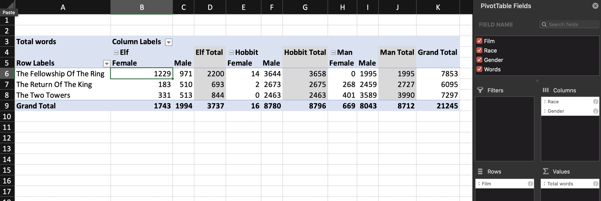
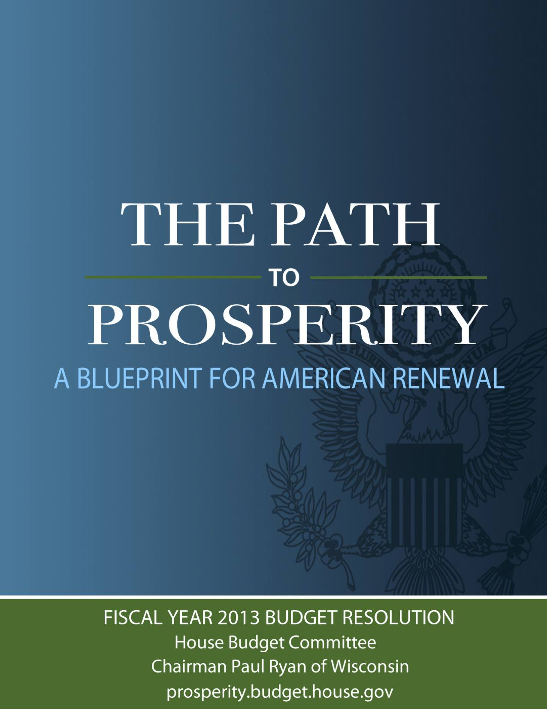
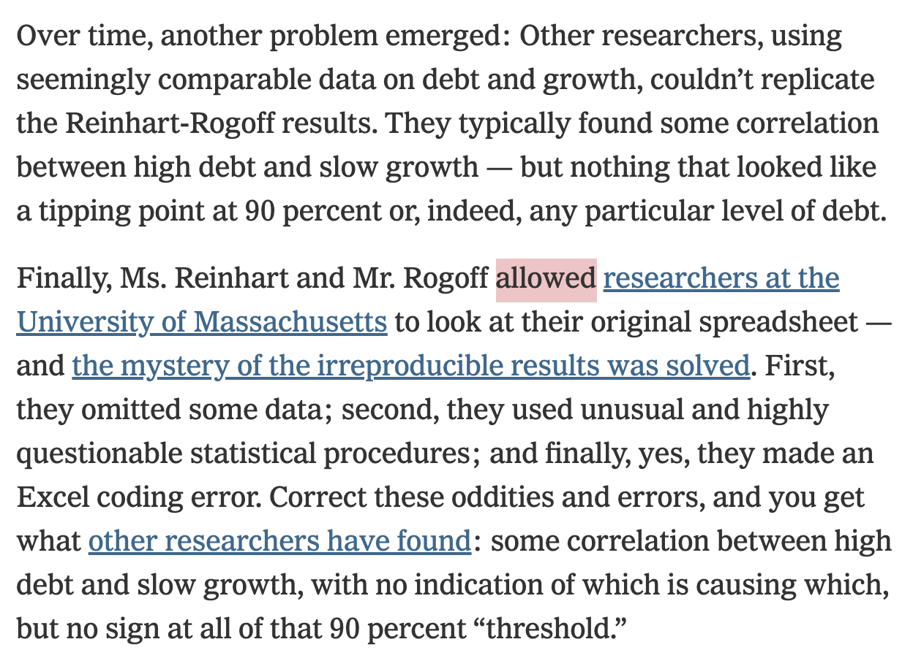
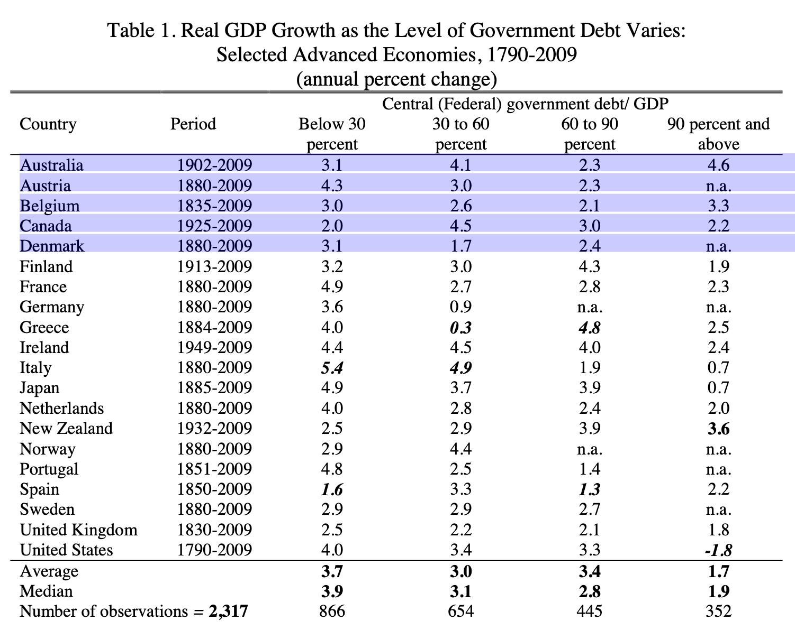
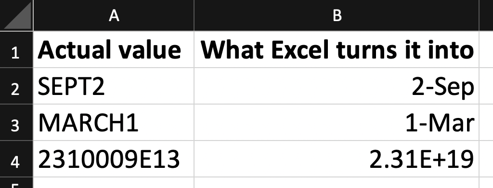
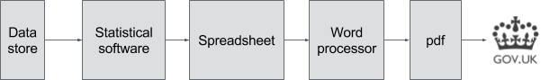
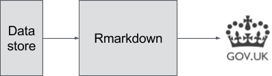
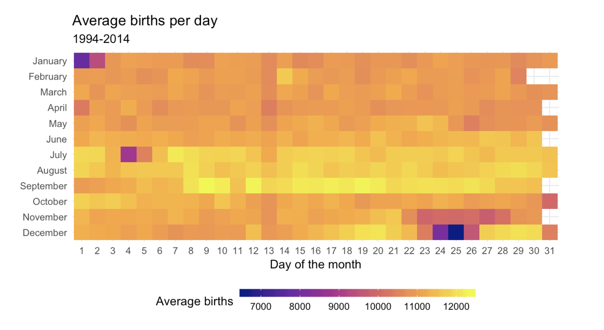

```{r setup, include=FALSE}
knitr::opts_chunk$set(warning = FALSE, message = FALSE, 
                      fig.retina = 3, fig.align = "center")
```

```{r packages-data, include=FALSE}
library(tidyverse)
library(flair)
```

class: center middle main-title section-title-4

# Amounts and Proportions

.class-info[

**Session 4**

.light[PMAP 8921: Data Visualization with R<br>
Andrew Young School of Policy Studies<br>
May 2020]

]

---

name: outline
class: title title-inv-7

# Plan for today

--

.box-1.medium.sp-after-half[Reproducibility]

--

.box-3.medium.sp-after-half[Amounts]

--

.box-5.medium.sp-after-half[Proportions]


---

name: reproducibility
class: center middle section-title section-title-1 animated fadeIn

# Reproducibility

---

layout: true
class: title title-1

---

# Why am I making you learn R?

--

.box-inv-1.sp-after[Pivot Tables do the same thing!]

.center[
<figure>
  
</figure>
]

---

# Why am I making you learn R?

&nbsp;

--

.box-inv-1.medium[More powerful]

--

.box-inv-1.medium[Free and open source]

--

.box-inv-1.medium.sp-after[Reproducibility]

---

# Austerity and Excel

.pull-left[

<figure>
  
</figure>

.box-inv-1[Debt:GDP ratio<br>90%+ → −0.1% growth]

]

--

.pull-right.center[

<figure>
  
  <figcaption>Paul Ryan's 2013 House budget resolution</figcaption>
</figure>

]

???

[2013 House Budget Resolution](https://republicans-budget.house.gov/uploadedfiles/pathtoprosperity2013.pdf)

---

# Austerity and Excel

.pull-left.center[

<figure>
  
  <figcaption>Thomas Herndon</figcaption>
</figure>

]

--

.pull-right.center[

<figure>
  
  <figcaption>From <a href="https://www.nytimes.com/2013/04/19/opinion/krugman-the-excel-depression.html" target="_blank">Paul Krugman, "The Excel Depression"</a></figcaption>
</figure>

]

???

[Paul Krugman on the reproducibility crisis](https://www.nytimes.com/2013/04/19/opinion/krugman-the-excel-depression.html)

---

# Austerity and Excel

.center[
<figure>
  
</figure>
]

--

.box-inv-1[Debt:GDP ratio = 90%+ → 2.2% growth (!!)]

---

# Genes and Excel

.pull-left-3[
.box-inv-1[Septin 2]
]

.pull-middle-3[
.box-inv-1[Membrane-Associated Ring Finger (C3HC4) 1]
]

.pull-right-3[
.box-inv-1[2310009E13]
]

--

.center.sp-after[
<figure>
  
</figure>
]

--

.center[
.box-1[20% of genetics papers between 2005–2015 (!!!)]
]

---

# General guidelines

.box-inv-1.medium[Don't touch the raw data]

.box-1[If you do, explain what you did!]

--

.box-inv-1.medium[Use self-documenting, reproducible code]

.box-1[R Markdown!]

--

.box-inv-1.medium[Use open formats]

.box-1[Use .csv, not .xlsx]

---

# R Markdown in real life

.pull-left.center[

<figure>
  
  <figcaption><a href="https://peerj.com/preprints/3182.pdf" target="_blank">Airbnb, ggplot, and rmarkdown</a></figcaption>
</figure>

]

--

.pull-right.center[

&nbsp;

<figure>
  
</figure>

<figure>
  
  <figcaption><a href="https://dataingovernment.blog.gov.uk/2017/03/27/reproducible-analytical-pipeline/" target="_blank">The UK's reproducible analysis pipeline</a></figcaption>
</figure>

]

???

https://peerj.com/preprints/3182.pdf + https://gdsdata.blog.gov.uk/2017/03/27/reproducible-analytical-pipeline/ 


---

layout: false
name: amounts
class: center middle section-title section-title-3 animated fadeIn

# Amounts

---

layout: true
class: title title-3

---

# Yay bar plots!

.box-inv-3[We are a lot better at visualizing<br>line lengths than angles and areas]

.pull-left[

```{r example-pie, echo=FALSE, fig.dim=c(4.8, 3), out.width="100%"}
example_df <- tribble(
  ~group, ~count,
  "President", 21,
  "Prime minister", 24,
  "King", 45,
  "General", 10
) %>% 
  arrange(desc(count)) %>% 
  mutate(group = fct_inorder(group))

ggplot(example_df, aes(x = "", y = count, fill = group)) +
  geom_col() +
  coord_polar(theta = "y") +
  labs(fill = "Head of state") +
  theme_void()
```

]

.pull-right[

```{r example-bar, echo=FALSE, fig.dim=c(4.8, 3), out.width="100%"}
ggplot(example_df, aes(x = group, y = count, fill = group)) +
  geom_col() +
  guides(fill = FALSE) +
  labs(x = "Head of state", y = "Count") +
  theme_minimal()
```

]

---

# Oh no bar plots!

.pull-left.center[

<figure>
  
</figure>

]

--

.pull-right.center[

<figure>
  
</figure>

]

???

https://blog.ed.gov/2014/10/progress-on-education-is-helping-fuel-our-economys-growth/ and https://www.mediamatters.org/fox-news/dishonest-fox-charts-obamacare-enrollment-edition and https://twitter.com/ObamaWhiteHouse/status/517743415375974401

---

# Start at zero

.box-inv-3.medium.sp-after[The entire line length matters,<br>so don't truncate it!]

--

.box-3.large.sp-after[Always start at 0]

--

.box-inv-3.sp-after[(Or don't use bars)]

---

# Bar plots and summary statistics

.box-inv-3.medium[\#barbarplots]

.center[
<video controls>
  <source src="https://datavizm20.s3.amazonaws.com/barbarcharts.mp4" type="video/mp4">
  <figcaption><a href="https://www.kickstarter.com/projects/1474588473/barbarplots" target="_blank">See the original at Kickstarter</a> if the video doesn't work in your browser</figcaption>
</video>
]

???

[\#barbarplot Kickstarter campaign](https://www.kickstarter.com/projects/1474588473/barbarplots)

---

# Bar plots and summary statistics

.pull-left[

```{r animal-weight-bar, echo=FALSE, fig.dim=c(4.8, 3.75), out.width="100%"}
set.seed(1234)
animals <- tibble(animal = c(rep(c("Small cat", "Big cat"), each = 250), rep("Dog", 500))) %>% 
  mutate(weight = case_when(
    animal == "Small cat" ~ rnorm(n(), 20, 5),
    animal == "Big cat" ~ rnorm(n(), 60, 5),
    animal == "Dog" ~ rnorm(n(), 40, 10)
  )) %>% 
  mutate(animal_type = ifelse(str_detect(animal, "cat"), "Cats", "Dogs"))

animals_mean <- animals %>% 
  group_by(animal_type) %>% 
  summarize(avg_weight = mean(weight))

ggplot(animals_mean, aes(x = animal_type, y = avg_weight, fill = animal_type)) + 
  geom_col() +
  labs(x = NULL, y = "Weight") +
  guides(fill = FALSE)
```

]

--

.pull-right[

```{r animal-weight-points, echo=FALSE, fig.dim=c(4.8, 3.75), out.width="100%"}
ggplot(animals, aes(x = animal_type, y = weight, color = animal_type)) +
  geom_point(position = position_jitter(height = 0), size = 1) +
  stat_summary(geom = "point", fun = "mean", size = 5, color = "darkred") +
  labs(x = NULL, y = "Weight") +
  guides(color = FALSE)
```

]

---

# Show more data with strip plots

.left-code[
```{r strip-plot, tidy=FALSE, message=FALSE, fig.show="hide", fig.dim=c(4.8, 3.75), out.width="100%"}
ggplot(animals, 
       aes(x = animal_type, 
           y = weight, 
           color = animal_type)) +
  geom_point(position = position_jitter(height = 0),
             size = 1) +
  labs(x = NULL, y = "Weight") +
  guides(color = FALSE)
```
]

.right-plot[
`)
]

---

# Show more data with beeswarm plots

.left-code[
```{r beeswarm-plot, tidy=FALSE, message=FALSE, fig.show="hide", fig.dim=c(4.8, 3.75), out.width="100%"}
library(ggbeeswarm)

ggplot(animals, aes(x = animal_type, 
                    y = weight, 
                    color = animal_type)) +
  geom_beeswarm(size = 1) +
  # Or try this too:
  # geom_quasirandom() +
  labs(x = NULL, y = "Weight") +
  guides(color = FALSE)
```
]

.right-plot[
`)
]

---

# Combine boxplots with points

.left-code[
```{r boxplot-plot, tidy=FALSE, message=FALSE, fig.show="hide", fig.dim=c(4.8, 3.75), out.width="100%"}
ggplot(animals, aes(x = animal_type, 
                    y = weight, 
                    color = animal_type)) +
  geom_boxplot(width = 0.5) +
  geom_point(position = position_jitter(height = 0), 
             size = 1, alpha = 0.5) +
  labs(x = NULL, y = "Weight") +
  guides(color = FALSE)
```
]

.right-plot[
`)
]

---

# Combine violins with points

.left-code[
```{r violin-plot, tidy=FALSE, message=FALSE, fig.show="hide", fig.dim=c(4.8, 3.75), out.width="100%"}
ggplot(animals, aes(x = animal_type, 
                    y = weight, 
                    color = animal_type)) +
  geom_violin(width = 0.5) +
  geom_point(position = position_jitter(height = 0), 
             size = 1, alpha = 0.5) +
  labs(x = NULL, y = "Weight") +
  guides(color = FALSE)
```
]

.right-plot[
`)
]

---

# Overlapping ridgeplots

.left-code[
```{r ridgeplot-plot, tidy=FALSE, message=FALSE, fig.show="hide", fig.dim=c(4.8, 3.75), out.width="100%", message=FALSE}
library(ggridges)

ggplot(animals, aes(x = weight, 
                    y = animal_type, 
                    fill = animal_type)) +
  geom_density_ridges() +
  labs(x = "Weight", y = NULL) +
  guides(fill = FALSE)
```
]

.right-plot[
`)
]

---

# General rules

.box-inv-3.medium[Bar charts always start at zero]

--

.box-inv-3.medium[Don't use bars for summary statistics.<br>You throw away too much information.]

--

.box-inv-3.medium[The end of the bar is often all that matters]

---

# Lots of alternatives

.box-inv-3.SMALL[We'll use a summarized version of the gapminder dataset as an example]

.left-code.small-code[

```{r gapminder-bars, fig.show="hide", tidy=FALSE, message=FALSE, fig.dim=c(4.8, 3.5), out.width="100%"}
library(gapminder)
gapminder_continents <- gapminder %>% 
  filter(year == 2007) %>%  # Only look at 2007
  count(continent) %>%  # Get a count of continents
  arrange(desc(n)) %>%   # Sort descendingly by count
  # Make continent into an ordered factor
  mutate(continent = fct_inorder(continent))

ggplot(gapminder_continents, 
       aes(x = continent, y = n, fill = continent)) +
  geom_col() +
  guides(fill = FALSE) +
  labs(x = NULL, y = "Number of countries")
```
]

.right-plot[

`)

]

---

# Alternatives: Lollipop charts

.box-inv-3[Since the end of the bar is important, emphasize it the most]

.left-code[

```{r lollipop, fig.show="hide", tidy=FALSE, message=FALSE, fig.dim=c(4.8, 3.5), out.width="100%"}
ggplot(gapminder_continents,
       aes(x = continent, y = n, 
           color = continent)) +
  geom_pointrange(aes(ymin = 0, ymax = n)) +
  guides(color = FALSE) +
  labs(x = NULL, y = "Number of countries")
```
]

.right-plot[

`)

]

---

# Alternatives: Waffle charts

.box-inv-3[Show the individual observations as squares]

.left-code[

```{r waffle, fig.show="hide", tidy=FALSE, message=FALSE, fig.dim=c(4.8, 3.5), out.width="100%"}
# This has to be installed in a special way--you can't use the Packages panel. 
# Run this in your console:
# devtools::install_github("hrbrmstr/waffle")
library(waffle)

ggplot(gapminder_continents,
       aes(x = continent, y = n, 
           fill = continent)) +
  geom_waffle(aes(values = n),  # geom_waffle() needs a special values aesthetic
              n_rows = 9,  # It has lots of other options too
              flip = TRUE) +
  labs(fill = NULL) +
  coord_equal() +  # Make all the squares square
  theme_void()  # Use a completely empty theme
```

]

.right-plot[

`)

]

---

# Alternatives: Heatmaps

.box-inv-3[If exact counts are less important,<br>try a heatmap with `geom_tile()`]

.center[
<figure>
  
</figure>
]

---

layout: false
name: proportions
class: center middle section-title section-title-5 animated fadeIn

# Proportions

---

layout: true
class: title title-5

---

# Why proportions?

.box-inv-5.sp-after[Sometimes we want to compare values across<br>a whole population instead of looking at raw counts]

--

.box-inv-5[Only do this when it makes analytical sense!]

--

.box-5[COVID-19 amounts vs. proportions]

---

# Pie charts

.box-inv-5[Perceptual issues with angle and fill space]

--

.box-inv-5[Only okay(ish) if there are a few easily distinguishable categories]

--

.pull-left[

```{r pie-good, echo=FALSE, fig.dim=c(3.3, 2), out.width="100%"}
df_pie1 <- tribble(
  ~group, ~count,
  "A", 75,
  "B", 20,
  "C", 5
)

ggplot(df_pie1, aes(x = "", y = count, fill = group)) +
  geom_col() +
  coord_polar(theta = "y") +
  scale_fill_viridis_d(option = "plasma") +
  labs(fill = NULL) +
  theme_void()
```

]

.pull-right[

```{r pie-bad, echo=FALSE, fig.dim=c(3.3, 2), out.width="100%"}
df_pie2 <- tribble(
  ~group, ~count,
  "A", 15,
  "B", 16,
  "C", 18,
  "D", 13,
  "E", 14,
  "F", 11,
  "G", 13,
)

ggplot(df_pie2, aes(x = "", y = count, fill = group)) +
  geom_col() +
  coord_polar(theta = "y") +
  scale_fill_viridis_d(option = "plasma") +
  labs(fill = NULL) +
  theme_void()
```

]

---

# Alternatives

.box-inv-5[Bar plots]

--

.box-inv-5[Any of the alternatives to bar plots]

--

.box-inv-5[Treemaps and mosaic plots<br>(but these can still be really hard to interpret)]

---

# Treemaps and mosaic plots

.pull-left[

.box-inv-5[Treemaps with the [**treemapify**](https://cran.r-project.org/web/packages/treemapify/vignettes/introduction-to-treemapify.html) package]

<figure>
  
</figure>

]

.pull-right[

.box-inv-5[Mosaic plots with the [**ggmosaic**](https://cran.r-project.org/web/packages/ggmosaic/vignettes/ggmosaic.html) package]

<figure>
  
</figure>

]

---

# Alternatives

.box-inv-5[Bar plots]


.box-inv-5[Any of the alternatives to bar plots]


.box-inv-5[Treemaps and mosaic plots<br>(but these can still be really hard to interpret)]


.box-inv-5[Specialized figures like parliament plots]

---

# Parliament plots

.box-inv-5[Parliament plots with the [**ggparliament**](https://github.com/RobWHickman/ggparliament) package]

.pull-left[
<figure>
  
</figure>
]

.pull-right[
<figure>
  
</figure>
]
