```{r setup, include=FALSE}
knitr::opts_chunk$set(warning = FALSE, message = FALSE, 
                      fig.retina = 3, fig.align = "center")
```

```{r packages-data, include=FALSE}
library(tidyverse)
set.seed(1234)
```

class: center middle main-title section-title-4

# Uncertainty

.class-info[

**Session 6**

.light[PMAP 8921: Data Visualization with R<br>
Andrew Young School of Policy Studies<br>
May 2020]

]

---

name: outline
class: title title-inv-7

# Plan for today

--

.box-2.medium.sp-after-half[Communicating uncertainty]

--

.box-4.medium.sp-after-half[Visualizing uncertainty]


---

name: communicating
class: center middle section-title section-title-2 animated fadeIn

# Communicating<br>uncertainty

---

layout: true
class: title title-2

---

# The Bay of Pigs

.pull-left-wide[
<figure>
  
</figure>
]

--

.pull-right-narrow[
.box-inv-2[Joint Chiefs said "fair chance of success"]

.box-inv-2[In Pentagon-speak, that meant 3:1 odds of failure]

.box-inv-2[25% chance of success!]
]

???

When asked by President John F. Kennedy to assess the CIA invasion plan, the U.S. Joint Chiefs of Staff responded that it had a “fair chance” of success. Kennedy took that as a positive assessment. Instead, the Chiefs meant that they judged the chances of success as “3 to 1 against.” But this was never clarified at the time.

Source of story: <https://www.cia.gov/library/center-for-the-study-of-intelligence/csi-publications/books-and-monographs/sherman-kent-and-the-board-of-national-estimates-collected-essays/6words.html>

Chart of perceptions and probabilities: <https://www.cia.gov/library/center-for-the-study-of-intelligence/csi-publications/books-and-monographs/psychology-of-intelligence-analysis/fig18.gif/image.gif>

---

# Misperceptions of probability

.box-inv-2.medium.sp-after[1 in 5 vs. 20%]

--

.center[

```{r echo=FALSE, fig.width=8, fig.height=3}
tibble(x = rep(1:5, 2),
       y = rep(1:2, 5)) %>% 
  mutate_all(factor) %>% 
  mutate(highlight = x == 1) %>% 
  ggplot(aes(x = x, y = y, color = highlight)) +
  geom_point(size = 30) +
  scale_color_manual(values = c("grey90", "#FCCE25"), guide = FALSE) +
  theme_void() +
  theme(panel.background = element_rect(fill = "#0D0887"))
```

]

---

# Misperceptions of probability

.center[
<figure>
  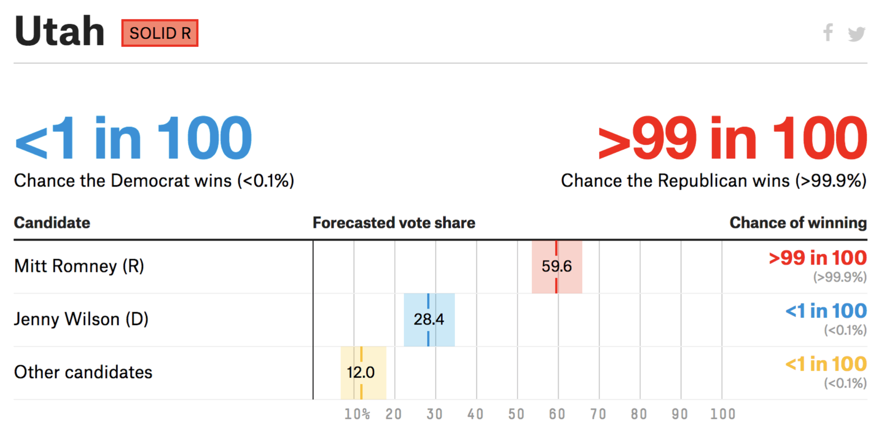
</figure>
]

???

UT Senate 2018 election forecast from FiveThirtyEight

---

# Misperceptions of probability

.center[
<figure>
  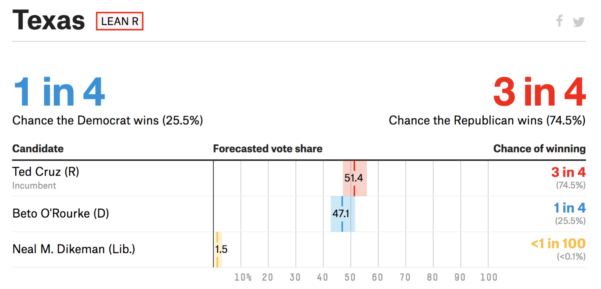
</figure>
]

???

TX Senate 2018 election forecast from FiveThirtyEight

---

# Misperceptions of probability

.box-inv-2.sp-after[Chance of rain = Probability × Area]

--

.pull-left-wide[
<figure>
  
</figure>
]

--

.pull-right-narrow[

.box-inv-2[100% chance in<br>1/3 of the city]

.box-inv-2[0% chance in<br>2/3 of the city]

.box-inv-2[Chance of rain<br>for city = 33%]

]

???

When it doesn't rain, it doesn't mean the forecast was wrong!

30% chance doesn't mean it’ll rain just 30% hard. Average over tons of simulations. Depends on geographic area

---

# Misperceptions of probability

.center[
<figure>
  
</figure>
]

???

[Coins](http://www.freestockphotos.biz/stockphoto/8215)

---

# Misperceptions of probability

.pull-left[
<figure>
  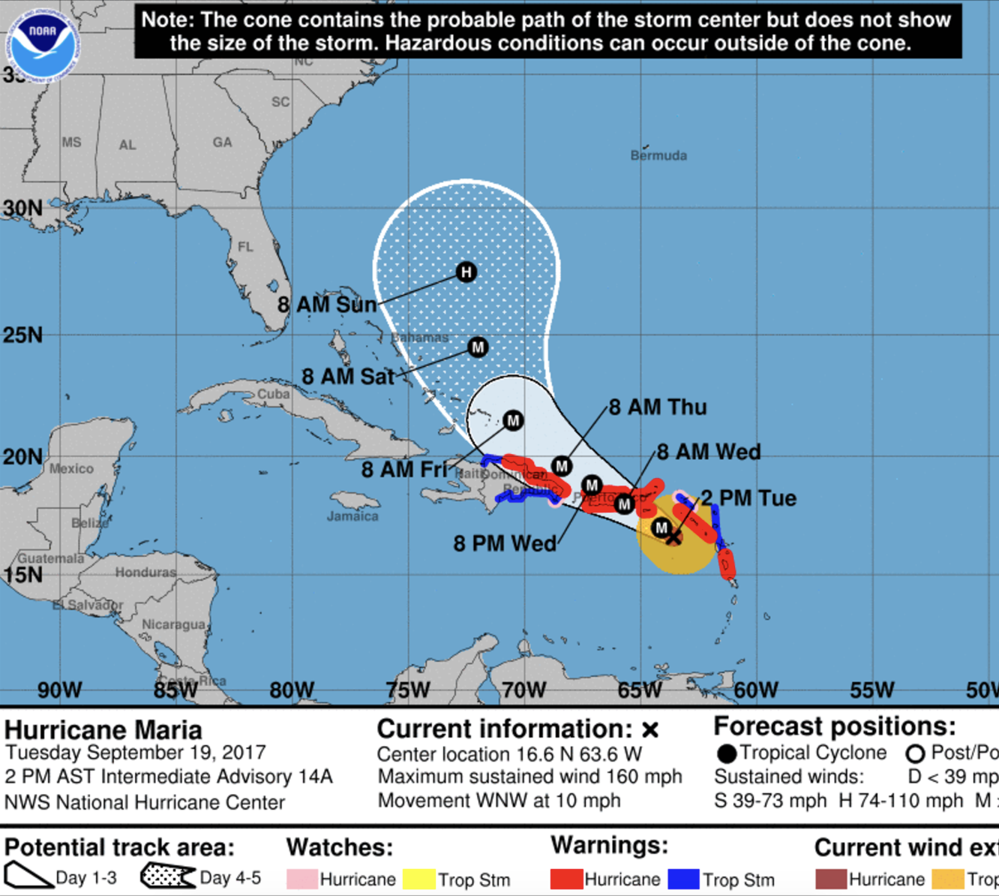
  <figcaption>Hurricane Maria map, NOAA</figcaption>
</figure>
]

--

.pull-right[
<figure>
  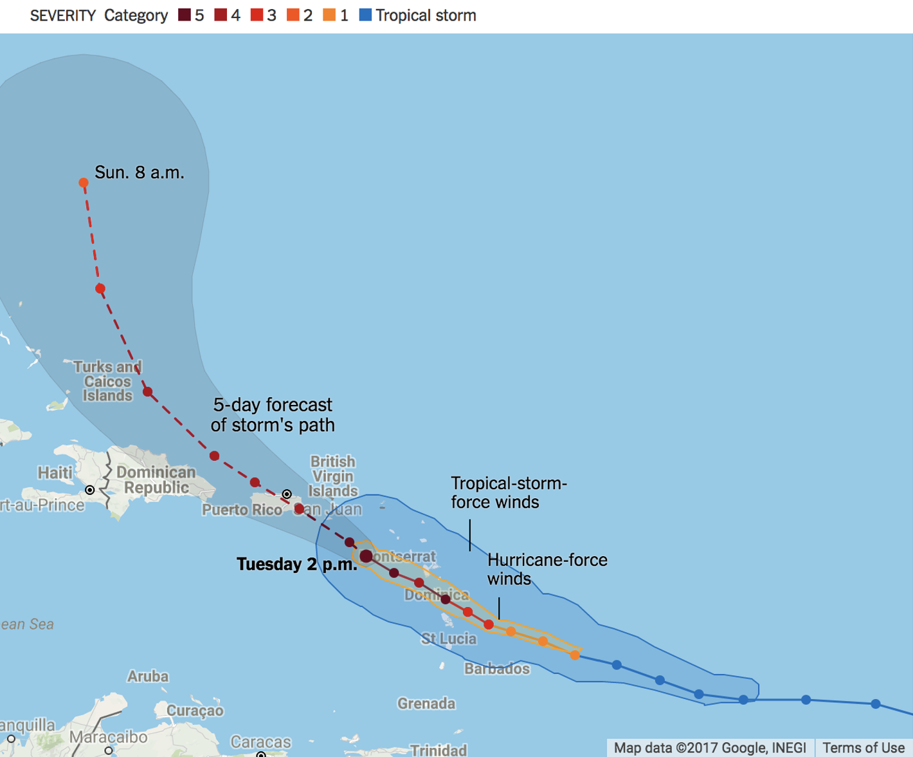
  <figcaption>Hurricane Maria map, New York Times</figcaption>
</figure>
]

???

Or just use a sharpie!

---

# The needle

.center[
<figure>
  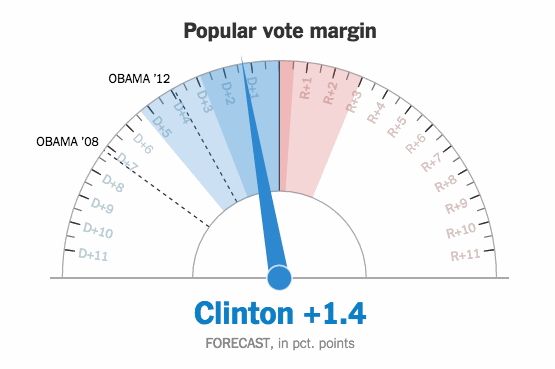
</figure>
]

???

Extra data is implicitly encoded in aesthetics - temporal sequence of ballot counting – how did Amanda Cox defend this?


Via https://www.vis4.net/blog/2016/11/jittery-gauges-election-forecast/

---

# The needle

.pull-left[
<figure>
  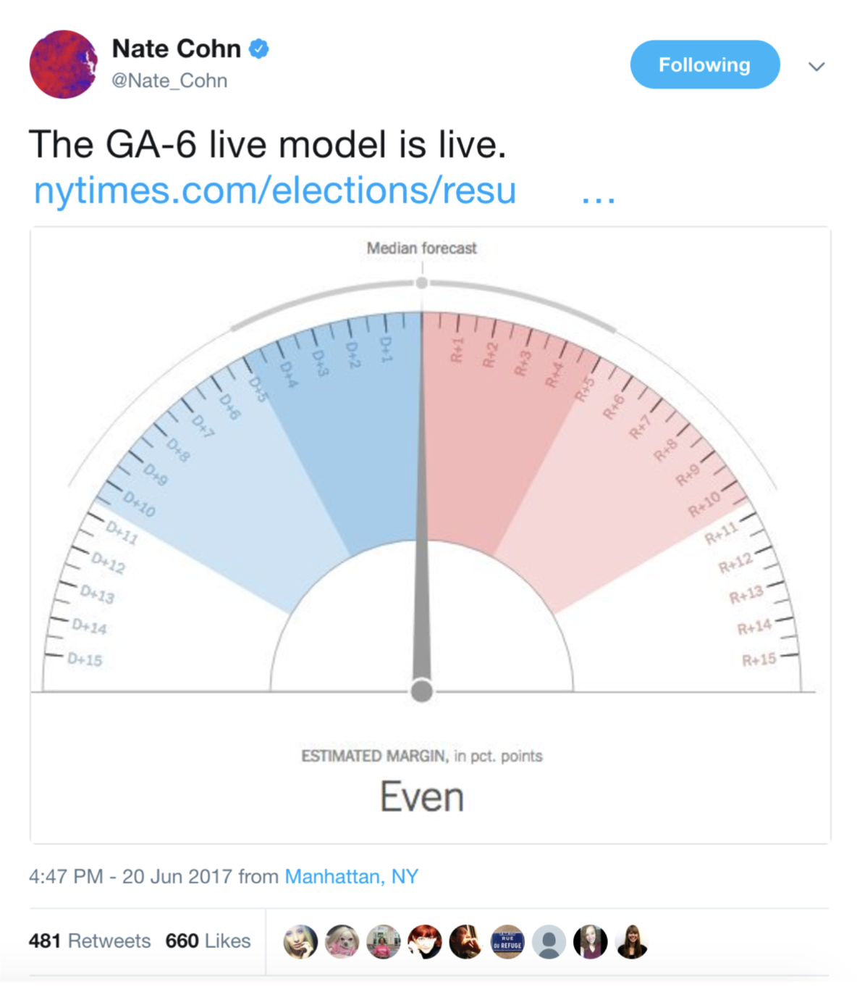
</figure>
]

.pull-right[
<figure>
  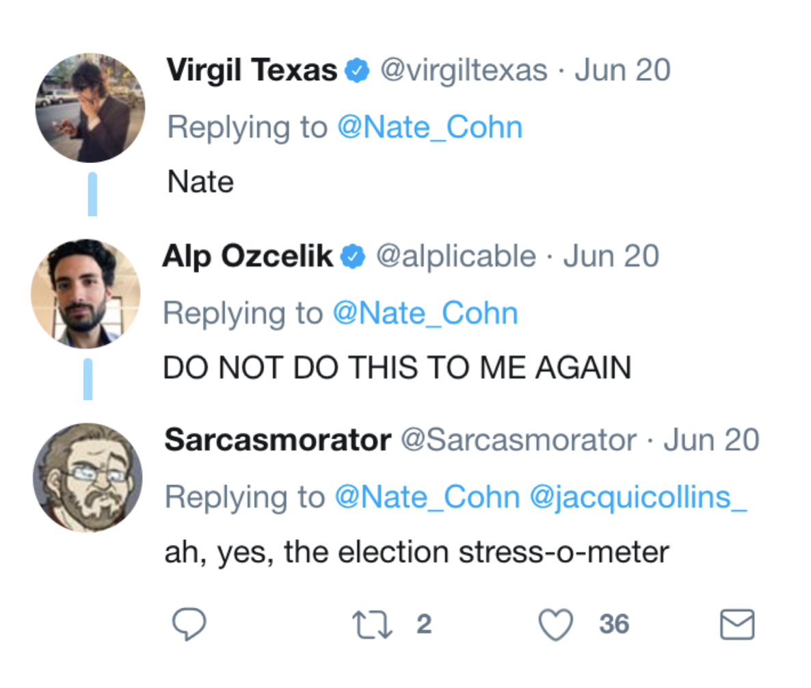
</figure>
]

---

layout: false
name: visualizing
class: center middle section-title section-title-4 animated fadeIn

# Visualizing uncertainty

---

layout: true
class: title title-4

---

# Problems with single numbers

.pull-left[

```{r animal-weight-bar, echo=FALSE, fig.dim=c(4.8, 3.75), out.width="100%"}
set.seed(1234)
animals <- tibble(animal = c(rep(c("Small cat", "Big cat"), each = 250), rep("Dog", 500))) %>% 
  mutate(weight = case_when(
    animal == "Small cat" ~ rnorm(n(), 20, 5),
    animal == "Big cat" ~ rnorm(n(), 60, 5),
    animal == "Dog" ~ rnorm(n(), 40, 10)
  )) %>% 
  mutate(animal_type = ifelse(str_detect(animal, "cat"), "Cats", "Dogs"))

animals_mean <- animals %>% 
  group_by(animal_type) %>% 
  summarize(avg_weight = mean(weight))

ggplot(animals_mean, aes(x = animal_type, y = avg_weight, fill = animal_type)) + 
  geom_col() +
  labs(x = NULL, y = "Weight") +
  guides(fill = FALSE)
```

]

--

.pull-right[

```{r animal-weight-points, echo=FALSE, fig.dim=c(4.8, 3.75), out.width="100%"}
ggplot(animals, aes(x = animal_type, y = weight, color = animal_type)) +
  geom_point(position = position_jitter(height = 0), size = 1) +
  stat_summary(geom = "point", fun = "mean", size = 5, color = "darkred") +
  labs(x = NULL, y = "Weight") +
  guides(color = FALSE)
```

]

---

# More information is always better

.box-inv-4.medium[Avoid visualizing single numbers when you have a whole range or distribution of numbers]

--

.box-4[Uncertainty in single variables]

--

.box-4[Uncertainty across multiple variables]

--

.box-4[Uncertainty in models and simulations]

---

# Histograms

.box-inv-4[Put data into equally spaced buckets (or bins),<br>plot how many rows are in each bucket]

.left-code[
```{r basic-histogram, tidy=FALSE, message=FALSE, fig.show="hide", fig.dim=c(4.8, 3), out.width="100%"}
library(gapminder)

gapminder_2002 <- gapminder %>% 
  filter(year == 2002)

ggplot(gapminder_2002,
       aes(x = lifeExp)) +
  geom_histogram()
```
]

.right-plot[
`)
]

---

# Histograms: Bin width

.box-inv-4[No official rule for what makes a good bin width]

.pull-left-3[
.box-4.small[Too narrow:<br>`binwidth = 0.2`]

```{r hist-too-narrow, echo=FALSE, fig.dim=c(4.5, 4.2), out.width="100%"}
ggplot(gapminder_2002, aes(x = lifeExp)) +
  geom_histogram(binwidth = 0.2)
```

]

--

.pull-middle-3[
.box-4.small[Too wide:<br>`binwidth = 50`]

```{r hist-too-wide, echo=FALSE, fig.dim=c(4.5, 4.2), out.width="100%"}
ggplot(gapminder_2002, aes(x = lifeExp)) +
  geom_histogram(binwidth = 50)
```
]

--

.pull-right-3[
.box-4.small[(One type of) just right:<br>`binwidth = 2`]

```{r hist-just-right, echo=FALSE, fig.dim=c(4.5, 4.2), out.width="100%"}
ggplot(gapminder_2002, aes(x = lifeExp)) +
  geom_histogram(binwidth = 2)
```
]

---

# Histogram tips

.pull-left[
.box-inv-4.small[Add a border to the bars<br>for readability]

.box-4.tiny[`geom_histogram(..., color = "white")`]

```{r hist-border, echo=FALSE, fig.dim=c(4.5, 3), out.width="100%"}
ggplot(gapminder_2002, aes(x = lifeExp)) +
  geom_histogram(binwidth = 5, color = "white")
```
]

--

.pull-right[
.box-inv-4.small[Set the boundary;<br>bucket now 50–55, not 47.5–52.5]

.box-4.tiny[`geom_histogram(..., boundary = 50)`]

```{r hist-boundary, echo=FALSE, fig.dim=c(4.5, 3), out.width="100%"}
ggplot(gapminder_2002, aes(x = lifeExp)) +
  geom_histogram(binwidth = 5, color = "white", boundary = 50)
```

]

---

# Density plots

.box-inv-4[Use calculus to find the probability of each x value]

.left-code[
```{r basic-density, tidy=FALSE, message=FALSE, fig.show="hide", fig.dim=c(4.8, 3), out.width="100%"}
ggplot(gapminder_2002,
       aes(x = lifeExp)) +
  geom_density(fill = "grey60", 
               color = "grey30")
```
]

.right-plot[
`)
]

---

# Density plots: Kernels and bandwidths

.box-inv-4[Different options for calculus change the plot shape]

.pull-left-3[
.box-4.small[`bw = 1`]

```{r gaussian-bw-1, echo=FALSE, fig.dim=c(4.5, 4.2), out.width="100%"}
ggplot(gapminder_2002, aes(x = lifeExp)) +
  geom_density(fill = "grey60", color = "grey30",
               kernel = "gaussian", bw = 1)
```

]

--

.pull-middle-3[
.box-4.small[`bw = 10`]

```{r gaussian-bw-10, echo=FALSE, fig.dim=c(4.5, 4.2), out.width="100%"}
ggplot(gapminder_2002, aes(x = lifeExp)) +
  geom_density(fill = "grey60", color = "grey30",
               kernel = "gaussian", bw = 10)
```
]

--

.pull-right-3[
.box-4.small[`bw = "nrd0"` <small>(default)</small>]

```{r gaussian-bw-auto, echo=FALSE, fig.dim=c(4.5, 4.2), out.width="100%"}
ggplot(gapminder_2002, aes(x = lifeExp)) +
  geom_density(fill = "grey60", color = "grey30",
               kernel = "gaussian")
```
]

---

# Density plots: Kernels and bandwidths

.box-inv-4[Different options for calculus change the plot shape]

.pull-left-3[
.box-4.small[`kernel = "gaussian"`]

```{r gaussian-kernel-gaussian, echo=FALSE, fig.dim=c(4.5, 4.2), out.width="100%"}
ggplot(gapminder_2002, aes(x = lifeExp)) +
  geom_density(fill = "grey60", color = "grey30",
               kernel = "gaussian")
```

]

--

.pull-middle-3[
.box-4.small[`"epanechnikov"`]

```{r gaussian-kernel-epanechnikov, echo=FALSE, fig.dim=c(4.5, 4.2), out.width="100%"}
ggplot(gapminder_2002, aes(x = lifeExp)) +
  geom_density(fill = "grey60", color = "grey30",
               kernel = "epanechnikov")
```
]

--

.pull-right-3[
.box-4.small[`"rectangular"`]

```{r gaussian-kernel-rectangular, echo=FALSE, fig.dim=c(4.5, 4.2), out.width="100%"}
ggplot(gapminder_2002, aes(x = lifeExp)) +
  geom_density(fill = "grey60", color = "grey30",
               kernel = "rectangular")
```
]

---

# Box plots

.box-inv-4[Show specific distributional numbers]

.left-code[
```{r basic-boxplot, tidy=FALSE, message=FALSE, fig.show="hide", fig.dim=c(4.8, 2.75), out.width="100%"}
ggplot(gapminder_2002,
       aes(x = lifeExp)) +
  geom_boxplot()
```
]

.right-plot[
`)
]

---

# Box plots

```{r boxplot-explanation, echo=FALSE, fig.width=8, fig.height=3.5, out.width="100%"}
hwy_50 <- quantile(mpg$hwy, 0.5)
hwy_25 <- quantile(mpg$hwy, 0.25)
hwy_75 <- quantile(mpg$hwy, 0.75)
hwy_iqr <- hwy_75 - hwy_25

# Technically this should just be hwy_75 + 1.5 * IQR, but ggplot does odd things
# with small datasets
hwy_min <- boxplot.stats(mpg$hwy)$stats[1]
hwy_max <- boxplot.stats(mpg$hwy)$stats[5]

hwy_out <- boxplot.stats(mpg$hwy)$out

ggplot(mpg, aes(x = hwy)) +
  geom_boxplot(fill = "#FFC0DC", color = "#BF3984") +
  annotate(geom = "text", x = hwy_50, y = 0.48, label = "Median", fontface = "bold") +
  annotate(geom = "segment", x = hwy_50, xend = hwy_50, y = 0.44, yend = 0.4,
           arrow = arrow(length = unit(0.3, "lines"))) +
  annotate(geom = "text", x = hwy_25, y = 0.48, label = "25%", fontface = "bold") +
  annotate(geom = "segment", x = hwy_25, xend = hwy_25, y = 0.44, yend = 0.4,
           arrow = arrow(length = unit(0.3, "lines"))) +
  annotate(geom = "text", x = hwy_75, y = 0.48, label = "75%", fontface = "bold") +
  annotate(geom = "segment", x = hwy_75, xend = hwy_75, y = 0.44, yend = 0.4,
           arrow = arrow(length = unit(0.3, "lines"))) +
  annotate(geom = "text", x = hwy_25 + 0.5 * hwy_iqr, y = -0.52, 
           label = "Interquartile range (IQR)", fontface = "bold") +
  annotate(geom = "segment", x = c(hwy_25, hwy_75), xend = c(hwy_25, hwy_75), 
           y = -0.46, yend = -0.4, arrow = arrow(length = unit(0.3, "lines"))) +
  annotate(geom = "segment", x = hwy_25, xend = hwy_75, y = -0.46, yend = -0.46) +
  annotate(geom = "text", x = hwy_min, y = 0.15, label = "Minimum\n25% − (1.5 × IQR)",
           hjust = 0, lineheight = 1, fontface = "bold") +
  annotate(geom = "segment", x = hwy_min, xend = hwy_min, y = 0.06, yend = 0.02,
           arrow = arrow(length = unit(0.3, "lines"))) +
  annotate(geom = "text", x = hwy_max, y = 0.15, label = "Maximum\n75% + (1.5 × IQR)",
           hjust = 1, lineheight = 1, fontface = "bold") +
  annotate(geom = "segment", x = hwy_max, xend = hwy_max, y = 0.06, yend = 0.02,
           arrow = arrow(length = unit(0.3, "lines")))  +
  annotate(geom = "text", x = min(hwy_out) + 0.5 * (max(hwy_out) - min(hwy_out)), y = -0.16, 
           label = "Outliers", fontface = "bold") +
  annotate(geom = "segment", x = c(min(hwy_out), max(hwy_out)), xend = c(min(hwy_out), max(hwy_out)), 
           y = -0.1, yend = -0.04, arrow = arrow(length = unit(0.3, "lines"))) +
  annotate(geom = "segment", x = min(hwy_out), xend = max(hwy_out),
           y = -0.1, yend = -0.1) +
  labs(x = "Highway MPG") +
  theme_minimal() +
  theme(axis.text.y = element_blank(),
        axis.ticks.y = element_blank(),
        axis.title.y = element_blank(),
        panel.grid.major.y = element_blank(),
        panel.grid.minor.y = element_blank())
```

---

# Violin plots

.box-inv-4[Mirror density plot and flip]

.box-4.small[Often helpful to overlay other things on it]

.left-code[
```{r basic-violin, tidy=FALSE, message=FALSE, fig.show="hide", fig.dim=c(4.8, 2.75), out.width="100%"}
ggplot(gapminder_2002,
       aes(x = "", 
           y = lifeExp)) +
  geom_violin() +
  geom_boxplot(width = 0.1)
```
]

.right-plot[
`)
]

???

<https://xkcd.com/1967/>

---

# Uncertainty across multiple variables

.box-inv-4.medium.sp-after[Visualize the distribution of a<br>single variable across groups]

--

.box-inv-4.medium[Add a `fill` aesthetic or use faceting!]

---

# Multiple histograms

.box-inv-4[Fill with a different variable]

.box-4[This is bad and really hard to read though]

.left-code[
```{r histogram-fill, tidy=FALSE, message=FALSE, fig.show="hide", fig.dim=c(4.8, 2.75), out.width="100%"}
ggplot(gapminder_2002,
       aes(x = lifeExp,
           fill = continent)) +
  geom_histogram(binwidth = 5, 
                 color = "white", 
                 boundary = 50)
```
]

.right-plot[
`)
]

---

# Multiple histograms

.box-inv-4[Facet with a different variable]

.left-code[
```{r histogram-facet, tidy=FALSE, message=FALSE, fig.show="hide", fig.dim=c(4.8, 3.25), out.width="100%"}
ggplot(gapminder_2002,
       aes(x = lifeExp,
           fill = continent)) +
  geom_histogram(binwidth = 5, 
                 color = "white", 
                 boundary = 50) +
  guides(fill = FALSE) +
  facet_wrap(vars(continent))
```
]

.right-plot[
`)
]

---

# Pyramid histograms

.left-code.small-code[
```{r gapminder-pyramid, tidy=FALSE, message=FALSE, fig.show="hide", fig.dim=c(4.8, 4.2), out.width="100%"}
gapminder_intervals <- gapminder %>% 
  filter(year == 2002) %>% 
  mutate(africa = 
           ifelse(continent == "Africa", 
                  "Africa", 
                  "Not Africa")) %>% 
  mutate(age_buckets = 
           cut(lifeExp, 
               breaks = seq(30, 90, by = 5))) %>% 
  group_by(africa, age_buckets) %>% 
  summarize(total = n())

ggplot(gapminder_intervals, 
       aes(y = age_buckets,
           x = ifelse(africa == "Africa", 
                      total, -total),
           fill = africa)) +
  geom_col(width = 1, color = "white")
```
]

.right-plot[
`)
]

???

There's no way to use `geom_histogram()` to do this, but we can fake it with `geom_col()`

---

# Multiple densities: Transparency

.left-code[
```{r density-fill, tidy=FALSE, message=FALSE, fig.show="hide", fig.dim=c(4.8, 4.2), out.width="100%"}
ggplot(filter(gapminder_2002, 
              continent != "Oceania"),
       aes(x = lifeExp,
           fill = continent)) +
  geom_density(alpha = 0.5)
```
]

.right-plot[
`)
]

---

# Multiple densities: Ridge plots

.left-code[
```{r density-ridges, tidy=FALSE, message=FALSE, fig.show="hide", fig.dim=c(4.8, 4.2), out.width="100%"}
library(ggridges)

ggplot(filter(gapminder_2002, 
              continent != "Oceania"),
       aes(x = lifeExp,
           fill = continent,
           y = continent)) +
  geom_density_ridges()
```
]

.right-plot[
`)
]

---

# Multiple densities: Ridge plots

.center[
<figure>
  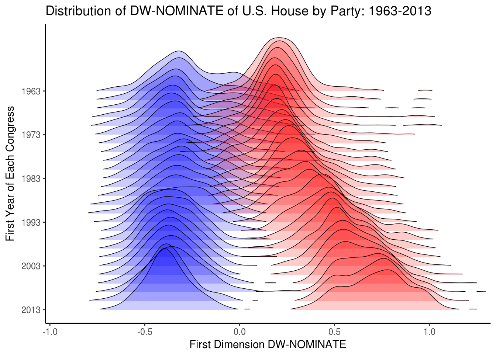
</figure>
]

---

# Multiple geoms: `gghalves`

.left-code[
```{r gghalves, tidy=FALSE, message=FALSE, fig.show="hide", fig.dim=c(4.8, 4.2), out.width="100%"}
library(gghalves)

ggplot(filter(gapminder_2002, 
              continent != "Oceania"),
       aes(y = lifeExp,
           x = continent,
           color = continent)) +
  geom_half_boxplot(side = "l") +
  geom_half_point(side = "r") 
```
]

.right-plot[
`)
]

---

# Multiple geoms: Raincloud plots

.left-code[
```{r raincloud, tidy=FALSE, message=FALSE, fig.show="hide", fig.dim=c(4.8, 4.2), out.width="100%"}
library(gghalves)

ggplot(filter(gapminder_2002, 
              continent != "Oceania"),
       aes(y = lifeExp,
           x = continent,
           color = continent)) +
  geom_half_point(side = "l", size = 0.3) + 
  geom_half_boxplot(side = "l", width = 0.5, 
                    alpha = 0.3, nudge = 0.1) +
  geom_half_violin(aes(fill = continent), 
                   side = "r") +
  guides(fill = FALSE, color = FALSE) +
  coord_flip()  #<<
```
]

.right-plot[
`)
]

---

# Uncertainty in model estimates

.box-inv-4[(You'll learn how to make these in the next session)]

.center[
<figure>
  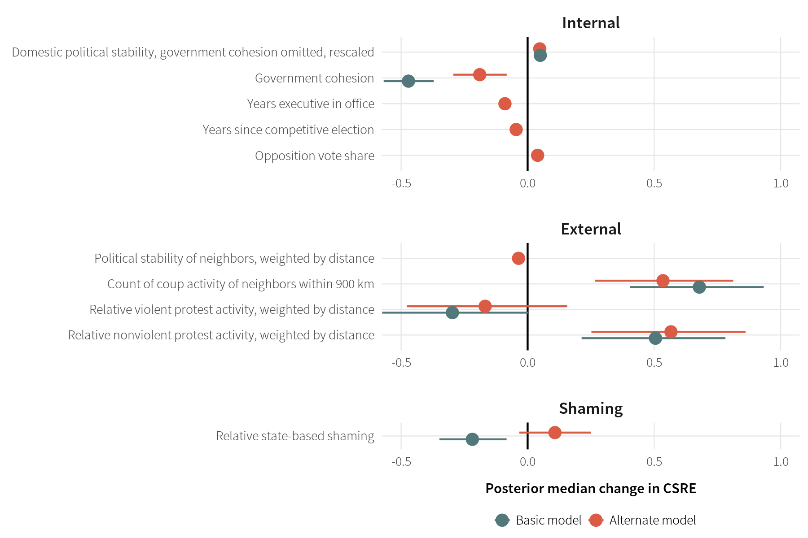
</figure>
]

---

# Uncertainty in model estimates

.center[
<figure>
  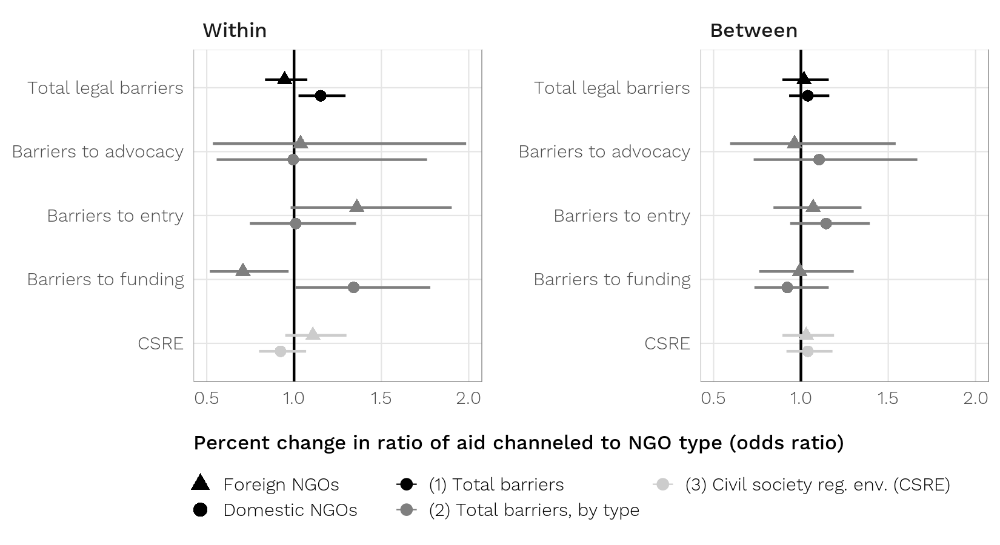
</figure>
]

---

# Uncertainty in model estimates

.center[
<figure>
  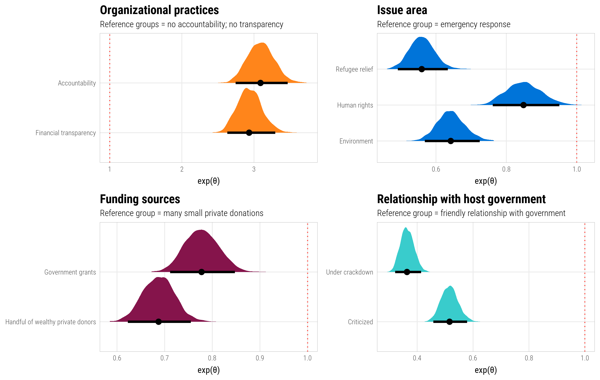
</figure>
]

---

# Uncertainty in model effects

.box-inv-4[(You'll learn how to make these in the next session)]

.center[
<figure>
  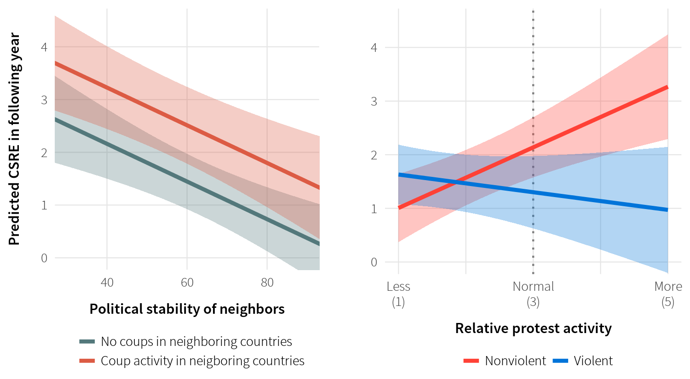
</figure>
]

---

# Uncertainty in model outcomes

.center[
<figure>
  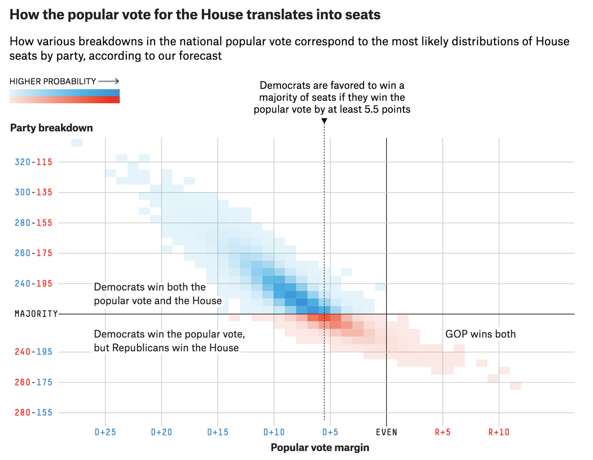
  <figcaption>FiveThirtyEight's 2018 midterms model outcomes plot</figcaption
</figure>
]
