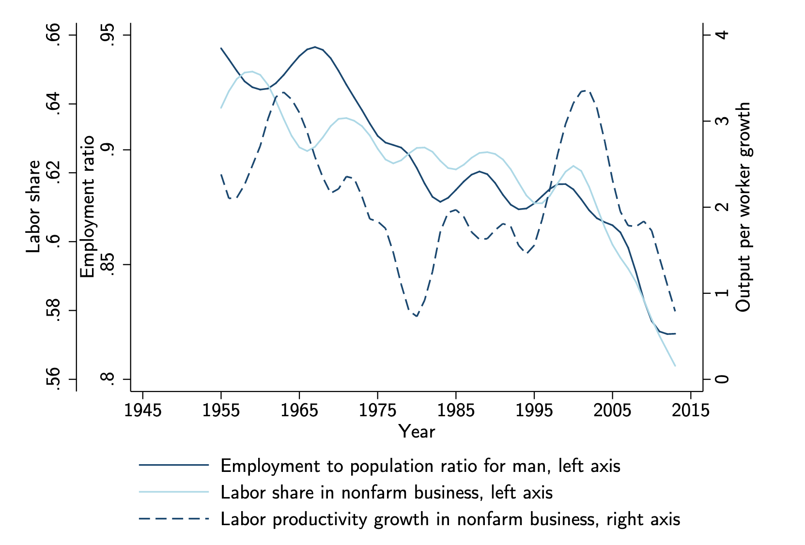
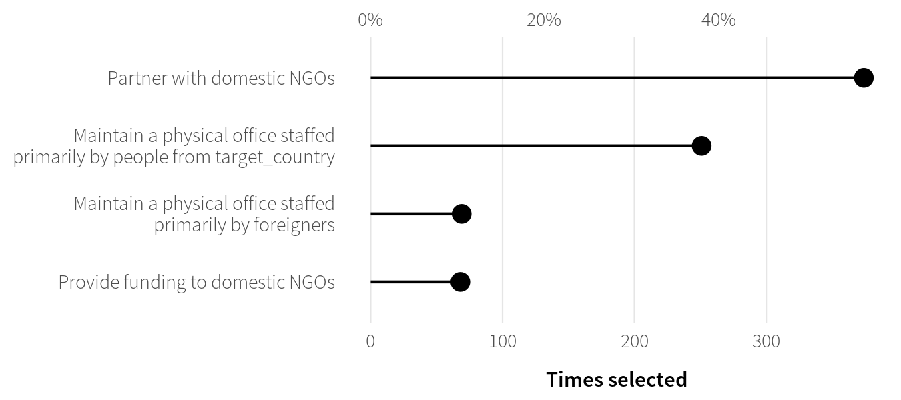
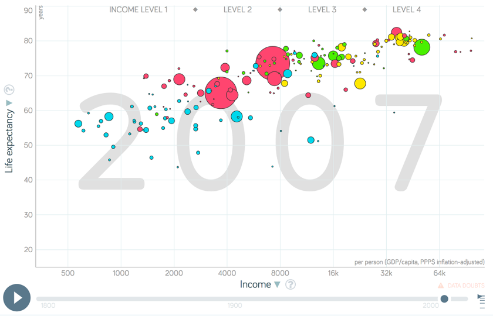
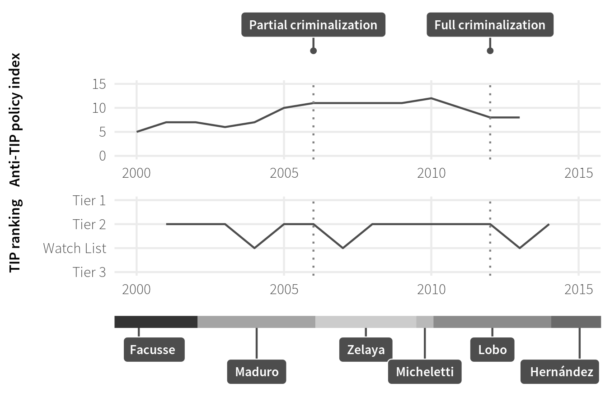
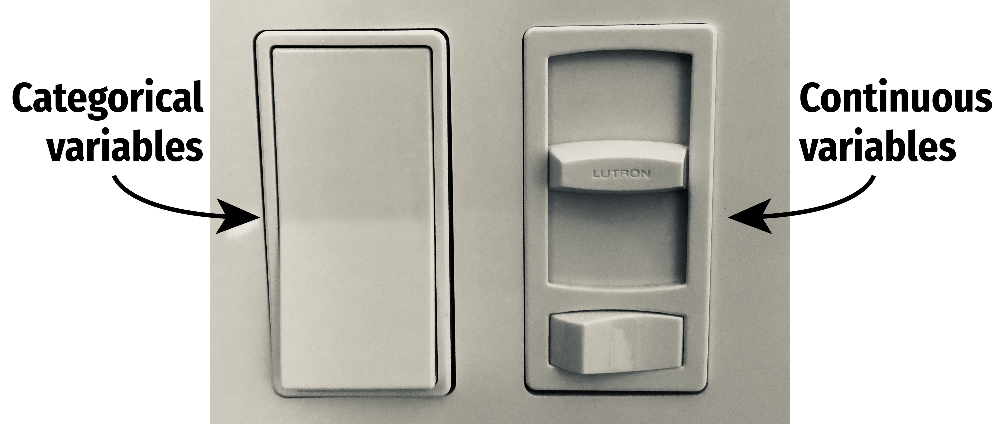

```{r setup, include=FALSE}
knitr::opts_chunk$set(warning = FALSE, message = FALSE, 
                      fig.retina = 3, fig.align = "center")
```

```{r packages-data, include=FALSE}
library(tidyverse)
library(broom)
library(scales)
set.seed(1234)
```

class: center middle main-title section-title-4

# Relationships

.class-info[

**Session 7**

.light[PMAP 8921: Data Visualization with R<br>
Andrew Young School of Policy Studies<br>
May 2020]

]

---

name: outline
class: title title-inv-7

# Plan for today

--

.box-5.medium.sp-after-half[The dangers of dual y-axes]

--

.box-1.medium.sp-after-half[Visualizing correlations]

--

.box-6.medium.sp-after-half[Visualizing regressions]


---

name: dual-y-axes
class: center middle section-title section-title-5 animated fadeIn

# The dangers of<br>dual y-axes

---

layout: true
class: title title-5

---

# Stop eating margarine!

.center[
<figure>
  
  <figcaption>Source: <a href="https://www.tylervigen.com/spurious-correlations" target="_blank">Tyler Vigen's spurious correlations</a></figcaption>
</figure>
]

---

# Why not use double y-axes?

.box-inv-5.medium[You have to choose where the y-axes<br>start and stop, which means…]

--

.box-inv-5.medium[…you can force the two trends<br>to line up however you want!]

---

# It even happens in *The Economist!*

.center[
<figure>
  
</figure>
]

???

<https://medium.economist.com/mistakes-weve-drawn-a-few-8cdd8a42d368>

---

# The rare triple y-axis!

.center[
<figure>
  
  <figcaption>Source: Daron Acemoglu and Pascual Restrepo, "The Race Between Man and Machine:<br>Implications of Technology for Growth, Factor Shares and Employment"</figcaption>
</figure>
]

???

Daron Acemoglu and Pascual Restrepo, ["The Race Between Man and Machine:<br>Implications of Technology for Growth, Factor Shares and Employment"](https://economics.mit.edu/files/10866)

---

# When is it legal?

--

.box-inv-5.medium[When the two axes measure the same thing]

--

.center[
<figure>
  
</figure>
]

---

# When is it legal?

```{r atl-weather-dual-nice, echo=FALSE, message=FALSE, fig.dim=c(8, 3.5), out.width="100%"}
weather_atl <- read_csv("data/atl-weather-2019.csv")

ggplot(weather_atl, aes(x = time, y = temperatureHigh)) +
  geom_line() +
  geom_smooth() +
  scale_y_continuous(sec.axis = 
                       sec_axis(trans = ~ (32 - .) * -5/9,
                                name = "Celsius")) +
  labs(x = NULL, y = "Fahrenheit",
       title = "Daily high temperatures in Atlanta",
       subtitle = "January 1 2019–December 31, 2019",
       caption = "Source: Dark Sky") +
  theme_minimal() +
  theme(plot.title = element_text(face = "bold"))
```

---

# Adding a second scale in R

.left-code[
```{r atl-weather-dual, tidy=FALSE, message=FALSE, fig.show="hide", fig.dim=c(4.8, 4.2), out.width="100%"}
# From the uncertainty example
weather_atl <- 
  read_csv("data/atl-weather-2019.csv")

ggplot(weather_atl, 
       aes(x = time, y = temperatureHigh)) +
  geom_line() +
  geom_smooth() +
  scale_y_continuous(
    sec.axis = 
      sec_axis(trans = ~ (32 - .) * -5/9,
               name = "Celsius")
  ) +
  labs(x = NULL, y = "Fahrenheit")
```
]

.right-plot[
`)
]

---

# Adding a second scale in R

.left-code[
```{r cars-dual, tidy=FALSE, message=FALSE, fig.show="hide", fig.dim=c(4.8, 4.2), out.width="100%"}
car_counts <- mpg %>% 
  group_by(drv) %>% 
  summarize(total = n())

total_cars <- sum(car_counts$total)

ggplot(car_counts,
       aes(x = drv, y = total, 
           fill = drv)) +
  geom_col() +
  scale_y_continuous(
    sec.axis = sec_axis(
      trans = ~ . / total_cars,
      labels = scales::percent)
  ) +
  guides(fill = FALSE)
```
]

.right-plot[
`)
]

---

# Alternative 1: Use another aesthetic

.center[
<figure>
  
</figure>
]

---

# Alternative 2: Use multiple plots

.center[
<figure>
  
  <figcaption>Anti-trafficking policy timeline in Honduras</figcaption>
</figure>
]

---

# Alternative 2: Use multiple plots

.left-code[
```{r atl-weather-patchwork, tidy=FALSE, message=FALSE, fig.show="hide", fig.dim=c(4.8, 4.2), out.width="100%"}
library(patchwork)

temp_plot <- ggplot(weather_atl, 
                    aes(x = time, 
                        y = temperatureHigh)) +
  geom_line() + geom_smooth() +
  labs(x = NULL, y = "Fahrenheit")

humid_plot <- ggplot(weather_atl, 
                     aes(x = time, 
                         y = humidity)) +
  geom_line() + geom_smooth() +
  labs(x = NULL, y = "Humidity")

temp_plot + humid_plot +
  plot_layout(ncol = 1, 
              heights = c(0.7, 0.3))
```
]

.right-plot[
`)
]


---

layout: false
name: correlation
class: center middle section-title section-title-1 animated fadeIn

# Visualizing correlations

---

layout: true
class: title title-1

---

# What is correlation?

.pull-left-narrow[
$$
r_{x, y} = \frac{\operatorname{cov}(x, y)}{\sigma_x \sigma_y}
$$
]

.pull-right-wide[
.box-inv-1.medium[As the value of X goes up,<br>Y tends to go up (or down)<br>a lot/a little/not at all]

.box-1[Says nothing about *how much*<br>Y changes when X changes]
]

---

# Correlation values

.pull-left[
&nbsp;

<table>
  <tr>
    <th class="cell-left">r</th>
    <th class="cell-left">Rough meaning</th>
  </tr>
  <tr>
    <td class="cell-left">±0.1–0.3&emsp;</td>
    <td class="cell-left">Modest</td>
  </tr>
  <tr>
    <td class="cell-left">±0.3–0.5</td>
    <td class="cell-left">Moderate</td>
  </tr>
  <tr>
    <td class="cell-left">±0.5–0.8</td>
    <td class="cell-left">Strong</td>
  </tr>
  <tr>
    <td class="cell-left">±0.8–0.9</td>
    <td class="cell-left">Very strong</td>
  </tr>
</table>
]

.pull-right[

```{r correlation-grid, echo=FALSE, fig.dim=c(4.8, 4.2), out.width="100%"}
make_correlated_data <- function(r, n = 200) {
  MASS::mvrnorm(n = n, 
                mu = c(0, 0), 
                Sigma = matrix(c(1, r, r, 1), nrow = 2), 
                empirical = TRUE) %>% 
    magrittr::set_colnames(c("x", "y")) %>% 
    as_tibble()
}

cor_grid <- tibble(r = c(0.2, 0.4, 0.75, 0.9)) %>% 
  mutate(data = map(r, make_correlated_data)) %>% 
  unnest(data)

ggplot(cor_grid, aes(x = x, y = y)) +
  geom_point(size = 2, color = "white", fill = "black", pch = 21) +
  facet_wrap(vars(r), labeller = label_both) +
  # theme_minimal() +
  theme(strip.text = element_text(face = "bold", size = rel(1.3), hjust = 0))
```

]

---

# Scatterplot matrices

.left-code[
```{r scatterplot-matrix, tidy=FALSE, message=FALSE, warning=FALSE, fig.show="hide", fig.dim=c(4.8, 3.75), out.width="100%"}
library(GGally)

cars_smaller <- mtcars %>% 
  select(mpg, cyl, gear, hp, qsec)

ggpairs(cars_smaller)
```
]

.right-plot[
`)
]

---

# Correlograms: Heatmaps

```{r cor-heatmap, echo=FALSE, message=FALSE, fig.dim=c(8, 3.5), out.width="100%"}
cars_cor <- mtcars %>% 
  select(mpg, cyl, gear, hp, qsec) %>% 
  cor()

cars_cor[lower.tri(cars_cor)] <- NA

cars_cor_long <- cars_cor %>% 
  as.data.frame() %>% 
  rownames_to_column("measure2") %>% 
  pivot_longer(cols = -measure2,
               names_to = "measure1",
               values_to = "cor") %>% 
  mutate(nice_cor = round(cor, 2)) %>% 
  mutate(measure1 = fct_inorder(measure1),
         measure2 = fct_inorder(measure2)) %>% 
  filter(!is.na(cor)) %>% 
  filter(measure2 != measure1)

ggplot(cars_cor_long, aes(x = measure2, y = measure1, fill = cor)) +
  geom_tile() +
  geom_text(aes(label = nice_cor)) +
  scale_fill_gradient2(low = "#E16462", mid = "white", high = "#0D0887",
                       limits = c(-1, 1)) +
  labs(x = NULL, y = NULL) +
  coord_equal() +
  theme_minimal() +
  theme(panel.grid = element_blank())
```


---

# Correlograms: Points

```{r cor-points, echo=FALSE, message=FALSE, fig.dim=c(8, 3.5), out.width="100%"}
ggplot(cars_cor_long, aes(x = measure2, y = measure1, color = cor)) +
  geom_point(aes(size = abs(cor))) +
  scale_color_gradient2(low = "#E16462", mid = "white", high = "#0D0887",
                        limits = c(-1, 1)) +
  scale_size_area(max_size = 15, limits = c(-1, 1), guide = FALSE) +
  labs(x = NULL, y = NULL) +
  coord_equal() +
  theme_minimal() +
  theme(panel.grid = element_blank())
```

---

layout: false
name: regression
class: center middle section-title section-title-6 animated fadeIn

# Visualizing regressions

---

layout: true
class: title title-6

---

# Drawing lines

.pull-left[

```{r cars-line, echo=FALSE, fig.dim=c(4.8, 4.2), out.width="100%"}
ggplot(mpg, aes(x = displ, y = hwy)) +
  geom_point() +
  geom_smooth(method = "lm", formula = "y ~ x")
```

]

--

.pull-right[

```{r cars-residuals, echo=FALSE, fig.dim=c(4.8, 4.2), out.width="100%"}
cars_model <- lm(hwy ~ displ, data = mpg)
cars_fitted <- augment(cars_model)

ggplot(mpg, aes(x = displ, y = hwy)) +
  geom_point() +
  geom_smooth(method = "lm", formula = "y ~ x") +
  geom_segment(data = cars_fitted, 
               aes(x = displ, xend = displ,
                   y = hwy, yend = .fitted))
```

]

---

# Drawing lines with math

$$
y = mx + b
$$

<table>
  <tr>
    <td class="cell-center">\(y\)</td>
    <td class="cell-left">&ensp;A number</td>
  </tr>
  <tr>
    <td class="cell-center">\(x\)</td>
    <td class="cell-left">&ensp;A number</td>
  </tr>
  <tr>
    <td class="cell-center">\(m\)</td>
    <td class="cell-left">&ensp;Slope (\(\frac{\text{rise}}{\text{run}}\))</td>
  </tr>
  <tr>
    <td class="cell-center">\(b\)</td>
    <td class="cell-left">&ensp;y-intercept</td>
  </tr>
</table>

---

# Slopes and intercepts

.pull-left[

$$
y = 2x - 1
$$

```{r simple-line-1, echo=FALSE, fig.dim=c(4.8, 3.5), out.width="100%"}
ggplot(data = tibble(x = 0:5), aes(x = x)) +
  stat_function(fun = function(x) 2 * x - 1, 
                color = "#BF3984", size = 1.5) +
  geom_vline(xintercept = 0) +
  geom_hline(yintercept = 0) +
  scale_x_continuous(breaks = 0:5) +
  scale_y_continuous(breaks = -1:9) +
  theme(panel.grid.minor = element_blank())
```

]

--

.pull-right[

$$
y = -0.5x + 6
$$

```{r simple-line-2, echo=FALSE, fig.dim=c(4.8, 3.5), out.width="100%"}
ggplot(data = tibble(x = 0:14), aes(x = x)) +
  stat_function(fun = function(x) -0.5 * x + 6, 
                color = "#BF3984", size = 1.5) +
  geom_vline(xintercept = 0) +
  geom_hline(yintercept = 0) +
  scale_x_continuous(breaks = 0:14) +
  scale_y_continuous(breaks = -1:9) +
  theme(panel.grid.minor = element_blank())
```

]

---

# Drawing lines with stats

$$
\hat{y} = \beta_0 + \beta_1 x_1 + \varepsilon
$$

<table>
  <tr>
    <td class="cell-center">\(y\)</td>
    <td class="cell-center">\(\hat{y}\)</td>
    <td class="cell-left">&ensp;Outcome variable (DV)</td>
  </tr>
  <tr>
    <td class="cell-center">\(x\)</td>
    <td class="cell-center">\(x_1\)</td>
    <td class="cell-left">&ensp;Explanatory variable (IV)</td>
  </tr>
  <tr>
    <td class="cell-center">\(m\)</td>
    <td class="cell-center">\(\beta_1\)</td>
    <td class="cell-left">&ensp;Slope</td>
  </tr>
  <tr>
    <td class="cell-center">\(b\)</td>
    <td class="cell-center">\(\beta_0\)</td>
    <td class="cell-left">&ensp;y-intercept</td>
  </tr>
  <tr>
    <td class="cell-center">&emsp;&emsp;</td>
    <td class="cell-center">&emsp;\(\varepsilon\)&emsp;</td>
    <td class="cell-left">&ensp;Error (residuals)</td>
  </tr>
</table>

---

# Building models in R

```{r model-template, eval=FALSE}
name_of_model <- lm(<Y> ~ <X>, data = <DATA>)

summary(name_of_model)  # See model details
```

--

```{r broom examples, eval=FALSE}
library(broom)

# Convert model results to a data frame for plotting
tidy(name_of_model)

# Convert model diagnostics to a data frame
glance(name_of_model)
```

---

# Modeling displacement and MPG

.pull-left[
$$
\hat{\text{hwy}} = \beta_0 + \beta_1 \text{displ} + \varepsilon
$$

```{r build-car-model}
car_model <- lm(hwy ~ displ,
                data = mpg)
```

]

.pull-right[

```{r cars-line-again, echo=FALSE, fig.dim=c(4.8, 4.2), out.width="100%"}
ggplot(mpg, aes(x = displ, y = hwy)) +
  geom_point() +
  geom_smooth(method = "lm", formula = "y ~ x")
```

]

---

# Modeling displacement and MPG

.small-code[
```{r tidy-car-model}
tidy(car_model, conf.int = TRUE)
```
]

--

.small-code[
```{r glance-car-model}
glance(car_model)
```
]

---

# Translating results to math

.pull-left[

.small-code[
```{r tidy-car-model-small, echo=FALSE}
tidy(car_model, conf.int = TRUE) %>% 
  select(term, estimate)
```
]

.small[
$$
\hat{\text{hwy}} = 35.7 + (-3.53) \times \text{displ} + \varepsilon
$$
]
]

.pull-right[

```{r cars-line-again-again, echo=FALSE, fig.dim=c(4.8, 4.2), out.width="100%"}
ggplot(mpg, aes(x = displ, y = hwy)) +
  geom_point() +
  geom_smooth(method = "lm", formula = "y ~ x", fullrange = TRUE) +
  coord_cartesian(xlim = c(0, 7))
```

]

---

# Template for single variables

.box-inv-6.medium[A one unit increase in X is *associated* with<br>a β<sub>1</sub> increase (or decrease) in Y, on average]

$$
\hat{\text{hwy}} = \beta_0 + \beta_1 \text{displ} + \varepsilon
$$

$$
\hat{\text{hwy}} = 35.7 + (-3.53) \times \text{displ} + \varepsilon
$$

--

.box-6[This is easy to visualize! It's a line!]

---

# Multiple regression

.box-inv-6[We're not limited to just one explanatory variable!]

--

$$
\hat{y} = \beta_0 + \beta_1 x_1 + \beta_2 x_2 + \cdots + \beta_n x_n + \varepsilon
$$

&nbsp;

--

```{r build-car-model-big}
car_model_big <- lm(hwy ~ displ + cyl + drv,
                    data = mpg)
```

$$
\hat{\text{hwy}} = \beta_0 + \beta_1 \text{displ} + \beta_2 \text{cyl} + \beta_3 \text{drv:f} + \beta_4 \text{drv:r} + \varepsilon
$$

---

# Modeling lots of things and MPG

.small-code[
```{r tidy-car-model-big}
tidy(car_model_big, conf.int = TRUE)
```
]

--

$$
\begin{aligned}
\hat{\text{hwy}} =&\ 33.1 + (-1.12) \times \text{displ} + (-1.45) \times \text{cyl} \ + \\
&(5.04) \times \text{drv:f} + (4.89) \times \text{drv:r} + \varepsilon
\end{aligned}
$$

---

# Sliders and switches

.center[
<figure>
  
</figure>
]

---

# Sliders and switches

.center[
<figure>
  
</figure>
]

---

# Template for continuous variables

.box-inv-6[*Holding everything else constant*, a one unit increase in X is *associated* with a β<sub>n</sub> increase (or decrease) in Y, on average]

$$
\begin{aligned}
\hat{\text{hwy}} =&\ 33.1 + (-1.12) \times \text{displ} + (-1.45) \times \text{cyl} \ + \\
&(5.04) \times \text{drv:f} + (4.89) \times \text{drv:r} + \varepsilon
\end{aligned}
$$

--

.box-6.small[On average, a one unit increase in cylinders is associated with<br>1.45 lower highway MPG, holding everything else constant]

---

# Template for categorical variables

.box-inv-6[*Holding everything else constant*, Y is β<sub>n</sub> units larger (or smaller) in X<sub>n</sub>, compared to X<sub>omitted</sub>, on average]

$$
\begin{aligned}
\hat{\text{hwy}} =&\ 33.1 + (-1.12) \times \text{displ} + (-1.45) \times \text{cyl} \ + \\
&(5.04) \times \text{drv:f} + (4.89) \times \text{drv:r} + \varepsilon
\end{aligned}
$$

--

.box-6[On average, front-wheel drive cars have 5.04 higher highway MPG than 4-wheel-drive cars, holding everything else constant]

---

# Good luck visualizng all this!

&nbsp;

.box-inv-6.medium[You can't just draw a line!<br>There are too many moving parts!]

---

# Main problems

--

.box-inv-6[Each coefficient has its own estimate and standard errors]

--

.box-6.sp-after[Solution: Plot the coefficients and<br>their errors with a *coefficient plot*]

--

.box-inv-6[The results change as you move each<br>slider up and down and flip each switch on and off]

--

.box-6[Solution: Plot the *marginal effects* for<br>the coefficients you're interested in]

---

# Coefficient plots

.box-inv-6[Convert the model results to a data frame with `tidy()`]

.small-code[
```{r tidy-coef-plot-cars}
car_model_big <- lm(hwy ~ displ + cyl + drv, data = mpg)

car_coefs <- tidy(car_model_big, conf.int = TRUE) %>% 
  filter(term != "(Intercept)")  # We can typically skip plotting the intercept, so remove it
car_coefs
```
]

---

# Coefficient plots

.box-inv-6[Plot the estimate and confidence intervals with `geom_pointrange()`]

.left-code[
```{r coef-plot-cars, tidy=FALSE, message=FALSE, fig.show="hide", fig.dim=c(4.8, 3), out.width="100%"}
ggplot(car_coefs,
       aes(x = estimate, 
           y = fct_rev(term))) +
  geom_pointrange(aes(xmin = conf.low, 
                      xmax = conf.high)) +
  geom_vline(xintercept = 0, color = "red")
```
]

.right-plot[
`)
]

---

# Marginal effects plots

.box-inv-6[Remember that we interpret individual coefficients<br>while holding the others constant]

.box-6.small.sp-after[We move one slider while leaving all the other sliders and switches alone]

--

.box-inv-6[Same principle applies to visualizing the effect]

--

.box-6.small[Plug a bunch of values into the model and find the predicted outcome]

--

.box-6.small[Plot the values and predicted outcome]

---

# Marginal effects plots

.box-inv-6[Create a data frame of values you want to<br>manipulate and values you want to hold constant]

--

.box-6[Must include all the explanatory variables in the model]

---

# Marginal effects plots

.small-code[
```{r build-simple-new-data}
cars_new_data <- tibble(displ = seq(2, 7, by = 0.1),
                        cyl = mean(mpg$cyl),
                        drv = "f")

head(cars_new_data)
```
]

---

# Marginal effects plots

.box-inv-6[Plug each of those rows of data into the model with `augment()`]

.small-code[
```{r agument-simple-cars-data}
predicted_mpg <- augment(car_model_big, newdata = cars_new_data)

head(predicted_mpg)
```
]

---

# Marginal effects plots

.box-inv-6[Plot the fitted values for each row]

.box-6.small[Cylinders held at their mean; assumes front-wheel drive]

.left-code[
```{r mfx-plot-cars, tidy=FALSE, message=FALSE, fig.show="hide", fig.dim=c(4.8, 3), out.width="100%"}
ggplot(predicted_mpg,
       aes(x = displ, y = .fitted)) +
  geom_ribbon(aes(ymin = .fitted + 
                    (-1.96 * .se.fit),
                  ymax = .fitted + 
                    (1.96 * .se.fit)),
              fill = "#5601A4", 
              alpha = 0.5) +
  geom_line(size = 1, color = "#5601A4")
```
]

.right-plot[
`)
]

---

# Multiple effects at once

.box-inv-6[We can also move multiple<br>sliders and switches at the same time!]

--

.box-6[What's the marginal effect of increasing displacement<br>across the front-, rear-, and four-wheel drive cars?]

---

# Multiple effects at once

.box-inv-6[Create a new dataset with varying displacement<br>*and* varying drive, holding cylinders at its mean]

.box-6[The `expand_grid()` function does this]

---

# Multiple effects at once

.small-code[
```{r build-complex-new-data}
cars_new_data_fancy <- expand_grid(displ = seq(2, 7, by = 0.1),
                                   cyl = mean(mpg$cyl),
                                   drv = c("f", "r", "4"))

head(cars_new_data_fancy)
```
]

---

# Multiple effects at once

.box-inv-6[Plug each of those rows of data into the model with `augment()`]

.small-code[
```{r agument-complex-cars-data}
predicted_mpg_fancy <- augment(car_model_big, newdata = cars_new_data_fancy)

head(predicted_mpg_fancy)
```
]

---

# Multiple effects at once

.box-inv-6[Plot the fitted values for each row]

.box-6.small[Cylinders held at their mean; colored/filled by drive]

.left-code[
```{r mfx-plot-cars-fancy, tidy=FALSE, message=FALSE, fig.show="hide", fig.dim=c(4.8, 3), out.width="100%"}
ggplot(predicted_mpg_fancy,
       aes(x = displ, y = .fitted)) +
  geom_ribbon(aes(ymin = .fitted + 
                    (-1.96 * .se.fit),
                  ymax = .fitted + 
                    (1.96 * .se.fit),
                  fill = drv),
              alpha = 0.5) +
  geom_line(aes(color = drv), size = 1)
```
]

.right-plot[
`)
]

---

# Multiple effects at once

.box-inv-6[Plot the fitted values for each row]

.box-6.small[Cylinders held at their mean; colored/filled/facetted by drive]

.left-code[
```{r mfx-plot-cars-fancy-facet, tidy=FALSE, message=FALSE, fig.show="hide", fig.dim=c(4.8, 3), out.width="100%"}
ggplot(predicted_mpg_fancy,
       aes(x = displ, y = .fitted)) +
  geom_ribbon(aes(ymin = .fitted + 
                    (-1.96 * .se.fit),
                  ymax = .fitted + 
                    (1.96 * .se.fit),
                  fill = drv),
              alpha = 0.5) +
  geom_line(aes(color = drv), size = 1) + 
  guides(fill = FALSE, color = FALSE) + #<<
  facet_wrap(vars(drv)) #<<
```
]

.right-plot[
`)
]

---

# Not just OLS!

.box-inv-6[These plots are for an OLS model built with `lm()`]

.pull-left[
`)
]

.pull-right[
`)
]

---

# Any type of statistical model

.box-inv-6[The same techniques work for pretty much any model R can run]

--

.box-6.small[Logistic, probit, and multinomial regression (ordered and unordered)]

--

.box-6.small[Multilevel (i.e. mixed and random effects) regression]

--

.box-6.small[Bayesian models<br><small>(These are extra pretty with the [**tidybayes** package](https://github.com/mjskay/tidybayes))</small>]

--

.box-6.small.sp-after[Machine learning models]

--

.box-inv-6[If it has coefficients and/or if it makes predictions,<br>you can (and should) visualize it!]
