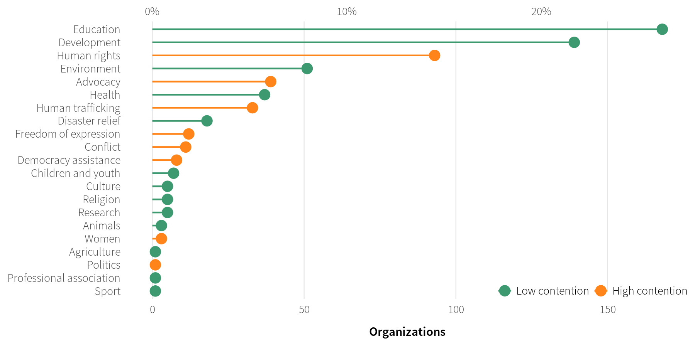
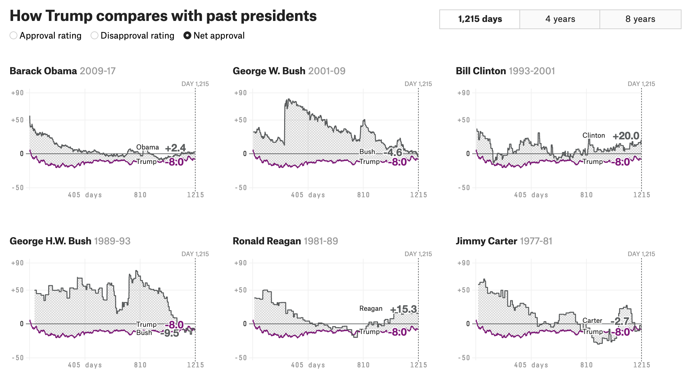
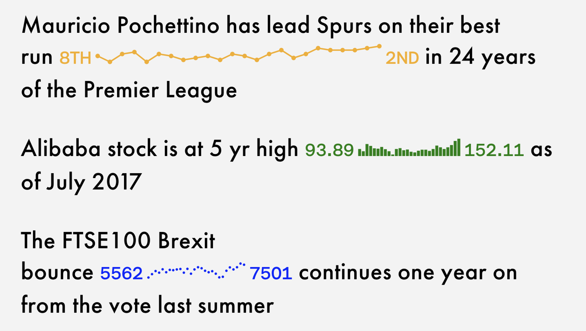
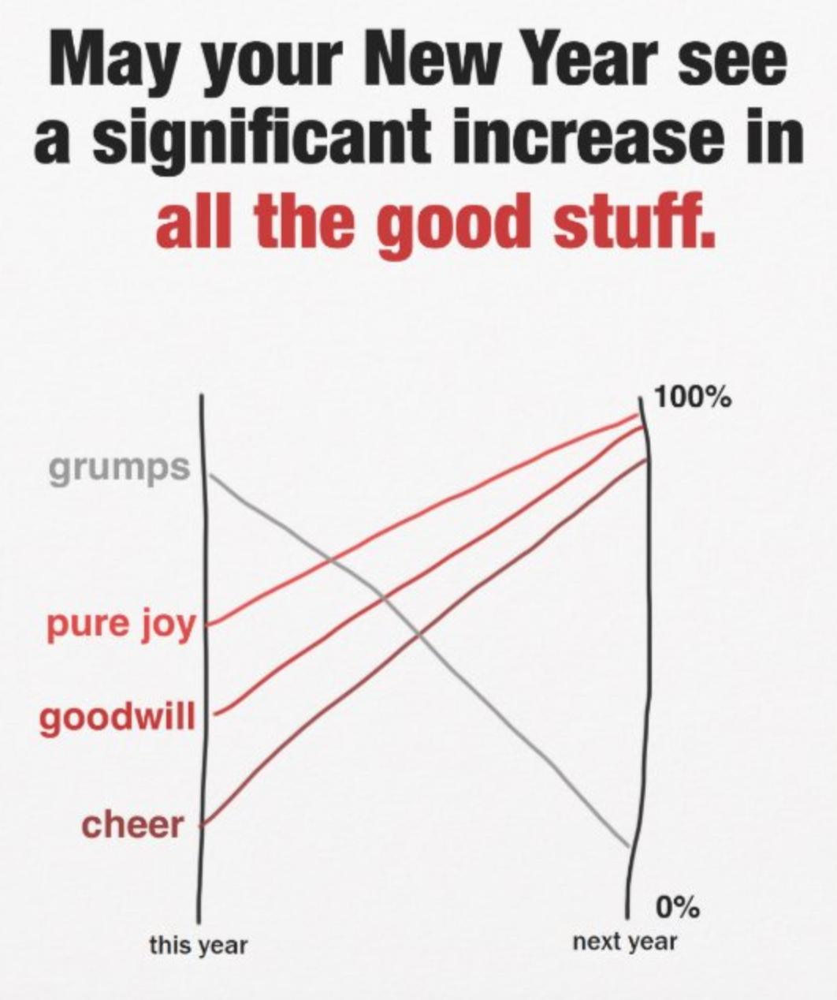
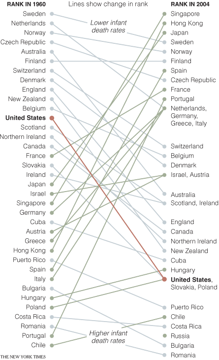
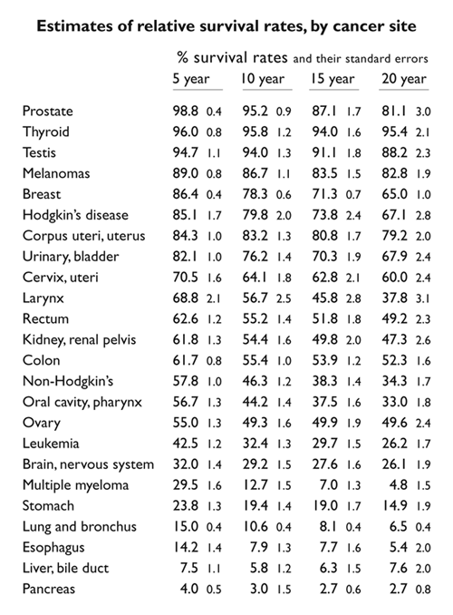
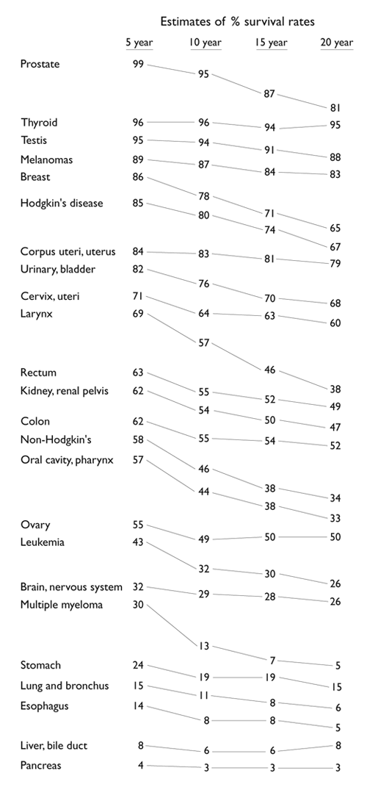
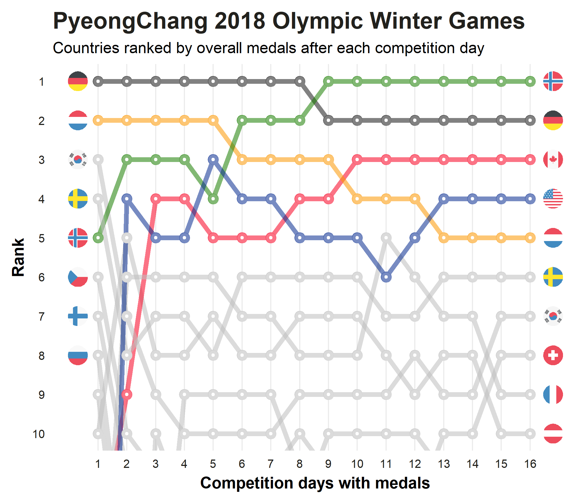
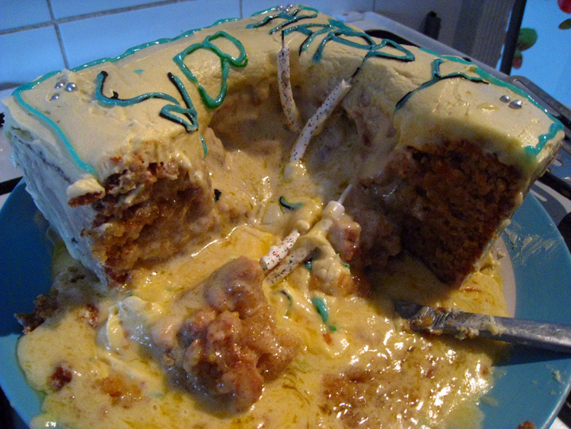

```{r setup, include=FALSE}
knitr::opts_chunk$set(warning = FALSE, message = FALSE, 
                      fig.retina = 3, fig.align = "center")
```

```{r packages-data, include=FALSE}
library(tidyverse)
set.seed(1234)
```

class: center middle main-title section-title-4

# Comparisons

.class-info[

**Session 8**

.light[PMAP 8921: Data Visualization with R<br>
Andrew Young School of Policy Studies<br>
May 2020]

]

---

name: outline
class: title title-inv-7

# Plan for today

--

.box-2.medium.sp-after-half[Visualizing comparisons]

--

.box-4.medium.sp-after-half[Reproducible examples]

---

layout: false
name: comparisons
class: center middle section-title section-title-2 animated fadeIn

# Visualizing comparisons

---

layout: true
class: title title-2

---

# Lollipops and bars

.center[
<figure>
  
</figure>
]

---

layout: false
class: bg-full
background-image: url("img/08/life_expectancy_sparklines.png")

???

Source: [FlowingData](https://flowingdata.com/2017/01/24/one-dataset-visualized-25-ways/02-time-series-sparklines-2/)

---

layout: true
class: title title-2

---

# Small multiples

.center[
<figure>
  
  <figcaption><a href="https://projects.fivethirtyeight.com/trump-approval-ratings/" target="_blank">FiveThirtyEight, Trump approval ratings</a></figcaption>
</figure>
]

???

Source: [FiveThirtyEight](https://projects.fivethirtyeight.com/trump-approval-ratings/)

---

# Small multiples with larger shapes

.center[
<figure>
  
  <figcaption><code>facet_geo()</code> in the <a href="https://hafen.github.io/geofacet/" target="_blank"><strong>geofacet</strong> package</a></figcaption>
</figure>
]

---

# Sparklines

.pull-left-wide[
<figure>
  
</figure>
]

.pull-right-narrow[
<figure>
  
</figure>
]

???

In-text sparklines from the now-retired [Sparks project](http://tools.aftertheflood.com/sparks/)

[Apple Watch example](https://www.edwardtufte.com/bboard/q-and-a-fetch-msg?msg_id=0001OR)

---

# Slopegraphs

.center[
<figure>
  
</figure>
]

???

Original by [Stephanie Evergreen](https://www.zazzle.com/slopegraph_holiday_card_for_data_nerds-137238378061787506?rf=238910033403516222)

---

# Slopegraphs

.center[
<figure>
  
</figure>
]

???

https://archive.nytimes.com/www.nytimes.com/imagepages/2009/04/06/health/infant_stats.html

---

# Slopegraphs

.pull-left[
<figure>
  
</figure>
]

.pull-right[
<figure>
  
</figure>
]

???

https://www.edwardtufte.com/bboard/q-and-a-fetch-msg?msg_id=0000Jr

---

# Bump charts

.center[
<figure>
  
</figure>
]

???

<https://dominikkoch.github.io/Bump-Chart/>

---

layout: false
name: reprex
class: center middle section-title section-title-4 animated fadeIn

# Reproducible examples

---

layout: true
class: title title-4

---

# This is 100% normal!

.center[
<figure>
  
</figure>
]

???

https://twitter.com/_brohrer_/status/1049388373541089280?s=12

---

# Broken cake

.pull-left[
<figure>
  
</figure>
]

--

.pull-right[
.box-inv-4[Help! My cake broke!]

.box-4.small[vs.]

.box-inv-4[Help! I followed these<br>6 steps and my cake broke!]

.box-1[Same principle<br>applies to code]
]

???

https://www.flickr.com/photos/slushpup/3700756035

---

# Reprexes

.box-inv-4.medium.sp-after[**Rep**roducible **ex**ampl**es**]

.box-4[Something anyone can run on their computer<br>to reproduce the problem you're facing]

---

# Debugging and reprexes

.box-inv-4[Simplify your code down to something very basic]

--

.box-inv-4[Add additional things until stuff breaks]

--

.box-inv-4[Use a subset of your data or invent fake data]

--

.box-inv-4[Restart your session and see if it runs in a new session]

--

.box-inv-4.sp-after[Ask the internet for help using your toy example]

--

.box-4[75% of the time you'll find what's wrong as you make the reprex!]

---

# Making datasets with `tribble()`

.pull-left[
```{r tribble-example}
my_data <- tribble(
  ~animal, ~number,
  "cat", 5,
  "dog", 4,
  "bear", 7,
  "bison", 1
)
```
]

--

.pull-right[
```{r show-tribble}
my_data
```
]

---

# Example reprex

.small-code[
```{r example-reprex, eval=FALSE}
my_data <- tribble(
  ~animal, ~number,
  "cat", 5,
  "dog", 4,
  "bear", 7,
  "bison", 1
)

# This plot has a fill legend, but I want to remove it because it's redundant
# What's the best way to get rid of the fill?
ggplot(fake_data, aes(x = animal, y = number, fill = animal)) +
  geom_col() 
  # I add something here, but what?
```
]
