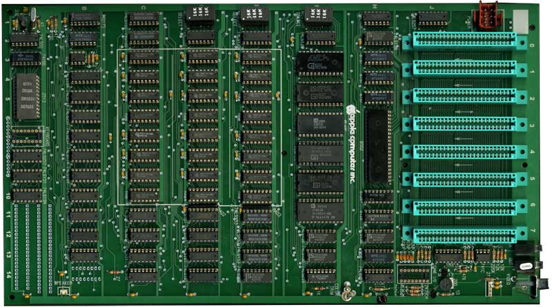
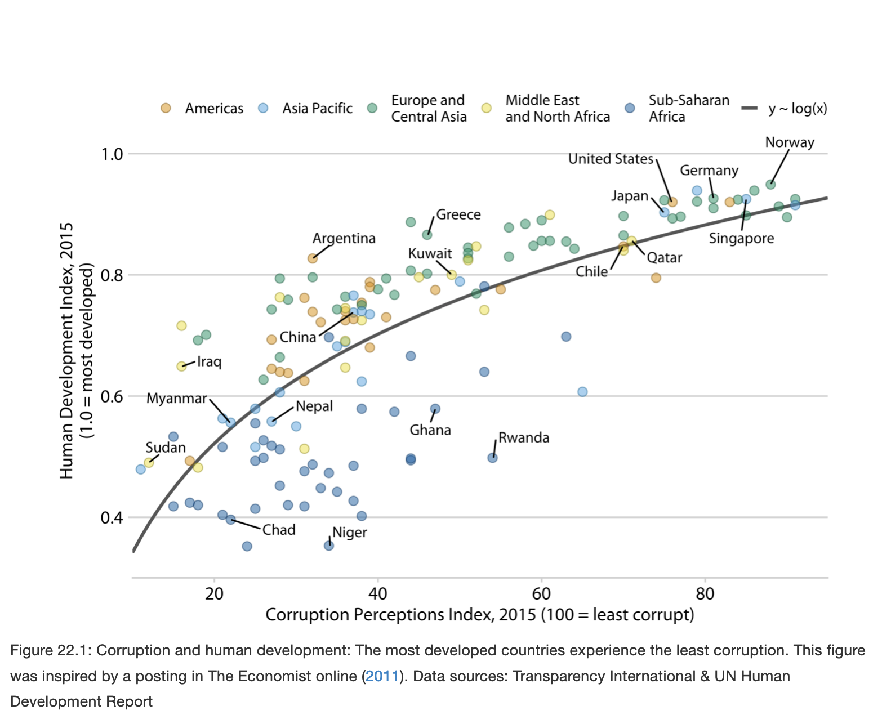
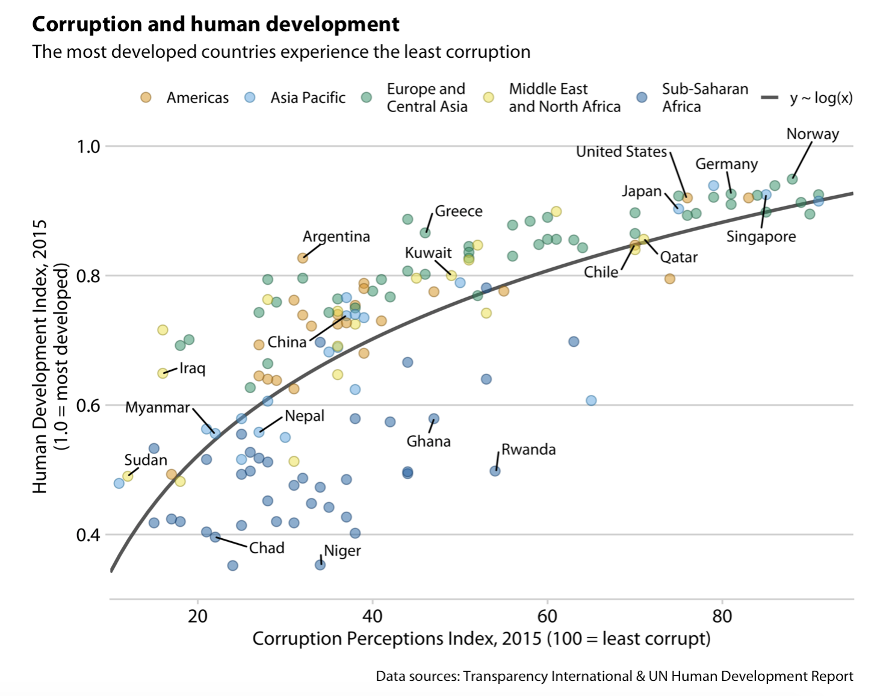

```{r setup, include=FALSE}
knitr::opts_chunk$set(warning = FALSE, message = FALSE, 
                      fig.retina = 3, fig.align = "center")
```

```{r packages-data, include=FALSE}
library(tidyverse)
set.seed(1234)
```

class: center middle main-title section-title-4

# Annotations

.class-info[

**Session 9**

.light[PMAP 8921: Data Visualization with R<br>
Andrew Young School of Policy Studies<br>
May 2020]

]

---

name: outline
class: title title-inv-7

# Plan for today

--

.box-5.medium.sp-after[Fretting the little things]

--

.box-2.medium.sp-after[Text in plots]

--

.box-6.medium.sp-after[Seeds]

---

layout: false
name: little-things
class: center middle section-title section-title-5 animated fadeIn

# Fretting the little things

---

layout: true
class: title title-5

---

# Little details matter

.pull-left.center[
<figure>
  
</figure>
]

--

.pull-right[
<figure>
  
</figure>
]

???

https://commons.wikimedia.org/wiki/File:Steve_Jobs_Headshot_2010-CROP.jpg

https://en.wikipedia.org/wiki/Apple_IIe#/media/File:Iie-system.jpg

---

# Obsession with tiny details

.pull-left.center[
<figure>
  
  <figcaption>IBM PC Jr.</figcaption>
</figure>
]

--

.pull-right.center[
<figure>
  
  <figcaption>Apple IIe</figcaption>
</figure>
]

???

https://en.wikipedia.org/wiki/IBM_PCjr#/media/File:IBM_PCB_Jr_Motherboard.jpg

http://www.willegal.net/appleii/appleii-kit.htm

---

# Human-focused design

.box-inv-5.large[“This is what customers<br>pay us for—to sweat all<br>these details so it’s easy<br>and pleasant for them to<br>use our computers.”]

???

Steve Jobs in *Fortune*, as quoted in [Alice Rawsthorn, *Hello World: Where Design Meets Life*, p. 110(?)](https://www.google.com/books/edition/Hello_World/b6iMDwAAQBAJ?hl=en&gbpv=1&dq=to+sweat+all+these+details+so+it%E2%80%99s+easy+and+pleasant+for+them+to+use+our+computers&pg=PT110&printsec=frontcover)

---

layout: false
class: bg-full
background-image: url("img/09/human-interface-guidelines.png")

???

https://developer.apple.com/design/human-interface-guidelines/

---

layout: true
class: title title-5

---

# Graph details: Redundant coding

.box-inv-5.sp-after[One little change makes this far more accessible]

.pull-left.center[
<figure>
  
</figure>
]

--

.pull-right.center[
<figure>
  
</figure>
]

???

Source: Claus Wilke: https://serialmentor.com/dataviz/redundant-coding.html

---

# Graph details: Consistent ordering

.box-inv-5.sp-after[Again, one little change makes this far more accessible]

.pull-left.center[
<figure>
  
</figure>
]

--

.pull-right.center[
<figure>
  
</figure>
]

???

Source: Claus Wilke: https://serialmentor.com/dataviz/redundant-coding.html

---

class: title title-5

# Details matter

.box-inv-5.medium[Worrying about tiny details in graphs…]

--

.box-5[…makes them easier for your audience to understand]

--

.box-5[…improves their beauty]

--

.box-5[…enhances the truth]

---

layout: false
name: text
class: center middle section-title section-title-2 animated fadeIn

# Text in plots

---

layout: true
class: title title-2

---

# Including text on a plot

.box-inv-2.medium[Label actual data points]

.box-2.small.sp-after[`geom_text()`, `geom_label()`, `geom_text_repel()`, etc.]

--

.box-inv-2.medium[Add arbitrary annotations]

.box-2.small.sp-after[`annotate()`]

--

.box-inv-2.medium[Titles, subtitles, captions, etc.]

.box-2.small.sp-after[`labs(title = "blah", subtitle = "blah", caption = "blah")`]

---

# Label actual data points

.left-code[
```{r gapminder-text-bad, tidy=FALSE, message=FALSE, fig.show="hide", fig.dim=c(4.8, 4.2), out.width="100%"}
library(gapminder)

gapminder_europe <- gapminder %>% 
  filter(year == 2007, 
         continent == "Europe")

ggplot(gapminder_europe, 
       aes(x = gdpPercap, y = lifeExp)) +
  geom_point() +
  geom_text(aes(label = country))
```

.box-2[Ew.]
]

.right-plot[
`)
]

---

# Label actual data points

.left-code[
```{r gapminder-label-bad, tidy=FALSE, message=FALSE, fig.show="hide", fig.dim=c(4.8, 4.2), out.width="100%"}
ggplot(gapminder_europe, 
       aes(x = gdpPercap, y = lifeExp)) +
  geom_point() +
  geom_label(aes(label = country)) #<<
```

.box-2[Still ew. Labels are neat,<br>but cover the points.]
]

.right-plot[
`)
]

---

# Solution 1: Repel labels

.left-code[
```{r gapminder-repel, tidy=FALSE, message=FALSE, fig.show="hide", fig.dim=c(4.8, 4.2), out.width="100%"}
library(ggrepel)

ggplot(gapminder_europe, 
       aes(x = gdpPercap, y = lifeExp)) +
  geom_point() +
  geom_text_repel(aes(label = country))
```
]

.right-plot[
`)
]

---

# Solution 1: Repel labels

.left-code[
```{r gapminder-repel-label, tidy=FALSE, message=FALSE, fig.show="hide", fig.dim=c(4.8, 4.2), out.width="100%"}
library(ggrepel)

ggplot(gapminder_europe, 
       aes(x = gdpPercap, y = lifeExp)) +
  geom_point() +
  geom_label_repel(aes(label = country)) #<<
```
]

.right-plot[
`)
]

---

# Solution 2a: Don't use so many labels

.left-code[
```{r gapminder-repel-filtered, tidy=FALSE, message=FALSE, fig.show="hide", fig.dim=c(4.8, 4.2), out.width="100%"}
gapminder_europe <- gapminder_europe %>% 
  mutate(should_be_labeled = 
           ifelse(country %in% c("Albania", 
                                 "Norway", 
                                 "Hungary"), 
                  TRUE, FALSE))

ggplot(gapminder_europe, 
       aes(x = gdpPercap, y = lifeExp)) +
  geom_point() +
  geom_label_repel(
    data = filter(gapminder_europe, 
                  should_be_labeled == TRUE),
    aes(label = country)
  )
```
]

.right-plot[
`)
]

---

# Solution 2b: Use other aesthetics too

.left-code[
```{r gapminder-repel-filtered-fancy, tidy=FALSE, message=FALSE, fig.show="hide", fig.dim=c(4.8, 4.2), out.width="100%"}
ggplot(gapminder_europe, 
       aes(x = gdpPercap, y = lifeExp)) +
  geom_point(aes(color = should_be_labeled)) +
  geom_label_repel(
    data = filter(
      gapminder_europe, 
      should_be_labeled == TRUE
    ),
    aes(label = country, 
        fill = should_be_labeled),
    color = "white"
  ) +
  scale_color_manual(values = c("grey50", 
                                "red")) +
  scale_fill_manual(values = c("red")) +
  guides(color = FALSE, fill = FALSE)
```
]

.right-plot[
`)
]

---

# (Highlight non-text things too!)

.left-code[
```{r gapminder-highlight, tidy=FALSE, message=FALSE, fig.show="hide", fig.dim=c(4.8, 4.2), out.width="100%"}
# Color just Oceania
gapminder_highlighted <- gapminder %>% 
  mutate(is_oceania = 
           ifelse(continent == "Oceania", 
                  TRUE, FALSE))

ggplot(gapminder_highlighted, 
       aes(x = year, y = lifeExp, 
           group = country, 
           color = is_oceania, 
           size = is_oceania)) +
  geom_line() +
  scale_color_manual(values = c("grey70", 
                                "red")) +
  scale_size_manual(values = c(0.1, 0.5)) +
  guides(color = FALSE, size = FALSE) +
  theme_minimal()
```
]

.right-plot[
`)
]

---

# Including text on a plot

.box-inv-2.medium[Label actual data points]

.box-2.small.sp-after[`geom_text()`, `geom_label()`, `geom_text_repel()`, etc.]

--

.box-inv-2.medium[Add arbitrary annotations]

.box-2.small.sp-after[`annotate()`]


---

# Adding arbitrary annotations

.left-code[
```{r gapminder-annotate-1, tidy=FALSE, message=FALSE, fig.show="hide", fig.dim=c(4.8, 4.2), out.width="100%"}
ggplot(gapminder_europe, 
       aes(x = gdpPercap, y = lifeExp)) +
  geom_point() +
  annotate(geom = "text",
           x = 40000, y = 76,
           label = "Some text!")
```
]

.right-plot[
`)
]

---

# Adding arbitrary annotations

.left-code[
```{r gapminder-annotate-2, tidy=FALSE, message=FALSE, fig.show="hide", fig.dim=c(4.8, 4.2), out.width="100%"}
ggplot(gapminder_europe, 
       aes(x = gdpPercap, y = lifeExp)) +
  geom_point() +
  annotate(geom = "label", #<<
           x = 40000, y = 76,
           label = "Some text!")
```
]

.right-plot[
`)
]

---

# Any geom works

.left-code[
```{r gapminder-annotate-3, tidy=FALSE, message=FALSE, fig.show="hide", fig.dim=c(4.8, 4.2), out.width="100%"}
ggplot(gapminder_europe, 
       aes(x = gdpPercap, y = lifeExp)) +
  geom_point() +
  # This is evil though!!! #<<
  # We just invented a point #<<
  annotate(geom = "point", #<<
           x = 40000, y = 76)
```
]

.right-plot[
`)
]

---

# Any geom works

.left-code[
```{r gapminder-annotate-4, tidy=FALSE, message=FALSE, fig.show="hide", fig.dim=c(4.8, 4.2), out.width="100%"}
ggplot(gapminder_europe, 
       aes(x = gdpPercap, y = lifeExp)) +
  geom_point() +
  annotate(geom = "rect", 
           xmin = 30000, xmax = 50000,
           ymin = 78, ymax = 82,
           fill = "red", alpha = 0.2)
```
]

.right-plot[
`)
]

---

# Use multiple annotations

.left-code[
```{r gapminder-annotate-5, tidy=FALSE, message=FALSE, fig.show="hide", fig.dim=c(4.8, 4.2), out.width="100%"}
ggplot(gapminder_europe, 
       aes(x = gdpPercap, y = lifeExp)) +
  geom_point() +
  annotate(geom = "rect", 
           xmin = 30000, xmax = 50000,
           ymin = 78, ymax = 82,
           fill = "red", alpha = 0.2) +
  annotate(geom = "label",
           x = 40000, y = 76.5,
           label = "Rich and long-living") +
  annotate(geom = "segment", 
           x = 40000, xend = 40000, 
           y = 76.8, yend = 77.8,
           arrow = arrow(
             length = unit(0.1, "in")))
```
]

.right-plot[
`)
]

---

# Including text on a plot

.box-inv-2.medium[Label actual data points]

.box-2.small.sp-after[`geom_text()`, `geom_label()`, `geom_text_repel()`, etc.]

.box-inv-2.medium[Add arbitrary annotations]

.box-2.small.sp-after[`annotate()`]

--

.box-inv-2.medium[Titles, subtitles, captions, etc.]

.box-2.small.sp-after[`labs(title = "blah", subtitle = "blah", caption = "blah")`]

---

# Which is better?

.pull-left.center[
<figure>
  
</figure>
]

--

.pull-right.center[
<figure>
  
</figure>
]

--

.box-inv-2.sp-after[Neither! Depends on the final document output.]

???

Source: Claus Wilke: https://serialmentor.com/dataviz/figure-titles-captions.html

---

layout: false
name: seeds
class: center middle section-title section-title-6 animated fadeIn

# Seeds

---

layout: true
class: title title-6

---

# Pseudorandomness

.box-inv-6.medium[Your computer uses a complicated algorithm to generate random numbers]

--

.box-6[Different programs use different algorithms]

--

.box-6[You can actually sometimes reverse engineer the algorithm!]

???

https://www.gizmodo.co.uk/2018/06/canadas-random-immigration-lottery-uses-microsoft-excel-which-isnt-actually-random/

---

# `r emo::ji("seedling")``r emo::ji("seedling")``r emo::ji("seedling")`

.box-inv-6.medium[These algorithms all start with something called a "seed", or some number]

--

.box-6.sp-after[In R this is the current time on your computer +<br>the internal program process ID]

--

.box-inv-6.medium[If two random functions use the same seed,<br>they'll create the same numbers]

---

# Seeds

.box-inv-6[Open R on your computer and run this:]

.box-6[`rnorm(3)`]

--

.box-inv-6.sp-after[You'll generate 3 random numbers from a normal distribution<br>with a mean of 0 and a standard deviation of 1.]

```{r echo=FALSE}
set.seed(5094)
random_numbers <- rnorm(3)
```

--

.box-inv-6[They will 100% **not** be these 3 numbers:]

--

.box-6[`r knitr::combine_words(round(random_numbers, 3))`]

---

# Seeds

.box-inv-6[Now run these two lines in R:]

--

.box-6[`set.seed(1234)`]

.box-6.sp-after[`rnorm(3)`]

--

```{r echo=FALSE}
set.seed(1234)
random_numbers_seed <- rnorm(3)
```

.box-inv-6[You'll again generate 3 random numbers,<br>but they will **100%** be these:]

--

.box-6[`r knitr::combine_words(round(random_numbers_seed, 3))`]

---

# Why should we care?

.box-inv-6.sp-after[Because we set a seed the random numbers<br>will be the same random numbers every time]

--

.box-6[Reproducible simulations]

--

.box-6[Reproducible Bayesian models]

--

.box-6[Jittering in plots]

--

.box-6[`geom_text_repel()` in plots]

---

# What is a good seed?

--

.box-inv-6.medium[Any whole number]

--

.box-6[1234(567)]

--

.box-6[1]

--

.box-6[13, 42, 8675309, or your favorite number]

--

.box-6[20200519]

--

.box-6[[Random.org](https://www.random.org/) atmospheric noise]

---

# Best practice

.box-inv-6.sp-after[If you're doing *anything* with randomness, include `set.seed(SOME_NUMBER)` at the beginning of your document]

--

.box-inv-6[Some functions have a `seed` argument—use it]

--

.box-6[`geom_label_repel(..., seed = 1234)`]

--

.box-6[`position_jitter(..., seed = 1234)`]

---

# Example

.left-code.small-code[
```{r cars-random, tidy=FALSE, message=FALSE, fig.show="hide", fig.dim=c(4.8, 4.2), out.width="100%"}
ggplot(mpg, aes(x = drv, y = hwy)) +
  geom_point(position = 
               position_jitter(seed = 1234, 
                               width = 0.3))
```

.box-6.small[As long as the seed is 1234,<br>those dots will always<br>be in those exact spots<br>on any computer running R]
]

.right-plot[
`)
]
