```{r setup, include=FALSE}
knitr::opts_chunk$set(warning = FALSE, message = FALSE, 
                      fig.retina = 3, fig.align = "center")
```

```{r packages-data, include=FALSE}
library(tidyverse)
library(plotly)
set.seed(1234)
```

class: center middle main-title section-title-4

# Interactivity

.class-info[

**Session 10**

.light[PMAP 8921: Data Visualization with R<br>
Andrew Young School of Policy Studies<br>
May 2020]

]

---

name: outline
class: title title-inv-7

# Plan for today

--

.box-6.medium.sp-after[Making interactive graphics]

--

.box-2.medium.sp-after[Sharing content]

---

layout: false
name: interactive-graphs
class: center middle section-title section-title-6 animated fadeIn

# Making interactive graphics

---

layout: true
class: title title-6

---

# Three general methods

.box-inv-6.medium[Single plots with **plotly**]

.box-6.small.sp-after[Easy!]

--

.box-inv-6.medium[Dashboards with **flexdashboard**]

.box-6.small.sp-after[Slightly more complicated]

--

.box-inv-6.medium[Complete interactive apps with **Shiny**]

.box-6.small[Super complicated!]

---

# Single plots with plotly

.box-inv-6[[Plotly](https://plotly.com/graphing-libraries/) is special software for<br>creating interactive plots with JavaScript]

--

.box-inv-6.sp-after[No knowledge of JavaScript needed!]

--

.box-6[`ggplotly()` in the **plotly** R package translates<br>between R and Javascript for you!]

---

# Plotly

.left-code[
```{r plotly-simple, tidy=FALSE, message=FALSE}
library(gapminder)
library(plotly)

gapminder_2007 <- filter(gapminder, 
                         year == 2007)

my_plot <- ggplot(
  data = gapminder_2007,
  mapping = aes(x = gdpPercap, y = lifeExp, 
                color = continent)) +
  geom_point() +
  scale_x_log10() +
  theme_minimal()
```

```{r eval=FALSE}
ggplotly(my_plot)
```
]

.pull-right.small-code[
```{r show-plotly-simple, echo=FALSE}
ggplotly(my_plot)
```
]

---

# Plotly tooltips

.left-code[
```{r plotly-text, tidy=FALSE, message=FALSE}
my_plot <- ggplot(
  data = gapminder_2007,
  mapping = aes(x = gdpPercap, y = lifeExp, 
                color = continent)) +
  geom_point(aes(text = country)) + #<<
  scale_x_log10() +
  theme_minimal()
```

```{r eval=FALSE}
interactive_plot <- ggplotly( #<<
  my_plot, tooltip = "text" #<<
) #<<
interactive_plot #<<
```
]

.pull-right.small-code[
```{r show-plotly-text, echo=FALSE}
ggplotly(my_plot, tooltip = "text")
```
]

---

# Works with most geoms!

.left-code[
```{r plotly-bars, tidy=FALSE, message=FALSE}
car_hist <- ggplot(mpg, 
                   aes(x = hwy)) +
  geom_histogram(binwdith = 2, 
                 boundary = 0, 
                 color = "white")
```

```{r eval=FALSE}
ggplotly(car_hist)
```
]

.pull-right.small-code[
```{r show-plotly-bars, echo=FALSE}
ggplotly(car_hist)
```
]

---

# Save as HTML

.box-inv-6[Save a self-contained HTML version of it with<br>`saveWidget()` in the **htmlwidgets** R package]

```{r save-widget, eval=FALSE}
# This is like ggsave, but for interactive HTML plots
htmlwidgets::saveWidget(interactive_plot, "fancy_plot.html")
```

---

# Fully documented

.box-inv-6[The [documentation](https://plotly.com/ggplot2/) for ggplot2 + plotly is full of<br>examples of how to customize everything]

.box-inv-6[Rely on that ↑ + Google to make<br>really fancy (and easy!) interactive plots]

---

# Three general methods

.box-inv-6.medium[Single plots with **plotly**]

.box-6.small.sp-after[Easy!]

--

.box-inv-6.medium[Dashboards with **flexdashboard**]

.box-6.small.sp-after[Slightly more complicated]


---

# Dashboards with **flexdashboard**

.box-inv-6[Use basic R Markdown to build a dashboard!]

.center[
<figure>
  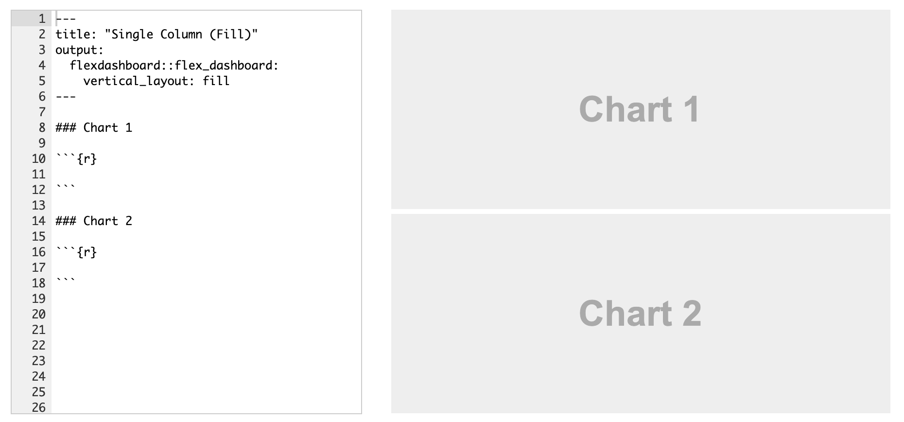
</figure>
]

---

# Dashboards with **flexdashboard**

.box-inv-6[Make any kind of block arrangement]

.center[
<figure>
  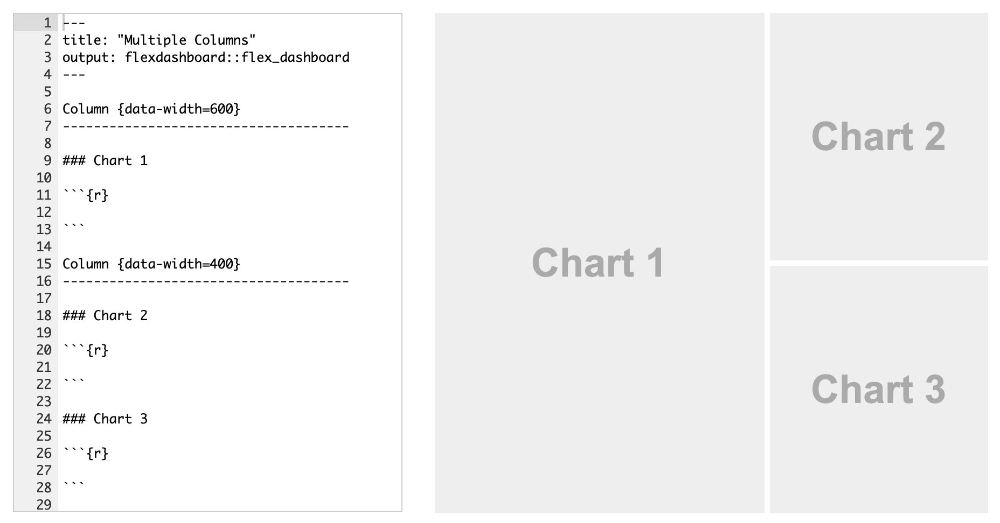
</figure>
]

---

# Dashboards with **flexdashboard**

.box-inv-6[Add other elements like text and gauges]

.center[
<figure>
  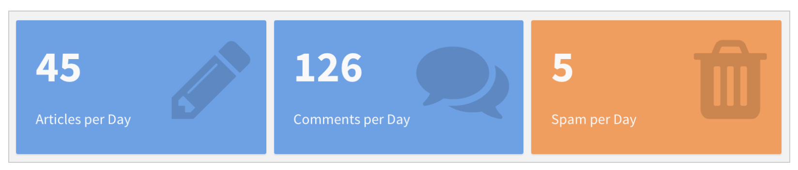
</figure>

<figure>
  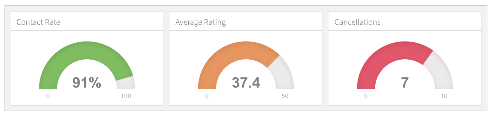
</figure>
]

---

# Example dashboards

.center[
<figure>
  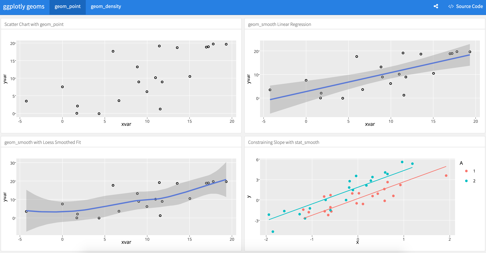
  <figcaption><a href="https://beta.rstudioconnect.com/jjallaire/htmlwidgets-ggplotly-geoms/" target="_blank">ggplot2 geoms</a></figcaption>
</figure>
]

---

# Example dashboards

.center[
<figure>
  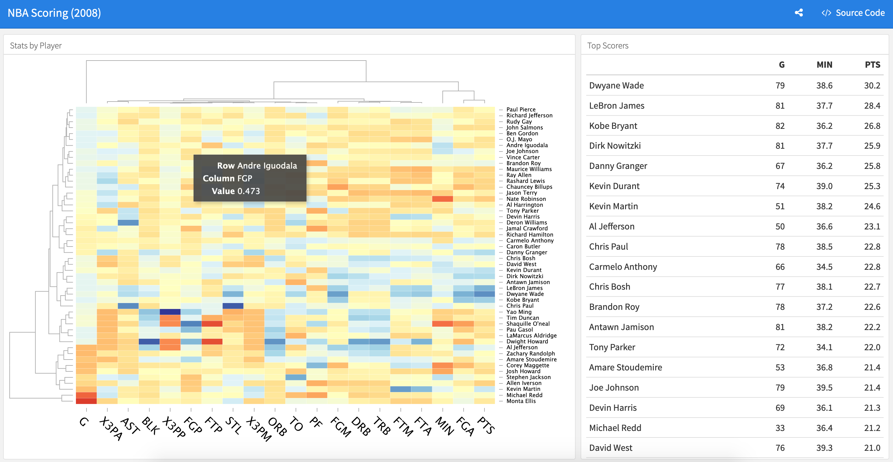
  <figcaption><a href="https://beta.rstudioconnect.com/jjallaire/htmlwidgets-d3heatmap/" target="_blank">NBA scoring</a></figcaption>
</figure>
]

---

# Example dashboards

.center[
<figure>
  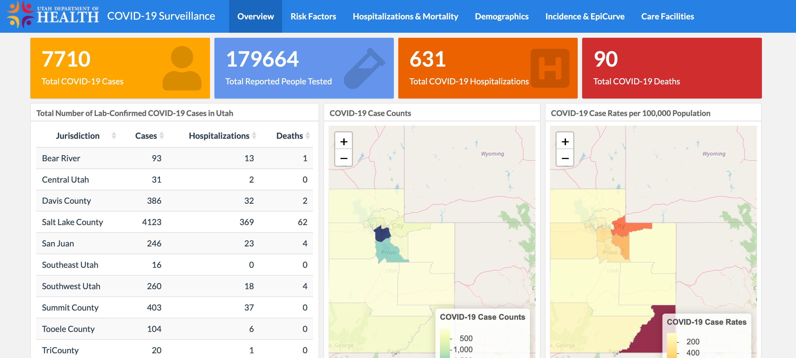
  <figcaption><a href="https://coronavirus-dashboard.utah.gov/" target="_blank">Utah's COVID-19 dashboard</a></figcaption>
</figure>
]

---

# Outstanding documentation

.box-inv-6[The [documentation](https://rmarkdown.rstudio.com/flexdashboard/index.html) for **flexdashboard** is<br>full of examples and details of everything you can do]

.box-inv-6[Rely on that ↑ + Google to make<br>really fancy (and easy!) dashboards!]


---

# Three general methods

.box-inv-6.medium[Single plots with **plotly**]

.box-6.small.sp-after[Easy!]

.box-inv-6.medium[Dashboards with **flexdashboard**]

.box-6.small.sp-after[Slightly more complicated]

--

.box-inv-6.medium[Complete interactive apps with **Shiny**]

.box-6.small[Super complicated!]

---

# Shiny

.box-inv-6.medium[Shiny is a complete web application framework for interactive statistics]

--

.box-inv-6.sp-after[It's super complex and hard for beginners]

--

.box-6.medium[I've never made a standalone Shiny app!]

.box-6.small[(And I don't plan on trying anytime soon)]

---

# Lots of resources to help start

.box-inv-6[RStudio has [a whole website for helping you get started](https://shiny.rstudio.com/tutorial/)]

.center[
<figure>
  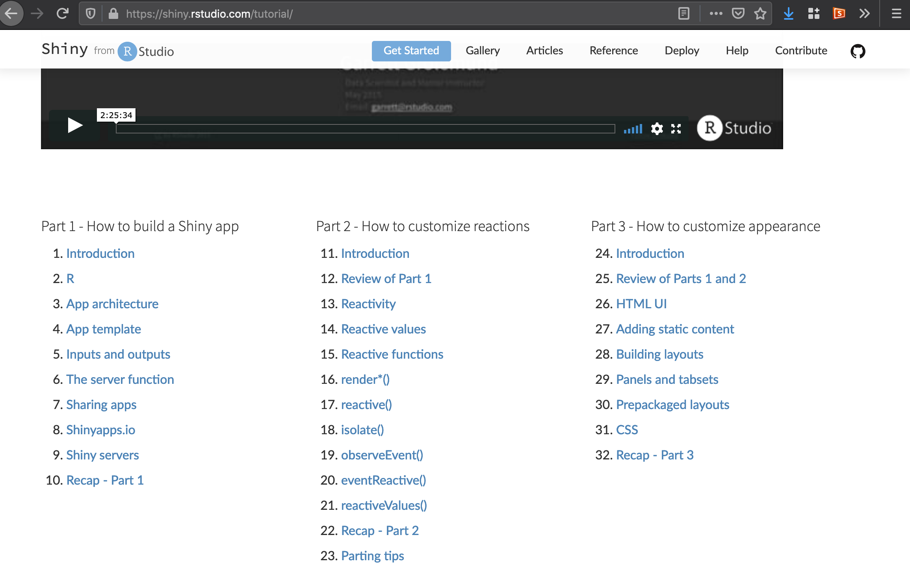
  <figcaption><a href="https://shiny.rstudio.com/tutorial/" target="_blank">Getting started with Shiny</a></figcaption>
</figure>
]

---

# Really neat examples!

.center[
<figure>
  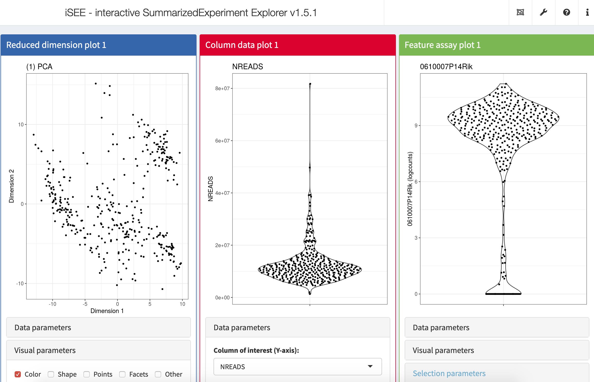
  <figcaption><a href="https://shiny.rstudio.com/gallery/isee.html" target="_blank">iSEE (interactive SummarizedExperiment Explorer)</a></figcaption>
</figure>
]

---

# Really neat examples!

.center[
<figure>
  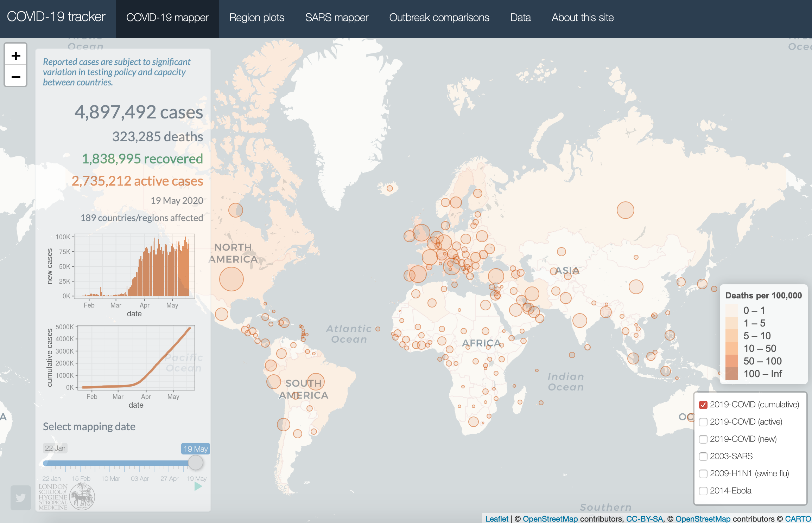
  <figcaption><a href="https://shiny.rstudio.com/gallery/covid19-tracker.html" target="_blank">COVID-19 tracker</a></figcaption>
</figure>
]

---

# Really neat examples!

.center[
<figure>
  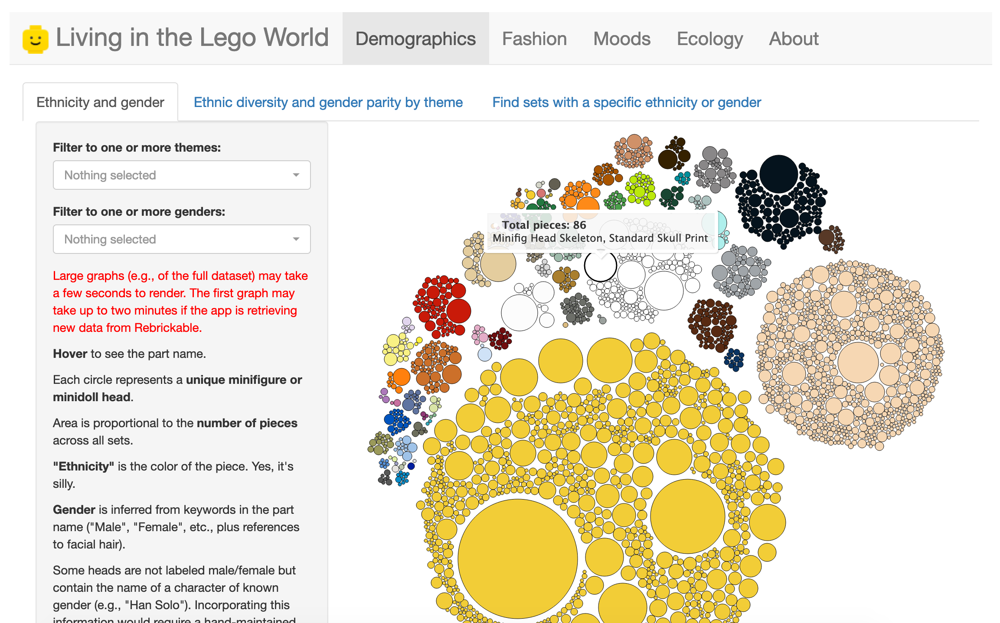
  <figcaption><a href="https://shiny.rstudio.com/gallery/lego-world.html" target="_blank">Living in the LEGO world</a></figcaption>
</figure>
]

---

# flexdashboard + Shiny

.box-inv-6[You can [use reactive Shiny things in flexdashboards](https://rmarkdown.rstudio.com/flexdashboard/shiny.html)<br>without building a complete Shiny app!]

.box-6.small[I *have* done this]

.center[
<figure>
  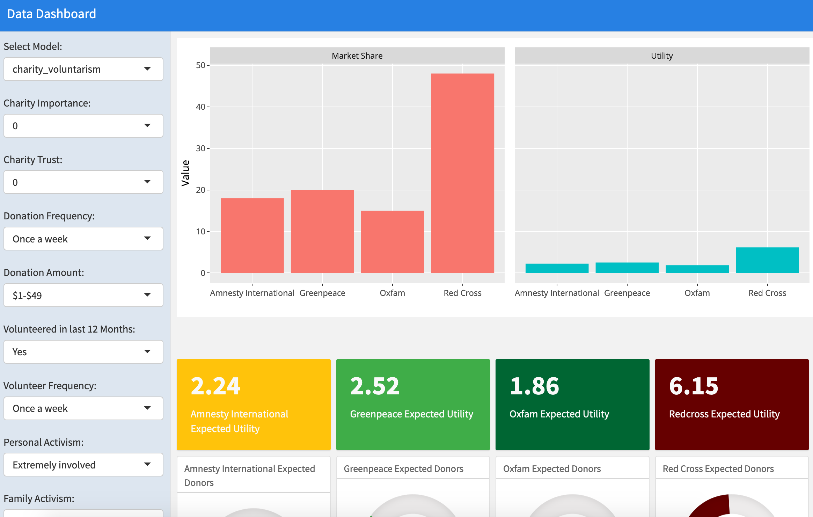
</figure>
]

---

layout: false
name: sharing-content
class: center middle section-title section-title-2 animated fadeIn

# Sharing content

---

layout: true
class: title title-2

---

# What do you do after you knit?

.box-inv-2[When knitting to PDF or Word, you make a standalone file]

.box-2.small.sp-after[E-mail it, message it, Slack it, whatever]

--

.box-inv-2[When knitting to HTML, you make a website]

--

.box-2.small[By default it's a standalone `.html` file with graphics embedded,<br>so you can still e-mail it, etc., but it can get huge if there are lots of images]

--

.box-2.small[Standalone files won't work well if there's anything interactive]

--

.box-2.small[You can also post it online!]

---

# Places to put HTML documents

.box-inv-2[[RPubs](https://rpubs.com/) for knitted HTML documents]

--

.box-2.small.sp-after[Built in to RStudio; works with ggplotly!]

.center[
<figure>
  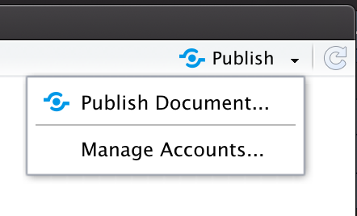
</figure>
]

--

.box-inv-2[[RPubs](https://rpubs.com/) or [shinyapps.io](https://www.shinyapps.io/) for flexdashboards]

--

.box-inv-2[Your own web server for anything, if you have one]
