```{r setup, include=FALSE}
knitr::opts_chunk$set(warning = FALSE, message = FALSE, 
                      fig.retina = 3, fig.align = "center")
```

```{r packages-data, include=FALSE}
library(tidyverse)
library(scales)
library(scico)
library(gapminder)
library(ggridges)
library(lubridate)
library(ggrepel)
library(patchwork)
library(tsibble)
library(fable)
library(ggtext)

set.seed(1234)

fred_raw <- read_csv("data/fred_raw.csv")
measles <- read_csv("data/cdc-measles.csv") %>% 
  group_by(Year) %>% 
  slice(1) %>% 
  ungroup()
```

class: center middle main-title section-title-4

# Time

.class-info[

**Session 11**

.light[PMAP 8921: Data Visualization with R<br>
Andrew Young School of Policy Studies<br>
May 2020]

]

---

name: outline
class: title title-inv-7

# Plan for today

--

.box-5.medium.sp-after[Axis issues]

--

.box-3.medium.sp-after[Visualizing time]

--

.box-1.medium[Starting, ending,<br>and decomposing time]

---

layout: false
name: axis-issues
class: center middle section-title section-title-5 animated fadeIn

# Axis issues

---

layout: true
class: title title-5

---

# Is truncating the y-axis misleading?

```{r truncation-yes-no, echo=FALSE, fig.width=12, fig.height=7}
tibble(y = seq(0, 0.995, 0.005)) %>% 
  mutate(fill = y <= 0.989) %>% 
  ggplot(aes(ymin = y, ymax = y + 0.005, xmin = 0, xmax = 1, fill = fill)) +
  geom_rect() +
  annotate(geom = "text", x = 0.5, y = 0.995, label = "No", color = "#FFDC00",
           family = "Fira Sans Condensed Black", fontface = "plain", size = 25) +
  annotate(geom = "text", x = 0.5, y = 0.985, label = "Yes", color = "#FFDC00",
           family = "Fira Sans Condensed Black", fontface = "plain", size = 25) +
  scale_x_continuous(expand = c(0, 0)) +
  scale_y_continuous(labels = percent_format(accuracy = 0.1)) +
  scale_fill_manual(values = c("#FF4136", "#0074D9"), guide = FALSE) +
  labs(x = NULL, y = "Percent of the time") +
  coord_cartesian(ylim = c(.98, 1)) +
  theme_minimal(base_size = 25, base_family = "Fira Sans Condensed") +
  theme(panel.grid = element_blank(),
        axis.text.x = element_blank())
```

---

# Don't be too extreme!

.box-inv-5.medium[It is actually more legal to<br>truncate the y-axis than you might think!]

--

.box-5[When small movements matter]

--

.box-5[When the scale itself is distorted]

--

.box-5[When zero values are impossible]

---

# When is it okay to truncate?

.box-inv-5[When small movements matter]

--

.pull-left[
<figure>
  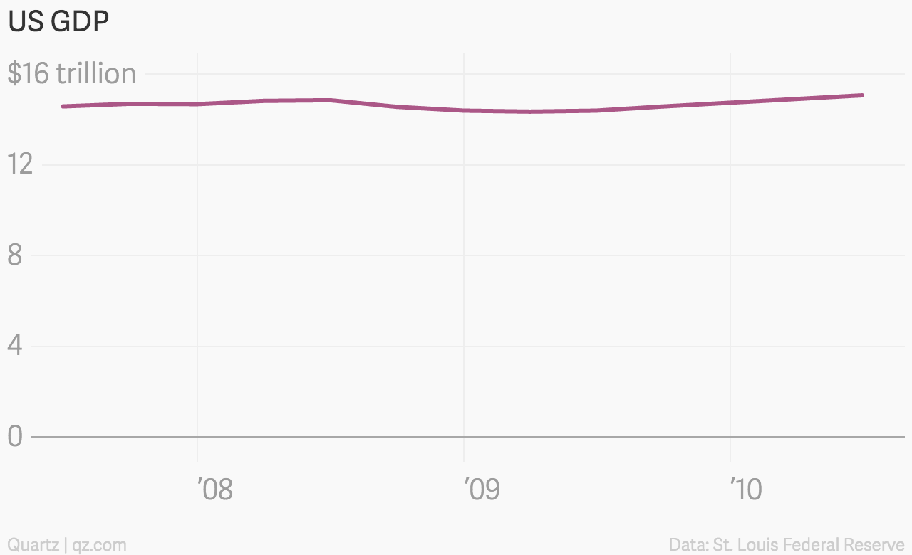
</figure>
]

--

.pull-right[
<figure>
  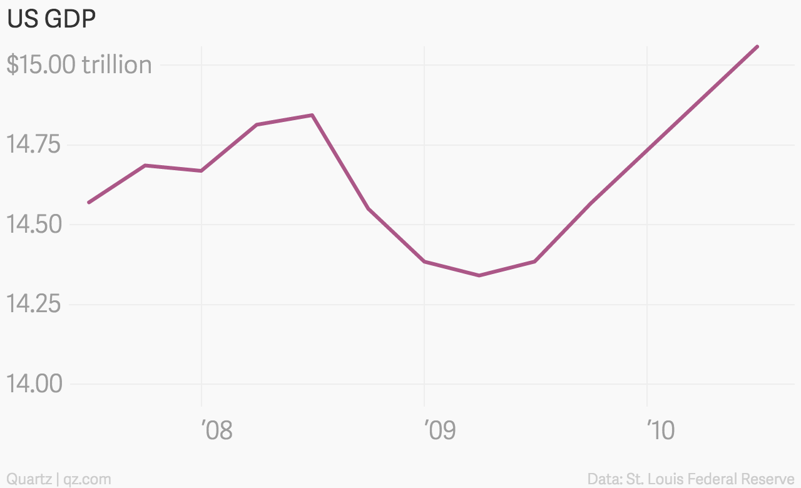
</figure>
]

???

Stock prices too

https://qz.com/418083/its-ok-not-to-start-your-y-axis-at-zero/

---

# When is it okay to truncate?

.box-inv-5[When the scale itself is distorted]

--

.pull-left.center[
<figure>
  
</figure>
]

--

.pull-right[
<figure>
  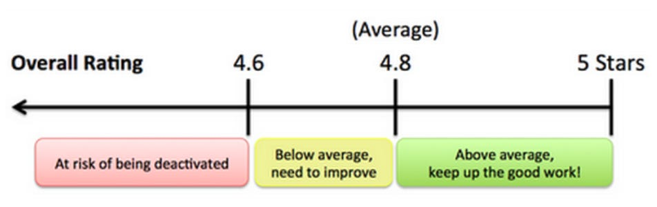
</figure>
]

???

https://www.buzzfeed.com/carolineodonovan/the-fault-in-five-stars

http://www.businessinsider.com/leaked-charts-show-how-ubers-driver-rating-system-works-2015-2


---

# When is it okay to truncate?

.box-inv-5[When zero values are impossible]

--

.pull-left[
<figure>
  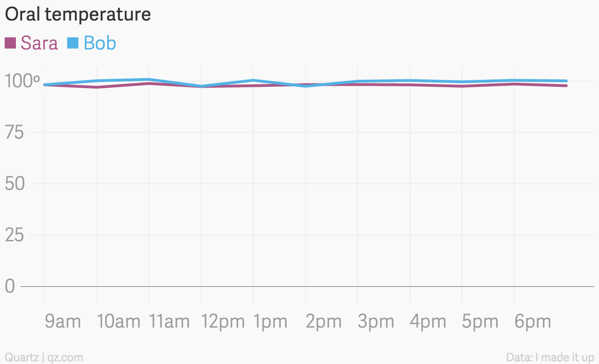
</figure>
]

--

.pull-right[
<figure>
  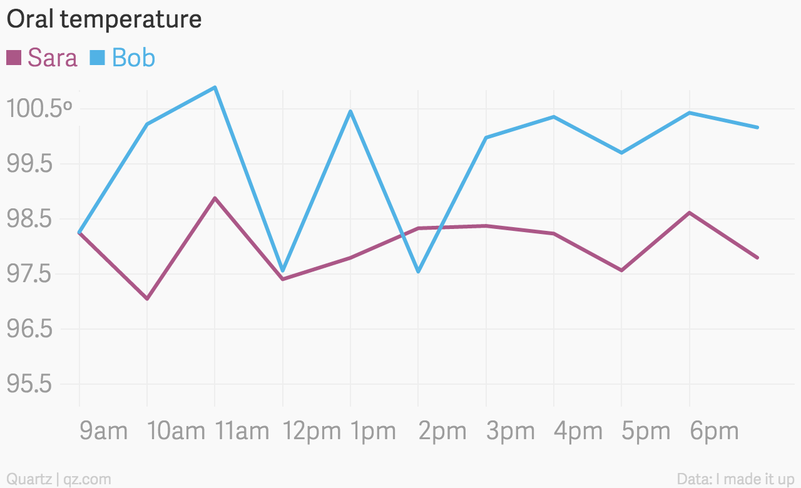
</figure>
]

???

https://qz.com/418083/its-ok-not-to-start-your-y-axis-at-zero/

---

# Never on bar charts

.pull-left.center[

<figure>
  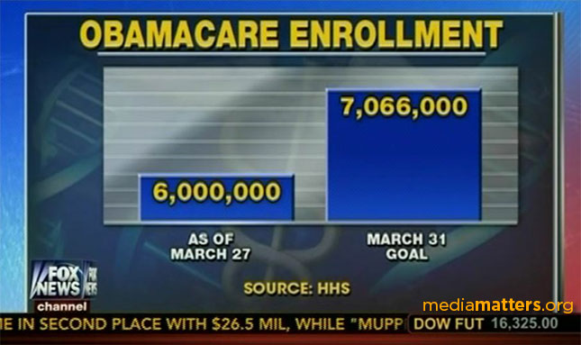
</figure>

]

--

.pull-right.center[

<figure>
  
</figure>

]

---

# Zero is okay too!

.box-inv-5.medium[Just because you don't *have to* start at 0<br>doesn't mean you should *never* start at 0]

.box-5.small.sp-after[It's often a good idea!]

---

# Keep axis scales consistent

.center[
<figure>
  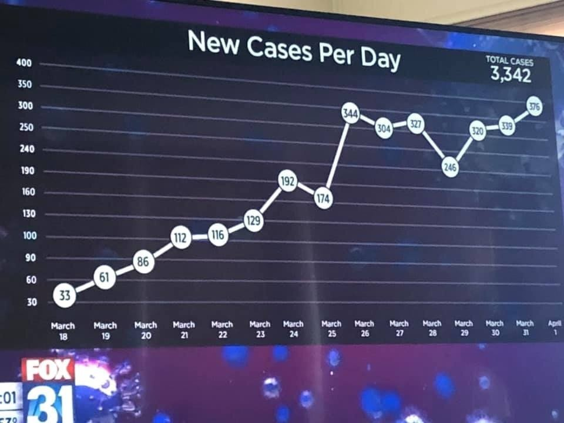
  <figcaption>FOX affiliate in Colorado reporting on COVID-19 cases</figcaption>
</figure>
]

???

http://freerangestats.info/blog/2020/04/06/crazy-fox-y-axis

---

# Keep axis scales consistent

&nbsp;

.center[
<figure>
  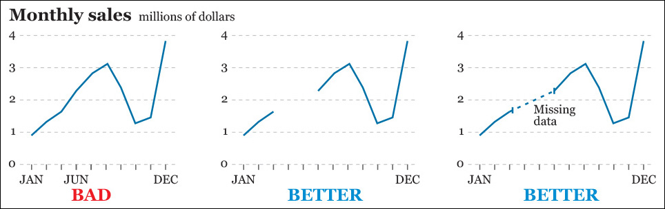
</figure>
]

???

Alberto Cairo, *The Truthful Art*, chapter 8, figure 8.21

---

# Don’t impute across categories

.pull-left[
```{r likert-imputation-bad, echo=FALSE, fig.width=4.8, fig.height=4.2, out.width="100%"}
fake_survey <- tribble(
  ~response, ~count,
  "Strongly agree", 5,
  "Agree", 10,
  "Neutral", 11,
  "Disagree", 8,
  "Strongly disagree", 2
) %>% 
  mutate(response = fct_rev(fct_inorder(response)))

ggplot(fake_survey, aes(x = response, y = count, group = 1)) +
  geom_line(size = 1, color = "grey50") +
  geom_point(aes(color = response), size = 9) +
  scale_color_scico_d(palette = "berlin", direction = -1) +
  expand_limits(y = 0) +
  labs(title = "This is BAD", x = NULL, y = "Count") +
  guides(color = FALSE)
```
]

--

.pull-right[
```{r likert-good, echo=FALSE, fig.width=4.8, fig.height=4.2, out.width="100%"}
ggplot(fake_survey, aes(x = response, y = count)) +
  geom_pointrange(aes(ymin = 0, ymax = count, color = response), size = 2) +
  scale_color_scico_d(palette = "berlin", direction = -1) +
  labs(title = "This is BETTER", x = NULL, y = "Count") +
  guides(color = FALSE)
```
]

---

layout: false
name: visualizing-time
class: center middle section-title section-title-3 animated fadeIn

# Visualizing time

---

layout: true
class: title title-3

---

# Showing changes over time

.box-inv-3[Time is just a variable that can be mapped to an aesthetic]

--

.box-inv-3[Can be used as `x`, `y`, `color`, `fill`, `facet`, and even animation]

--

.box-inv-3.sp-after[Can use all sorts of `geom` s:<br>lines, columns, points, heatmaps, densities, maps, etc.]

--

.box-3[In general, follow reading conventions to show time progression:]

.box-3.medium[→ & ↓]

---

# Time on x-axis + `geom_line/col()`

.pull-left[
```{r covid-unemp-claims, echo=FALSE, fig.width=4.8, fig.height=4.2, out.width="100%"}
# Wrangle the recession dates so that we just have start and end dates
recessions_raw <- fred_raw %>% 
  filter(symbol == "USREC") %>% 
  mutate(recession_delta = price - lag(price))

recessions <- tibble(start = filter(recessions_raw, recession_delta == 1)$date,
                     end = filter(recessions_raw, recession_delta == -1)$date)

claims <- fred_raw %>% 
  filter(symbol == "ICSA") %>% 
  rename(claims = price)

ggplot() +
  geom_rect(data = recessions, aes(xmin = start, xmax = end, ymin = -Inf, ymax = Inf),
            fill = "#FF851B", alpha = 0.2) +
  geom_line(data = claims, aes(x = date, y = claims), size = 0.5, color = "#85144b") +
  scale_x_date(date_breaks = "5 years", date_labels = "%Y") +
  scale_y_continuous(labels = comma) +
  labs(x = NULL, y = "Initial unemployment claims",
       title = "HOLY CRAP",
       caption = "Source: Initial weekly unemployment claims (ICSA); FRED\nRecessions highlighted in orange") +
  theme_bw(base_family = "Fira Sans Condensed") +
  theme(plot.title = element_text(face = "bold"),
        panel.grid.minor.x = element_blank())

```
]

.pull-right.center[
<figure>
  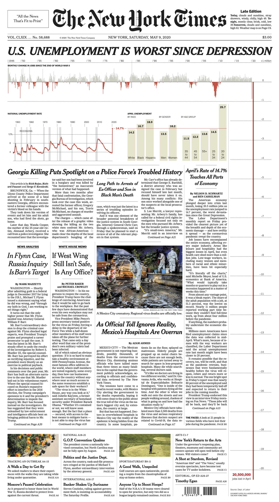
  <figcaption><a href="https://static01.nyt.com/images/2020/05/09/nytfrontpage/scan.pdf" target="_blank">Front page of the New York Times</a>, May 9, 2020</figcaption>
</figure>
]

???

Monthly change in jobs since end of WWII

The New York Times front page, May 9, 2020

https://www.nytimes.com/issue/todayspaper/2020/05/09/todays-new-york-times

https://static01.nyt.com/images/2020/05/09/nytfrontpage/scan.pdf

---

# Time on x-axis + `geom_tile()`

.center[
<figure>
  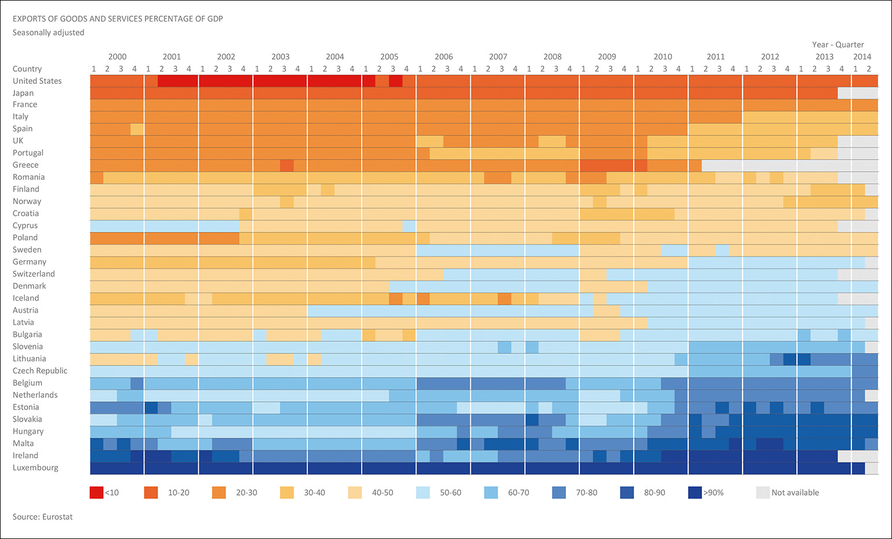
  <figcaption>Figure 8.28 in Alberto Cairo's <i>The Truthful Art</i>: Heat map by Jorge Camões</figcaption>
</figure>
]

???

Alberto Cairo, *The Truthful Art*, chapter 8, figure 8.28

---

# Time on y-axis + `geom_density()`

```{r density-ridges, echo=FALSE, fig.width=7, fig.height=3.5, out.width="80%"}
gapminder_clean <- gapminder %>% 
  mutate(year_factor = factor(year))

ggplot(gapminder_clean, aes(x = lifeExp, y = fct_rev(year_factor), fill = ..x..)) +
  geom_density_ridges_gradient(color = "white", quantile_lines = TRUE, quantiles = 2) +
  scale_fill_scico(palette = "batlow", breaks = seq(20, 85, 15), labels = seq(20, 85, 15)) + 
  scale_x_continuous(expand = c(0, 0)) +
  labs(x = "Life expectancy", y = NULL, fill = NULL) + 
  theme_minimal(base_family = "Fira Sans Condensed") +
  theme(legend.position = "bottom",
        panel.grid = element_blank(),
        legend.key.width = unit(3, "lines"),
        legend.key.height = unit(0.5, "lines"))
```

---

# Time in animation + `geom_point()`

.center[
<figure>
  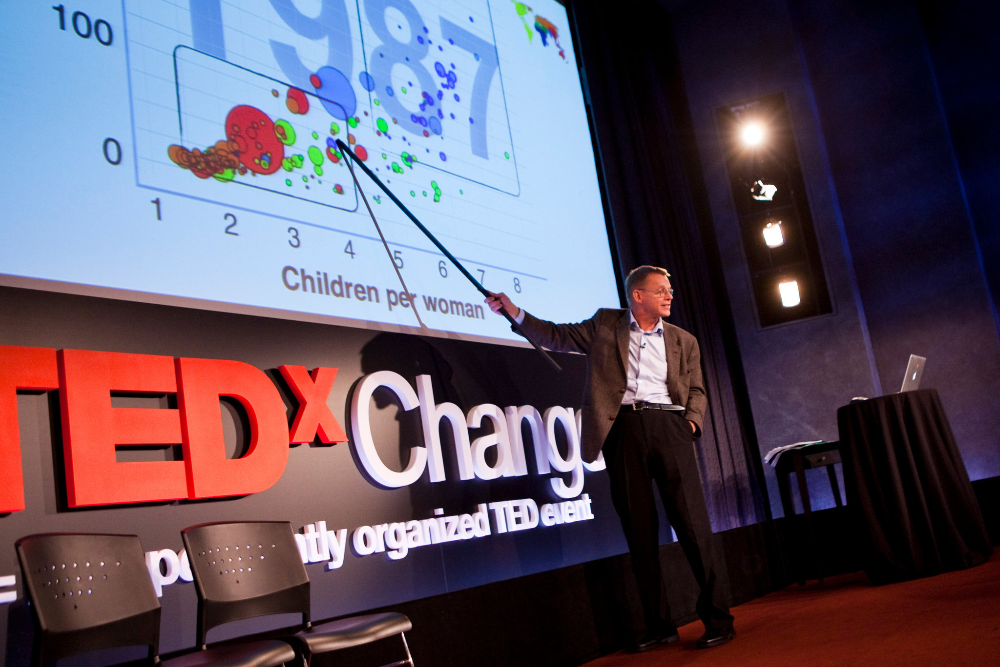
</figure>
]

???

Source: [New York Times](https://www.nytimes.com/2017/02/09/world/europe/hans-rosling-dead-statistician.html)

---

# Time in maps

.center[
<figure>
  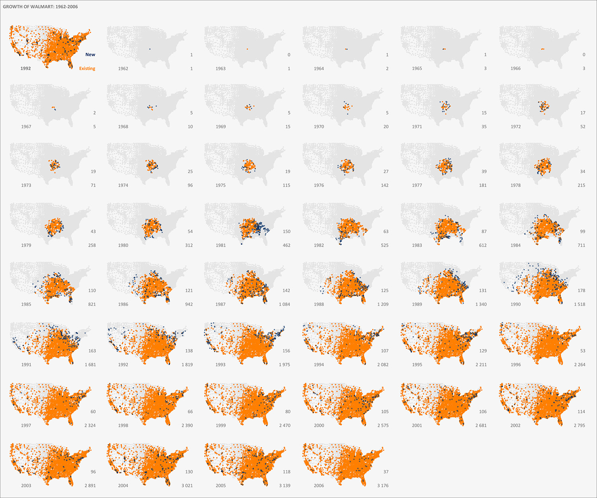
  <figcaption>Figure 8.30 in Alberto Cairo's <i>The Truthful Art</i>: Map of the spread of Walmart by Jorge Camões</figcaption>
</figure>
]

???

Alberto Cairo, *The Truthful Art*, chapter 8, figure 8.30

---

# Time in `geom_col()` + small multiples

.center[
<figure>
  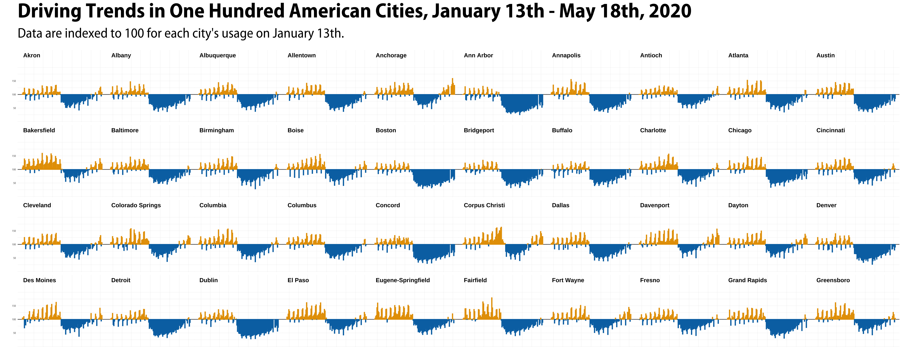
  <figcaption>Kieran Healy, <a href="https://kieranhealy.org/blog/archives/2020/05/21/the-kitchen-counter-observatory/" target="_blank">“The Kitchen Counter Observatory”</a></figcaption>
</figure>
]

???

https://kieranhealy.org/blog/archives/2020/05/21/the-kitchen-counter-observatory/

---

# Don't go wild with time mapping!

.center[
<figure>
  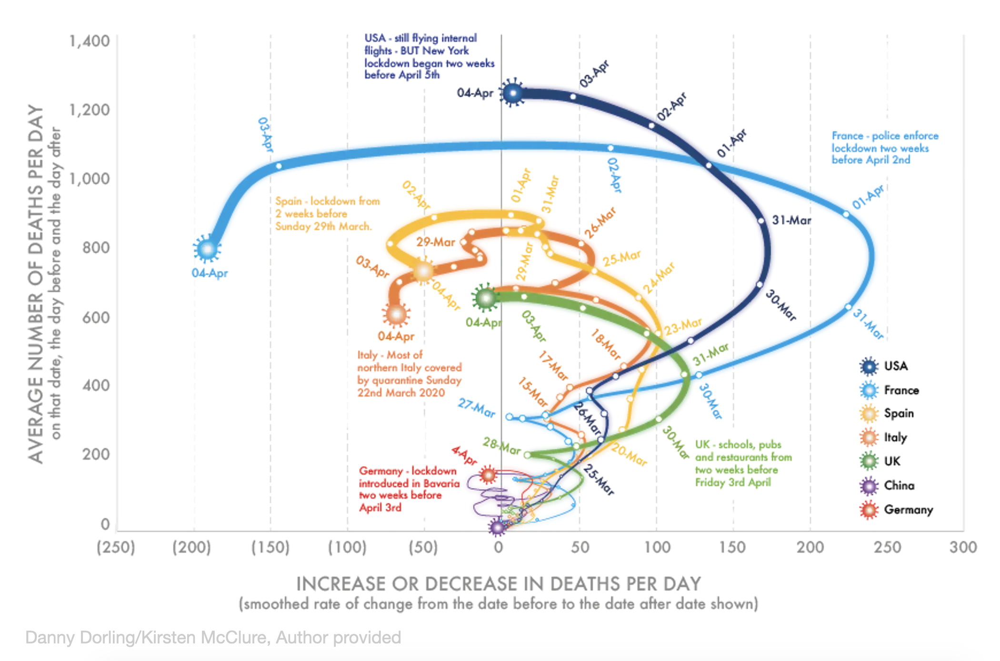
  <figcaption><a href="https://theconversation.com/three-graphs-that-show-a-global-slowdown-in-covid-19-deaths-135756" target="_blank">Tornado plot</a>: When a curve crosses the left of the central axis, the number of deaths per day falls</figcaption>
</figure>
]

???

https://theconversation.com/three-graphs-that-show-a-global-slowdown-in-covid-19-deaths-135756

---

# Interpreting tornado plots

```{r tornado, echo=FALSE, fig.width=9, fig.height=3.75, out.width="100%"}
tornado <- tibble(x = 1:10,
                  y = c(2, 4, 5, 5.5, 4, 6, 7.5, 8, 7.5, 10)) %>% 
  mutate(dy = y - lag(y))

plot1 <- ggplot(tornado, aes(x = x, y = y)) +
  geom_path(size = 2, linejoin = "round", lineend = "round") +
  geom_point(size = 3) +
  scale_x_continuous(breaks = 0:10) +
  coord_cartesian(xlim = c(1, 10), ylim = c(1, 10)) +
  labs(x = "X", y = "y") +
  theme_bw(base_family = "Fira Sans Condensed")

plot2 <- ggplot(drop_na(tornado, dy), aes(x = dy, y = y)) +
  geom_vline(xintercept = 0, size = 1, linetype = "dotted") +
  geom_path(size = 2, linejoin = "round", lineend = "round") +
  geom_point(size = 3) +
  geom_label_repel(aes(label = x), family = "Fira Sans Condensed") +
  coord_cartesian(xlim = c(-2, 3), ylim = c(1, 10)) +
  annotate(geom = "text", x = -Inf, y = -Inf, 
           label = "← y value decreasing",
           hjust = -0.1, vjust = -1, fontface = "bold",
           family = "Fira Sans Condensed") +
  annotate(geom = "text", x = Inf, y = -Inf, 
           label = "y value increasing →",
           hjust = 1.1, vjust = -1, fontface = "bold",
           family = "Fira Sans Condensed") +
  labs(x = "Change in y", y = "y") +
  theme_bw(base_family = "Fira Sans Condensed")

plot1 + plot2
```

???

http://www.bewitched.com/demo/tornado/tornado.html

http://www.dannydorling.org/books/SLOWDOWN/Illustrations.html

---

# Better with multiple plots

.pull-left[
```{r unemp-inflation-path, echo=FALSE, fig.width=4.8, fig.height=4.2, out.width="100%"}
unemp_inflation <- fred_raw %>% 
  filter(symbol %in% c("UNRATE", "FPCPITOTLZGUSA")) %>% 
  pivot_wider(id = date, names_from = symbol, values_from = price) %>% 
  rename(inflation = FPCPITOTLZGUSA, unemployment = UNRATE) %>% 
  mutate(year = year(date)) %>% 
  mutate_at(vars(inflation, unemployment), ~ . / 100) %>% 
  filter(year >= 1990, year < 2020) %>% 
  arrange(date)

unemp_inflation_small <- unemp_inflation %>% 
  group_by(year) %>% 
  summarize(inflation = mean(inflation, na.rm = TRUE),
            unemployment = mean(unemployment))

ggplot(unemp_inflation_small, aes(x = unemployment, y = inflation)) +
  geom_path(size = 1, color = "grey50") +
  geom_point() +
  geom_text_repel(aes(label = year), vjust = -0.5, family = "Fira Sans Condensed") +
  scale_x_continuous(labels = percent_format(accuracy = 1)) +
  scale_y_continuous(labels = percent_format(accuracy = 1)) +
  labs(x = "Unemployment", y = "Inflation") +
  theme_minimal(base_family = "Fira Sans Condensed")
```
]

--

.pull-right[
```{r unemp-inflation-good, echo=FALSE, fig.width=4.8, fig.height=4.2, out.width="100%"}
plot_inflation <- ggplot(drop_na(unemp_inflation, inflation), 
                         aes(x = date, y = inflation)) +
  geom_line(size = 1, color = "#F012BE") +
  scale_y_continuous(labels = percent_format(accuracy = 1)) +
  labs(x = NULL, y = "Inflation") +
  theme_minimal(base_family = "Fira Sans Condensed")

plot_unempl <- ggplot(unemp_inflation, aes(x = date, y = unemployment)) +
  geom_line(size = 1, color = "#FF851B") +
  scale_y_continuous(labels = percent_format(accuracy = 1)) +
  labs(x = NULL, y = "Unemployment") +
  theme_minimal(base_family = "Fira Sans Condensed")

plot_inflation / plot_unempl
```

]

---

layout: false
name: decomposing
class: center middle section-title section-title-1 animated fadeIn

# Starting, ending,<br>and decomposing time

---

layout: true
class: title title-1

---

# ∞

.box-inv-1.medium[You always have to choose<br>a start and end point]


.box-inv-1[Start and end at reasonable times that<br>help maintain the context of the story]


---

# Measles vaccine was pretty effective!

```{r measles-partial, echo=FALSE, fig.width=5, fig.height=3.5, out.width="60%"}
measles_1963 <- filter(measles, Year == 1963)

ggplot(measles, aes(x = Year, y = Cases)) +
  geom_line(size = 1, color = "#3D9970") +
  scale_y_continuous(labels = comma) +
  annotate(geom = "segment", x = 1963, xend = 1963, 
           y = 320000, yend = 360000,
           arrow = arrow(angle = 15, length = unit(0.3, "lines")),
           color = "#F012BE", size = 0.5) +
  annotate(geom = "text", x = 1963, y = 300000, 
           label = "Vaccine introduced in 1963", hjust = 0.5, vjust = 0.5,
           family = "Fira Sans Condensed", color = "#F012BE") +
  annotate(geom = "point", x = measles_1963$Year, y = measles_1963$Cases, 
           color = "#F012BE", size = 2) +
  coord_cartesian(xlim = c(1960, 1965), ylim = c(0, 500000)) +
  labs(x = NULL, y = "Cases per year", 
       caption = "Source: CDC, Epidemiology and Prevention of\nVaccine-Preventable Diseases, 13th Edition") +
  theme_minimal(base_family = "Fira Sans Condensed")
```


???

Data sources listed here: 

https://commons.m.wikimedia.org/wiki/File:Measles_US_1938-2019.png

I used [this big PDF table from the CDC](https://web.archive.org/web/20190120205018/https://www.cdc.gov/vaccines/pubs/pinkbook/downloads/appendices/e/reported-cases.pdf), used some random online PDF → CSV converter, and cleaned up the data by hand in Excel:

---

# Measles vaccine was *incredible*!

```{r measles-full, echo=FALSE, fig.width=6, fig.height=3.75, out.width="70%"}
ggplot(measles, aes(x = Year, y = Cases)) +
  geom_line(size = 1, color = "#3D9970") +
  scale_x_continuous(breaks = seq(1950, 2020, 10)) +
  scale_y_continuous(labels = comma) +
  annotate(geom = "segment", x = 1967, xend = 1965, 
           y = measles_1963$Cases, yend = measles_1963$Cases,
           arrow = arrow(angle = 15, length = unit(0.3, "lines")),
           color = "#F012BE", size = 0.5) +
  annotate(geom = "text", x = 1967.5, y = measles_1963$Cases, 
           label = "Vaccine introduced in 1963", hjust = 0, vjust = 0.5,
           family = "Fira Sans Condensed", color = "#F012BE") +
  annotate(geom = "point", x = measles_1963$Year, y = measles_1963$Cases, 
           color = "#F012BE", size = 2) +
  labs(x = NULL, y = "Cases per year", 
       caption = "Source: CDC, Epidemiology and Prevention of\nVaccine-Preventable Diseases, 13th Edition") +
  theme_minimal(base_family = "Fira Sans Condensed")
```

---

# Seasonality

.box-inv-1[Don't mistake seasonality for actual trends]

```{r process-fred-seasonality, echo=FALSE}
# Clean up retail sales data
retail_sales <- fred_raw %>% 
  filter(symbol == "RSXFSN") %>% 
  filter(date > "1999-12-31") %>% 
  rename(sales = price) %>% 
  mutate(year_month = yearmonth(date)) %>% 
  as_tsibble(index = year_month, key = symbol)

# Decompose sales
sales_model <- retail_sales %>% 
  # Probably best to use multiplicative errors, but then the values are less
  # easily interpretable
  model(ets = ETS(sales ~ error("A") + trend("Ad") + season("A")))

# Tidy decomposed data
sales_model_components <- sales_model %>% 
  components() %>% 
  select(-slope) %>% 
  pivot_longer(cols = c(sales, level, season, remainder),
               names_to = "component", values_to = "value") %>% 
  filter(year_month > "1999-12-31") %>% 
  mutate(is_component = component != "sales") %>% 
  mutate(component = recode(component, sales = "Total retail sales in the United States, 2000–2019",
                            level = "Trend",
                            season = "Seasonality",
                            remainder = "Remainder")) %>% 
  mutate(component = fct_inorder(component))
```

.pull-left[

```{r seasonality-zoomed-in, echo=FALSE, fig.width=4.8, fig.height=3.75, out.width="100%"}
ggplot(filter(retail_sales,
              date >= "2019-01-01",
              date <= "2019-12-31"), 
       aes(x = date, y = sales)) +
  geom_line(size = 1, color = "#85144b") +
  scale_x_date(breaks = "1 month", date_labels = "%B",
               guide = guide_axis(n.dodge = 2)) +
  scale_y_continuous(labels = comma) +
  labs(x = NULL, y = "Millions of dollars",
       title = "Total 2019 retail sales in the United States",
       caption = "Source: RSXFSN from FRED") +
  theme_minimal(base_family = "Fira Sans Condensed") +
  theme(panel.grid.minor.x = element_blank(),
        plot.title = element_text(face = "bold", size = rel(1.3)))
```

]

--

.pull-right[

```{r seasonality-zoomed-out, echo=FALSE, fig.width=4.8, fig.height=3.75, out.width="100%"}
ggplot(retail_sales,
       aes(x = date, y = sales)) +
  geom_rect(data = filter(recessions, start > "1999-12-31"), 
            aes(xmin = start, xmax = end, ymin = -Inf, ymax = Inf),
            inherit.aes = FALSE, fill = "#B10DC9", alpha = 0.1) +
  geom_line(size = 0.5, color = "#85144b") +
  scale_y_continuous(labels = comma) +
  labs(x = NULL, y = "Millions of dollars",
       title = "Total retail sales in the United States, 2000–2019",
       caption = "Source: RSXFSN from FRED. Recessions highlighted in <span style='color: #B10DC9;'>purple</span>.") +
  theme_minimal(base_family = "Fira Sans Condensed") +
  theme(plot.title = element_text(face = "bold", size = rel(1.3)),
        plot.caption = element_markdown())
```

]

---

# Decomposition

```{r retail-decomposition, echo=FALSE, fig.width=6, fig.height=4.35, out.width="60%"}
ggplot(sales_model_components, aes(x = year_month, y = value)) +
  geom_rect(data = filter(recessions, start > "1999-12-31"), 
            aes(xmin = start, xmax = end, ymin = -Inf, ymax = Inf),
            inherit.aes = FALSE, fill = "#B10DC9", alpha = 0.1) +
  geom_line(aes(color = is_component), size = 0.5) +
  scale_x_date(expand = c(0, 0)) +
  scale_y_continuous(labels = comma) +
  scale_color_manual(values = c("grey60", "#111111")) +
  labs(x = NULL, y = "Millions of dollars",
       caption = "Source: RSXFSN from FRED. Recessions highlighted in <span style='color: #B10DC9;'>purple</span>.") +
  guides(color = FALSE) +
  facet_wrap(vars(component), ncol = 1, scales = "free_y") +
  theme_minimal(base_family = "Fira Sans Condensed") +
  theme(strip.text = element_text(hjust = 0, face = "bold", size = rel(1.3)),
        plot.caption = element_markdown())
```


---

# Birthday decomposition

.center[
<figure>
  
  <figcaption>Cover of Andrew Gelman, et al., <i>Bayesian Data Analysis</i></figcaption>
</figure>
]

???

http://www.stat.columbia.edu/~gelman/book/
