```{r setup, include=FALSE}
knitr::opts_chunk$set(warning = FALSE, message = FALSE, 
                      fig.retina = 3, fig.align = "center")
```

```{r packages-data, include=FALSE}
library(tidyverse)
library(tidytext)

# devtools::install_github("bradleyboehmke/harrypotter")
library(harrypotter)
set.seed(1234)

options("digits" = 2, "width" = 90)

hp <- tibble(book = c("Philosopher's Stone", "Chamber of Secrets", 
                      "Prisoner of Azkaban", "Goblet of Fire", 
                      "Order of the Phoenix", "Half-Blood Prince",
                      "Deathly Hallows"),
             raw_text = list(philosophers_stone, chamber_of_secrets, 
                             prisoner_of_azkaban, goblet_of_fire, 
                             order_of_the_phoenix, half_blood_prince,
                             deathly_hallows)) %>% 
  mutate(text_data = map(raw_text, ~{
    tibble(text = .x) %>% 
      mutate(chapter = 1:n())
  })) %>% 
  select(book, text_data) %>% 
  unnest(text_data) %>% 
  mutate(book = fct_inorder(book))
```

class: center middle main-title section-title-4

# Text

.class-info[

**Session 13**

.light[PMAP 8921: Data Visualization with R<br>
Andrew Young School of Policy Studies<br>
May 2020]

]

---

name: outline
class: title title-inv-7

# Plan for today

--

.box-6.medium.sp-after[Qualitative text-based data]

--

.box-5.medium.sp-after[Crash course in<br>computational linguistics]

---

layout: false
name: text-data
class: center middle section-title section-title-6 animated fadeIn

# Qualitative text-based data

---

layout: true
class: title title-6

---

# Free responses

.center[
<figure>
  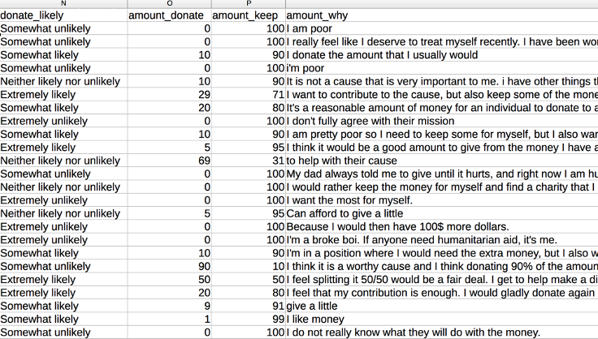
  <figcaption>Typical free responses from a survey</figcaption>
</figure>
]

---

# y tho?

&nbsp;

.center[
<figure>
  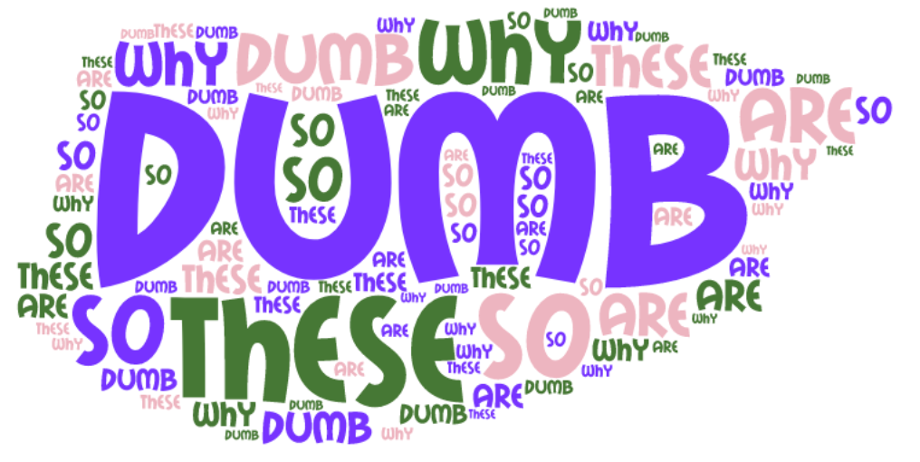
</figure>
]

---

# Some cases are okay

.center[
<figure>
  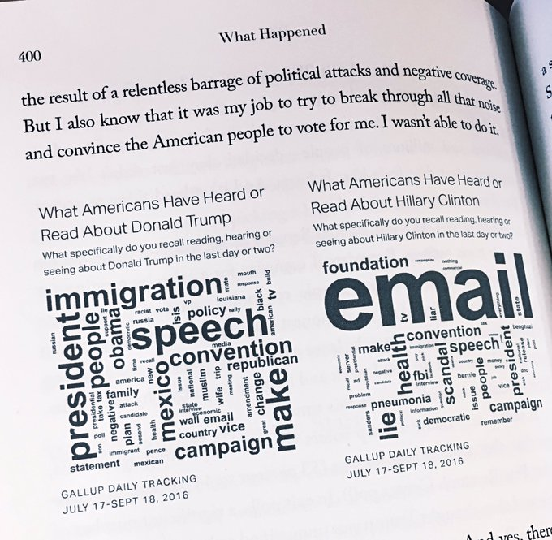
</figure>
]

???

https://twitter.com/s_soroka/status/907941270735278085

---

# Word clouds for grownups

.box-inv-6[Count words, but in fancier ways]

.center[
<figure>
  
</figure>
]

???

https://www.tidytextmining.com/

---

layout: false
class: bg-full
background-image: url("img/13/he-she-julia.png")

???

https://pudding.cool/2017/08/screen-direction/

---

layout: false
class: bg-90
background-image: url("img/13/minimap-1.png")

???

https://juliasilge.com/blog/song-lyrics-across/

---

layout: false
name: computational-linguistics
class: center middle section-title section-title-5 animated fadeIn

# Crash course in<br>computational linguistics

---

layout: true
class: title title-5

---

# Core concepts and techniques

--

.box-inv-5[Tokens, lemmas, and parts of speech]

--

.box-inv-5[Sentiment analysis]

--

.box-inv-5[tf-idf]

--

.box-inv-5[Topics and LDA]

--

.box-inv-5[Fingerprinting]

---

# Regular text

.small-code[
```{r show-hp1, echo=FALSE, comment=NA}
harrypotter::philosophers_stone[1] %>% 
  str_trunc(90 * 14) %>% 
  str_wrap(90) %>% 
  cat("\n")
```
]

---

# Tidy text

.box-inv-5[One row for each text element]

.box-5.small[Can be chapter, page, verse, etc.]

.small-code[
```{r tidy-hp1, echo=FALSE, comment=NA}
hp1_data <- tibble(text = harrypotter::philosophers_stone) %>%
  mutate(chapter = 1:n(),
         book = "Harry Potter and the Philosopher's Stone") %>% 
  select(chapter, book, text)
head(hp1_data)
```
]

---

# Tokens

.box-inv-5[Split the text into even smaller parts]

.box-5.small[Paragraph, line, verse, sentence, n-gram, word, letter, etc.]

.pull-left.small-code[
```{r hp1-word, echo=FALSE, comment=NA}
hp1_words <- hp1_data %>% 
  unnest_tokens(word, text) %>% 
  mutate(book = str_trunc(book, width = 15)) %>% 
  select(word, chapter, book) %>% 
  head()
hp1_words
```
]

--

.pull-right.small-code[
```{r hp1-bigram, echo=FALSE, comment=NA}
hp1_bigrams <- hp1_data %>% 
  unnest_tokens(bigram, text, token = "ngrams", n = 2) %>% 
  mutate(book = str_trunc(book, width = 15)) %>% 
  select(bigram, chapter, book) %>% 
  head()
hp1_bigrams
```
]

---

# Stop words

.box-inv-5[Common words that we can generally ignore]

.center.small-code[
```{r show-stop-words, echo=FALSE, comment=NA}
stop_words
```
]

---

# Token frequency: words

```{r hp-words, echo=FALSE, fig.width=8, fig.height=3.75, out.width="100%"}
hp_tokens <- hp %>% 
  unnest_tokens(word, text) %>% 
  anti_join(stop_words, by = "word") %>% 
  group_by(book) %>% 
  count(word, sort = TRUE) %>% 
  top_n(9, n) %>% 
  ungroup() %>% 
  mutate(word = fct_inorder(word))

ggplot(hp_tokens, aes(x = n, y = fct_rev(word), fill = book)) +
  geom_col() +
  guides(fill = FALSE) +
  labs(x = NULL, y = NULL) +
  scale_fill_viridis_d() +
  facet_wrap(vars(book), scales = "free_y") +
  theme_bw()
```

---

# Token frequency: n-grams

```{r hp-bigrams, echo=FALSE, fig.width=8, fig.height=3.75, out.width="100%"}
hp_bigrams <- hp %>% 
  unnest_tokens(bigram, text, token = "ngrams", n = 2) %>% 
  separate(bigram, c("word1", "word2"), sep = " ") %>% 
  filter(!word1 %in% stop_words$word) %>%
  filter(!word2 %in% stop_words$word) %>% 
  unite(bigram, word1, word2, sep = " ") %>% 
  group_by(book) %>% 
  count(bigram, sort = TRUE) %>% 
  top_n(9, n) %>% 
  ungroup() %>% 
  mutate(bigram = fct_inorder(bigram))

ggplot(hp_bigrams, aes(x = n, y = fct_rev(bigram), fill = book)) +
  geom_col() +
  guides(fill = FALSE) +
  labs(x = NULL, y = NULL) +
  scale_fill_viridis_d() +
  facet_wrap(vars(book), scales = "free_y") +
  theme_bw()
```

---

# Token frequency: n-gram ratios

```{r hp-se-she, echo=FALSE, fig.width=8, fig.height=3.75, out.width="100%"}
pronouns <- c("he", "she")

bigram_he_she_counts <- hp %>%
  unnest_tokens(bigram, text, token = "ngrams", n = 2)  %>%
  count(bigram, sort = TRUE) %>%
  # Split the bigram column into two columns
  separate(bigram, c("word1", "word2"), sep = " ") %>%
  # Only choose rows where the first word is he or she
  filter(word1 %in% pronouns) %>%
  count(word1, word2, wt = n, sort = TRUE) %>%
  rename(total = n)

word_ratios <- bigram_he_she_counts %>%
  # Look at each of the second words
  group_by(word2) %>%
  # Only choose rows where the second word appears more than 10 times
  filter(sum(total) > 10) %>%
  ungroup() %>%
  # Spread out the word1 column so that there's a column named "he" and one named "she"
  spread(word1, total, fill = 0) %>%
  # Add 1 to each number so that logs work (just in case any are zero)
  mutate_if(is.numeric, ~(. + 1) / sum(. + 1)) %>%
  # Create a new column that is the logged ratio of the she counts to he counts
  mutate(logratio = log2(she / he)) %>%
  # Sort by that ratio
  arrange(desc(logratio))

# Rearrange this data so it's plottable
plot_word_ratios <- word_ratios %>%
  # This gets the words in the right order---we take the absolute value, select
  # only rows where the log ratio is bigger than 0, and then take the top 15 words
  mutate(abslogratio = abs(logratio)) %>%
  group_by(logratio < 0) %>%
  top_n(10, abslogratio) %>%
  ungroup() %>%
  mutate(word = reorder(word2, logratio)) 

ggplot(plot_word_ratios, aes(word, logratio, color = logratio < 0)) +
  geom_segment(aes(x = word, xend = word,
                   y = 0, yend = logratio), 
               size = 1.1, alpha = 0.6) +
  geom_point(size = 3.5) +
  coord_flip() +
  labs(y = "How much more/less likely", x = NULL) +
  scale_color_manual(name = "", labels = c("More 'she'", "More 'he'"),
                     values = c("#3D9970", "#FF851B")) +
  scale_y_continuous(breaks = seq(-3, 3),
                     labels = c("8x", "4x", "2x",
                                "Same", "2x", "4x", "8x")) +
  theme_bw() +
  theme(legend.position = "bottom")
```

---

# Parts of speech

```{r tag-hp, echo=FALSE, eval=FALSE, include=FALSE}
library(cleanNLP)
cnlp_init_udpipe()

hp_to_tag <- hp %>% 
  mutate(book_chapter = paste0(book, "_", chapter))

# This took like 15-20 minutes for the whole HP series (!!!)
hp_pos <- cnlp_annotate(hp_to_tag, text_name = "text", doc_name = "book_chapter")
saveRDS(hp_pos, "~/Desktop/hp_pos.rds")

hp1_pos_terms <- hp_pos$token %>% 
  filter(doc_id < 18)

hp1_pos_terms %>% 
  head(50) %>% 
  write_csv("~/Desktop/hp_pos_small.csv")

hp_1_verbs <- hp1_pos_terms %>% 
  filter(upos == "VERB") %>% 
  count(lemma, sort = TRUE)

hp_1_nouns <- hp1_pos_terms %>% 
  filter(upos %in% c("NOUN", "PROPN")) %>% 
  count(lemma, sort = TRUE)

hp_1_adj_adv <- hp1_pos_terms %>% 
  filter(upos %in% c("ADJ", "ADV")) %>% 
  count(lemma, sort = TRUE)

write_csv(hp_1_verbs, "~/Desktop/hp1_verbs.csv")
write_csv(hp_1_nouns, "~/Desktop/hp1_nouns.csv")
write_csv(hp_1_adj_adv, "~/Desktop/hp1_adj_adv.csv")
```

```{r show-hp-pos, echo=FALSE}
hp_1_verbs <- read_csv("data/hp1_verbs.csv")
hp_1_nouns <- read_csv("data/hp1_nouns.csv")
hp_1_adj_adv <- read_csv("data/hp1_adj_adv.csv")

hp_1_pos_small <- read_csv("data/hp_pos_small.csv")
```

.small-code[
```{r echo=FALSE, comment=NA}
hp_1_pos_small
```
]

.box-inv-5.small[These use the [Penn part of speech tags](https://cs.nyu.edu/grishman/jet/guide/PennPOS.html)]

---

# Parts of speech frequency

.pull-left-3.small-code[
.box-inv-5.small[Verbs]

```{r echo=FALSE, comment=NA}
hp_1_verbs
```
]

--

.pull-middle-3.small-code[
.box-inv-5.small[Nouns]

```{r echo=FALSE, comment=NA}
hp_1_nouns
```
]

--

.pull-right-3.small-code[
.box-inv-5.small[Adjectives & adverbs]

```{r echo=FALSE, comment=NA}
hp_1_adj_adv
```
]

---

# Artsy stuff

.center[
<figure>
  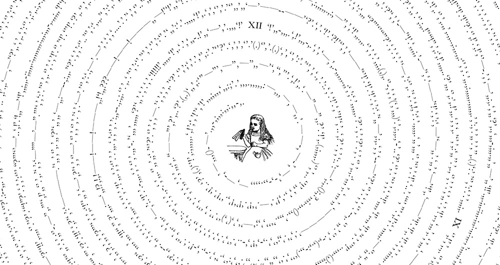
</figure>
]

???

[*Between the Words*](https://www.c82.net/work/?id=347) by Nicholas Rougeux

---

# Sentiment analysis

.pull-left-3.small-code[
```{r comment=NA}
get_sentiments("bing")
```
]

--

.pull-middle-3.small-code[
```{r comment=NA}
get_sentiments("afinn")
```
]

--

.pull-right-3.small-code[
```{r comment=NA}
get_sentiments("nrc")
```
]

---

```{r hp-net-sentiment, echo=FALSE, fig.width=8, fig.height=3.75, out.width="100%"}
# https://rstudio-pubs-static.s3.amazonaws.com/300624_8260952d1f0346969e65f41a97006bf5.html
hp_sentiment <- hp %>% 
  unnest_tokens(word, text) %>% 
  group_by(book) %>% 
  mutate(word_count = 1:n(),
         index = word_count %/% 500 + 1) %>% 
  inner_join(get_sentiments("bing")) %>% 
  count(book, index = index, sentiment) %>% 
  pivot_wider(names_from = sentiment, values_from = n) %>% 
  mutate(net_sentiment = positive - negative)

ggplot(hp_sentiment, 
       aes(x = index, y = net_sentiment, fill = net_sentiment > 0)) +
  geom_col() +
  guides(fill = FALSE) +
  labs(x = NULL, y = "Net sentiment") +
  facet_wrap(vars(book), scales = "free_x") +
  theme_bw()
```

---

# tf-idf

.box-inv-5[Term frequency-inverse document frequency]

.box-5.small[How important a term is compared to the rest of the documents]

$$
\begin{aligned}
tf &= \frac{n_{\text{term}}}{n_{\text{terms in document}}} \\
idf(\text{term}) &= \ln{\left(\frac{n_{\text{documents}}}{n_{\text{documents containing term}}}\right)} \\
tf\text{-}idf(\text{term}) &= tf(\text{term}) \times idf(\text{term})
\end{aligned}
$$

---

# tf-idf

```{r hp-tf-idf, echo=FALSE, fig.width=8, fig.height=3.75, out.width="100%"}
# Get a list of words in all the books
hp_words <- hp %>% 
  unnest_tokens(word, text) %>% 
  count(book, word, sort = TRUE) %>% 
  ungroup()

# Add the tf-idf for these words
hp_tf_idf <- hp_words %>% 
  bind_tf_idf(word, book, n) %>% 
  arrange(desc(tf_idf))

# Get the top 10 uniquest words
hp_tf_idf_plot <- hp_tf_idf %>% 
  group_by(book) %>% 
  top_n(10) %>% 
  ungroup() %>% 
  mutate(word = fct_inorder(word))

ggplot(hp_tf_idf_plot, aes(y = fct_rev(word), x = tf_idf, fill = book)) +
  geom_col() +
  guides(fill = FALSE) +
  labs(y = "tf-idf", x = NULL) +
  facet_wrap(~ book, scales = "free") +
  theme_bw()
```

---

# Topic modeling

.pull-left.center[
<figure>
  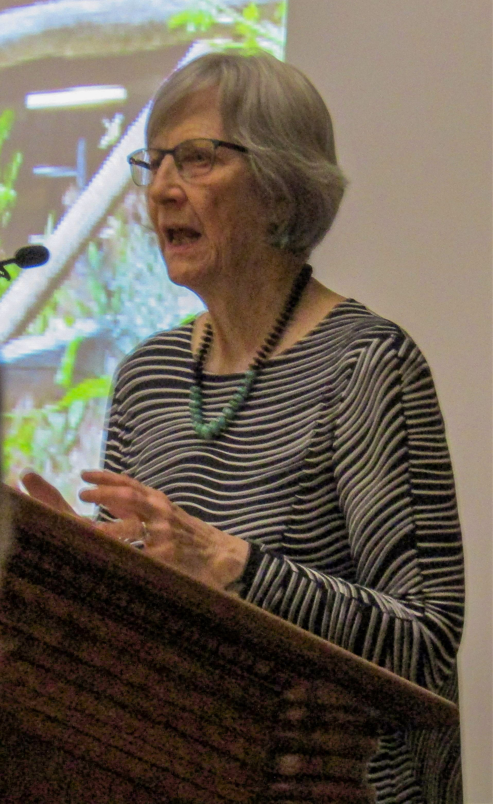
</figure>
]

.pull-right.center[
<figure>
  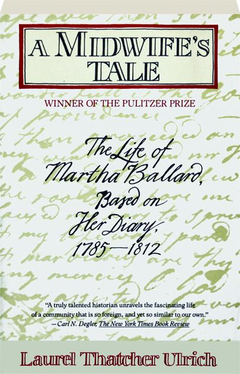
</figure>
]

???

https://commons.wikimedia.org/wiki/File:Laurel_Thatcher_Ulrich_(32803708014).jpg

https://commons.wikimedia.org/wiki/File:A_Midwife%27s_Tale_by_Laurel_Thatcher_Ulrich.jpg

---

# Latent Dirichlet Allocation (LDA)

.center[
<figure>
  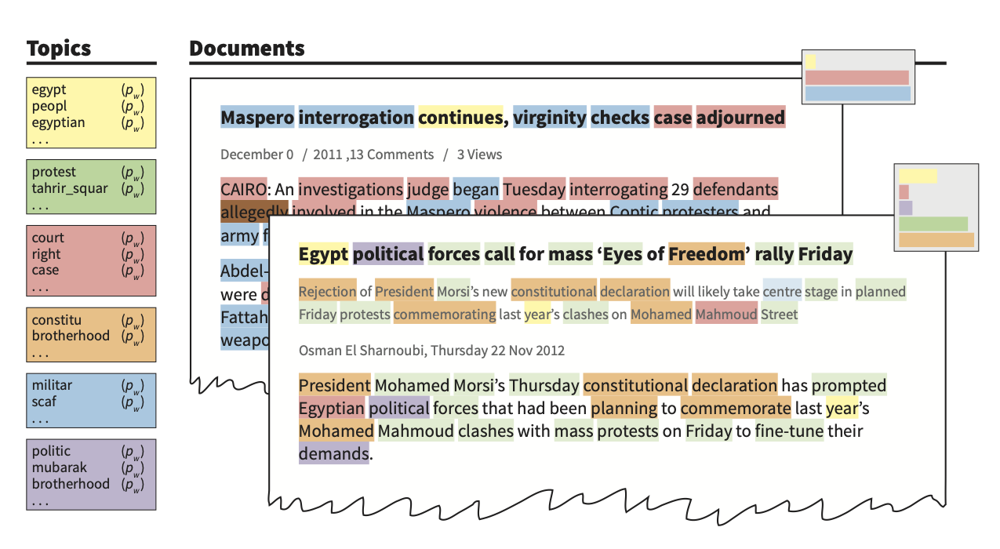
</figure>
]

---

# Clusters of related words

<table>
  <tr>
    <th class="cell-left">Topic label</th>
    <th class="cell-left">Topic words</th>
  </tr>
  <tr>
    <td class="cell-left">Midwifery</td>
    <td class="cell-left">birth safe morn receivd calld left cleverly pm labour …</td>
  </tr>
  <tr>
    <td class="cell-left">Church</td>
    <td class="cell-left">meeting attended afternoon reverend worship …</td>
  </tr>
  <tr>
    <td class="cell-left">Death</td>
    <td class="cell-left">day yesterday informd morn years death expired …</td>
  </tr>
  <tr>
    <td class="cell-left">Gardening</td>
    <td class="cell-left">gardin sett worked clear beens corn warm planted …</td>
  </tr>
  <tr>
    <td class="cell-left">Shopping</td>
    <td class="cell-left">lb made brot bot tea butter sugar carried …</td>
  </tr>
  <tr>
    <td class="cell-left">Illness</td>
    <td class="cell-left">unwell sick gave dr rainy easier care head neighbor …</td>
  </tr>
</table>

???

https://www.cameronblevins.org/posts/topic-modeling-martha-ballards-diary/

http://journalofdigitalhumanities.org/2-1/topic-modeling-a-basic-introduction-by-megan-r-brett/

---

# Track topics over time

.pull-left.center[
<figure>
  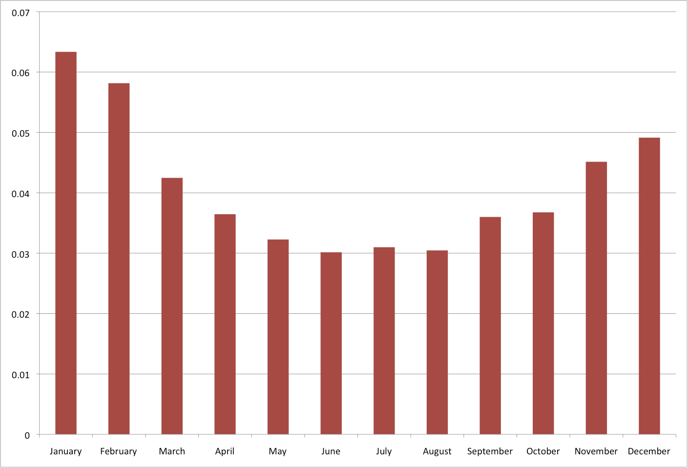
  <figcaption>Cold weather topic by month</figcaption>
</figure>
]

--

.pull-right.center[
<figure>
  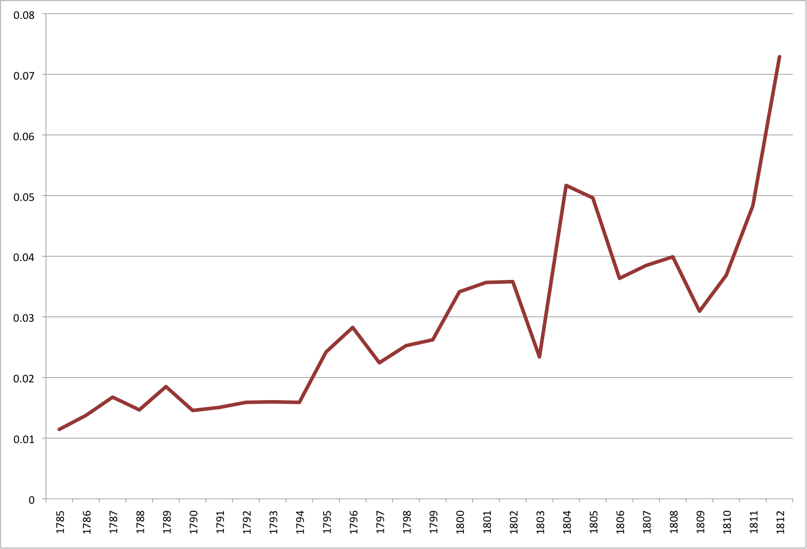
  <figcaption>Emotion topic over time</figcaption>
</figure>
]

???

https://www.cameronblevins.org/posts/topic-modeling-martha-ballards-diary/

---

# State of the Union addresses

.center[
<figure>
  
</figure>
]

???

https://cran.r-project.org/web/packages/cleanNLP/vignettes/state-of-union.html

---

# Fingerprinting

.box-inv-5[Analyze richness or uniqueness of a document]

.box-5[Punctuation patterns, vocabulary choices, sentence length]

.box-5[Hapax legomenon]

---

# Sentence length

.center[
<figure>
  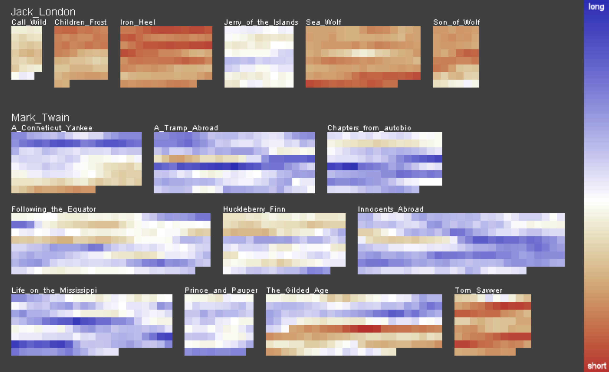
</figure>
]

???

https://kops.uni-konstanz.de/bitstream/handle/123456789/5492/Literature_Fingerprinting.pdf


---

# Hapax legomena

.center[
<figure>
  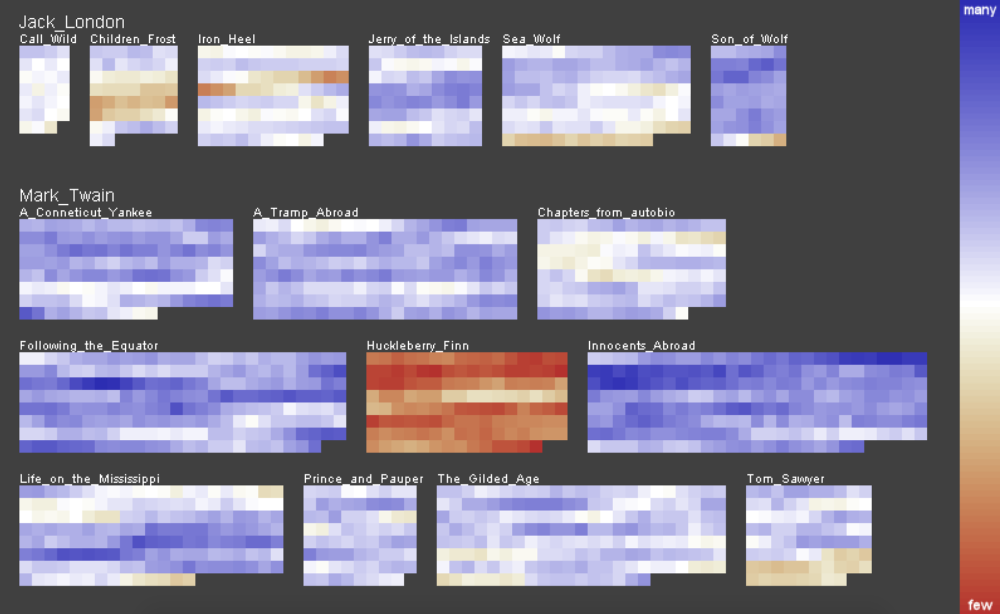
</figure>
]

---

# Verse length

.center[
<figure>
  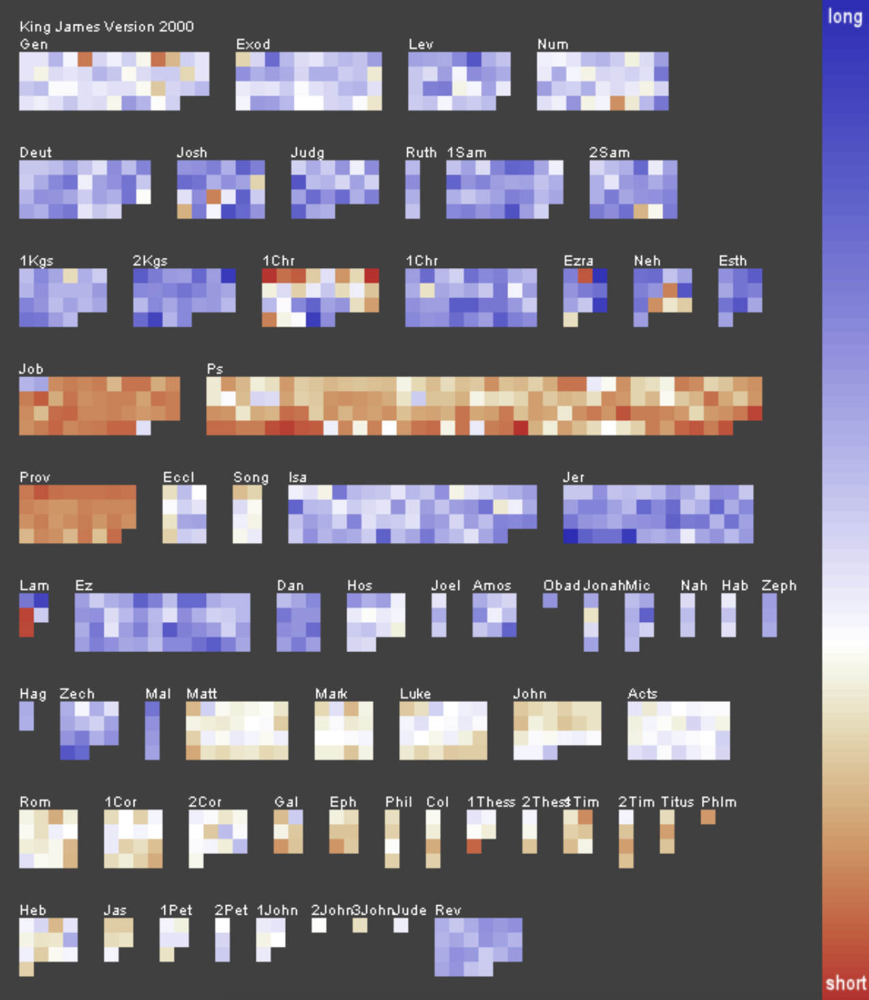
</figure>
]
