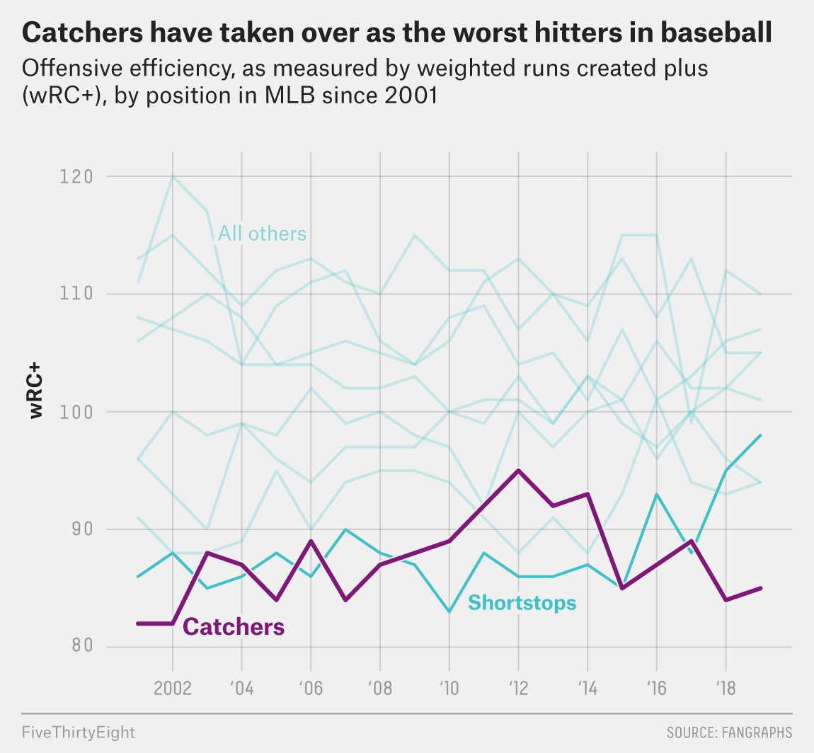
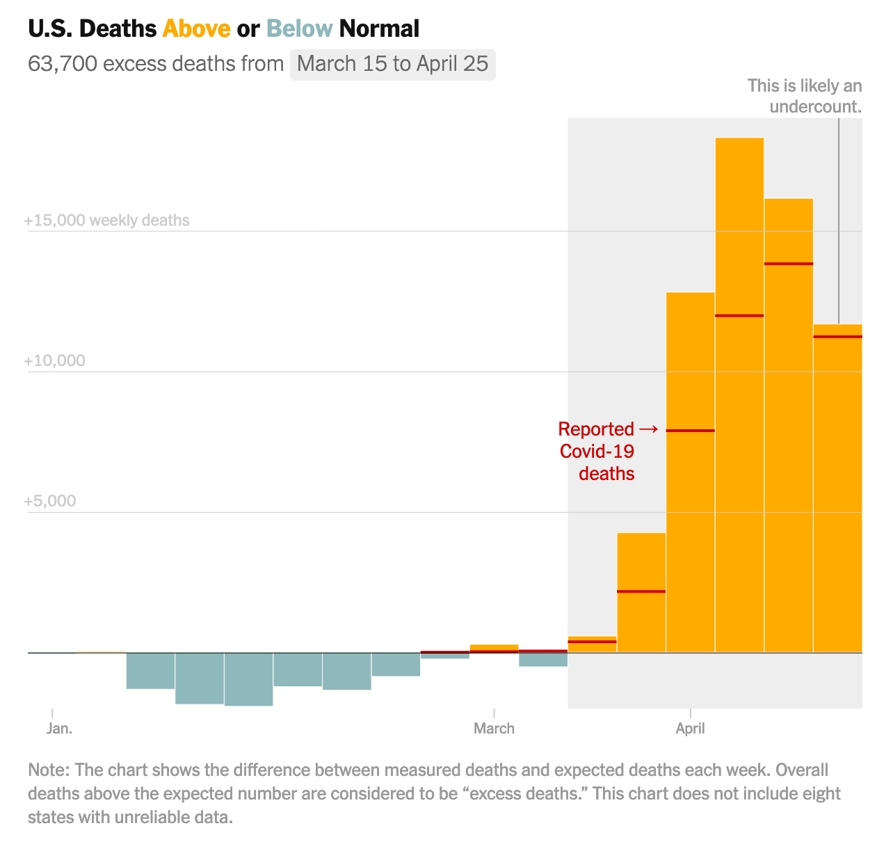

```{r setup, include=FALSE}
knitr::opts_chunk$set(warning = FALSE, message = FALSE, 
                      fig.retina = 3, fig.align = "center")
```

```{r packages-data, include=FALSE}
library(tidyverse)
set.seed(1234)
```

class: center middle main-title section-title-4

# Enhancing graphics

.class-info[

**Session 14**

.light[PMAP 8921: Data Visualization with R<br>
Andrew Young School of Policy Studies<br>
May 2020]

]

---

layout: true
class: title title-5

---

# Typical publication workflow

.box-inv-5[Create plot in R and ggplot2]

--

.box-inv-5.sp-after[Export plot as a vector]

--

.box-inv-5[Edit the vector in an external program<br>to make it match in-house style<br>(or just be fancy and well-designed in general)]

--

.box-5.small[*or*]

--

.box-inv-5[Extract parts of the vector for use in Javascript for interactivity]

---

# In-house styles

.pull-left[
<figure>
  
</figure>
]

--

.pull-right[
<figure>
  
</figure>
]

???

https://www.nytimes.com/interactive/2020/05/05/us/coronavirus-death-toll-us.html

https://fivethirtyeight.com/features/catcher-is-baseballs-most-endangered-position/

---

# Hot dogs

.center[
<figure>
  
</figure>
]

---

# This is all changing though!

.box-inv-5[This was made 100% in R and ggplot!]

.center[
<figure>
  
</figure>
]

---

# The way of the future

.box-inv-5.medium[**patchwork** and **ggtext**<br>are removing the need to edit<br>graphs by hand in Illustrator]

--

.box-inv-5.small.sp-after[You can replicate an entire in-house graphic style with R alone nowadays]

--

.box-5[Interactivity not quite at the same level,<br>but it's getting there with **plotly**]
