```{r setup, include=FALSE}
knitr::opts_chunk$set(warning = FALSE, message = FALSE, 
                      fig.retina = 3, fig.align = "center")
```

```{r packages-data, include=FALSE}
library(tidyverse)
set.seed(1234)
```

class: center middle main-title section-title-4

# Truth, beauty,<br>and data revisited

.class-info[

**Session 15**

.light[PMAP 8921: Data Visualization with R<br>
Andrew Young School of Policy Studies<br>
May 2020]

]

---

name: outline
class: title title-inv-7

# Plan for today

--

.box-2.medium.sp-after[Telling stories with data]

--

.box-5.medium[Curiosity]

---

layout: false
name: telling-stories
class: center middle section-title section-title-2 animated fadeIn

# Telling stories with data

---

layout: true
class: title title-2

---

# Truth is beautiful

.box-inv-2.medium[Truth ≠ facts]

.box-inv-2.medium.sp-after[Truth comes from aesthetic<br>combination of content and form]

.box-2.medium[Facts require beauty to be true]

---

# Art

.box-inv-2.large[Art is how we translate core,<br>essential **content** (or truth!) to different **forms**<br>for specific **audiences**.]

---

# Stories as art

.box-inv-2.large[**Stories** are an *art form* for<br>translating core, essential **content**<br>to different **forms**<br>for specific **audiences**.]

---

# Every story is the same

.center[
<iframe width="800" height="450" src="https://www.youtube.com/embed/LuD2Aa0zFiA" frameborder="0" allow="accelerometer; autoplay; encrypted-media; gyroscope; picture-in-picture" allowfullscreen></iframe>
]

???

Will Schoder, "Every Story is the Same", https://www.youtube.com/watch?v=LuD2Aa0zFiA

---

# Heroes

.pull-left.center[
<figure>
  
</figure>
]

.pull-right.center[
<figure>
  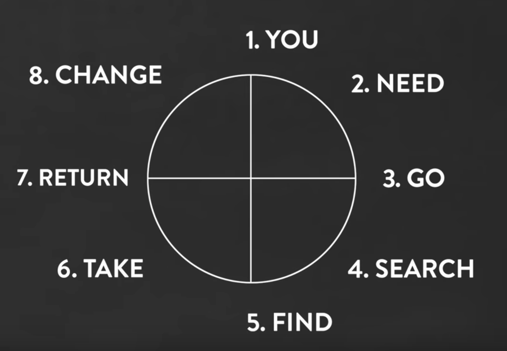
</figure>
]

???

https://commons.wikimedia.org/wiki/File:Heroesjourney.svg

5:35 from Will Schoder, "Every Story is the Same", https://www.youtube.com/watch?v=LuD2Aa0zFiA

---

# You are not the hero

&nbsp;

.center[
<figure>
  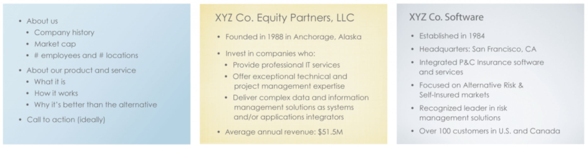
  <figcaption>From Cole Nussbaumer Knaflic, <i>Storytelling with Data: A Data Visualization Guide for Business Professionals</i></figcaption>
</figure>
]

---

# Should you tell stories though?

.pull-left.center[
<figure>
  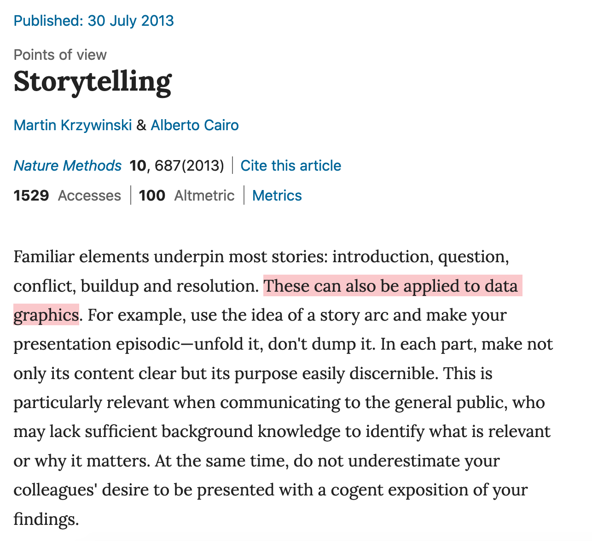
</figure>
]

--

.pull-right.center[
<figure>
  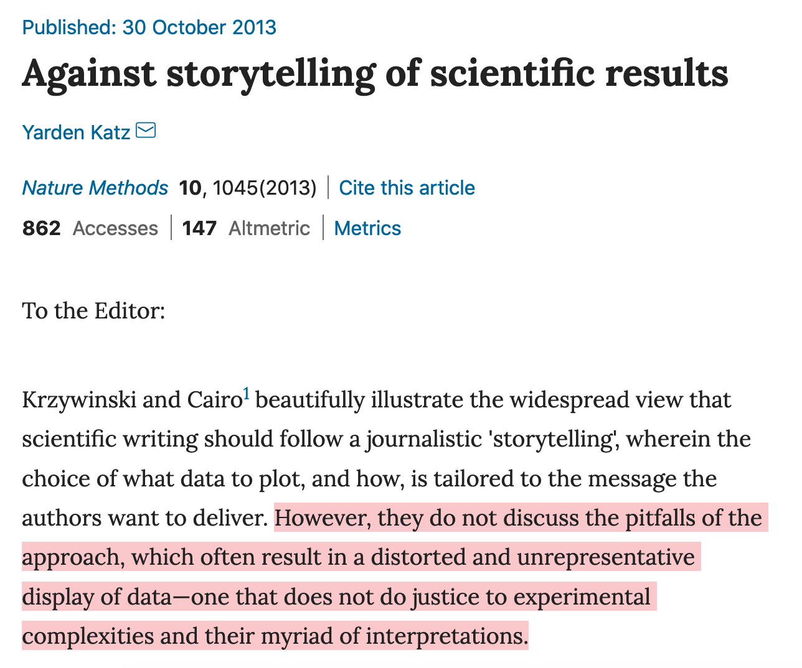
</figure>
]

???

https://www.nature.com/articles/nmeth.2699

https://www.nature.com/articles/nmeth.2571


---

# Possible pitfalls

.pull-left[
.box-inv-2.medium[Manipulation]

.box-2.small[Don't lie or manipulate data]

&nbsp;

.box-inv-2.medium[Misinterpretation]

.box-2.small[Temper expectations]
]

.pull-right[
.box-inv-2.medium[Ethos]

.box-2.small[Credentials ≠ ethos]

&nbsp;

.box-inv-2.medium[Equity]

.box-2.small[Don't dumb down]

.box-2.small[Amplify underrepresented voices]

]

---

layout: false
class: center middle section-title-inv section-title-inv-2

# Manipulation

---

class: center middle

<figure>
  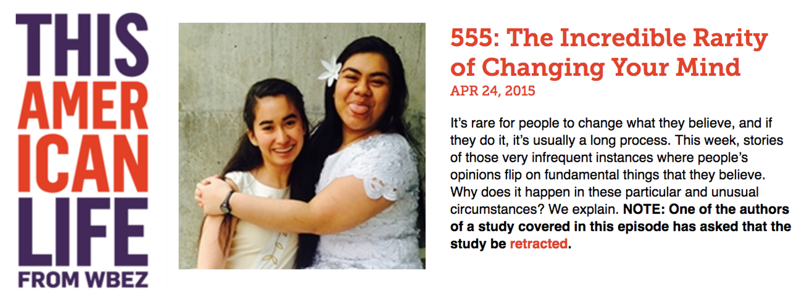
</figure>

???

https://www.thisamericanlife.org/555/the-incredible-rarity-of-changing-your-mind

---

class: bg-full
background-image: url("img/15/lacour-story.png")

???

[The Case of the Amazing Gay-Marriage Data: How a Grad Student Uncovered a Huge Fraud](https://slate.com/culture/2015/06/gay-marriage-study-faked-how-grad-student-david-broockman-uncovered-a-huge-scientific-fraud.html)

---

&nbsp;

.pull-left.center[
<figure>
  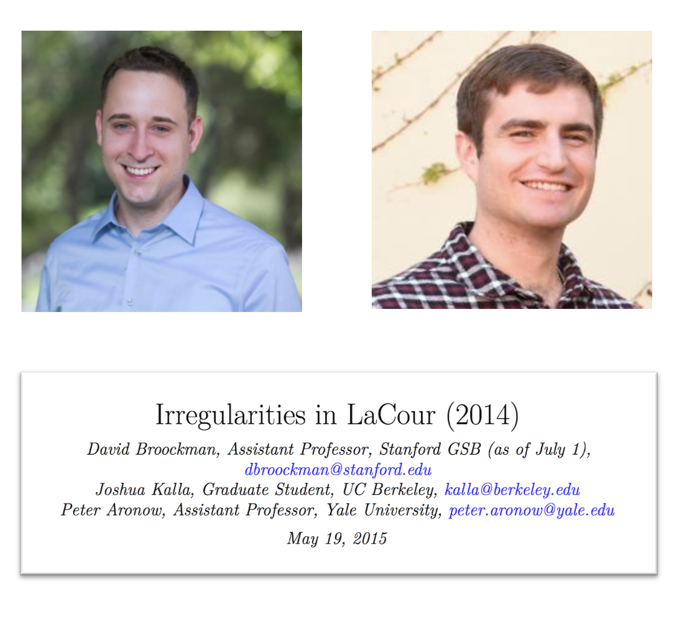
</figure>
]

--

.pull-right.center[
<figure>
  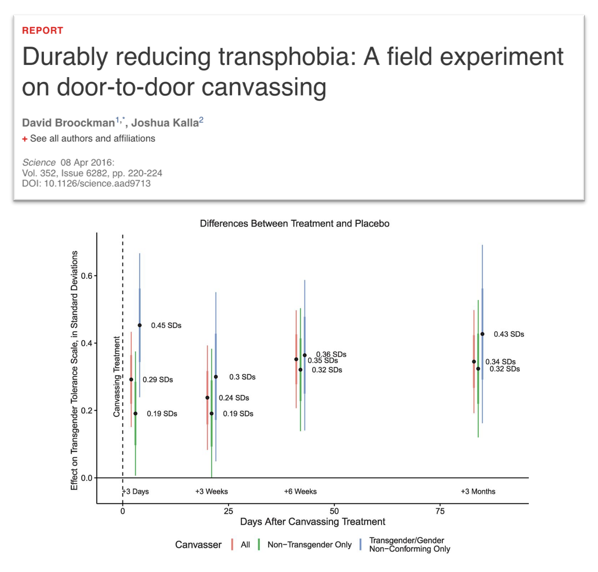
</figure>
]

???

https://dx.doi.org/10.1126/science.aad9713

---

class: title title-2

# Manipulation

--

.box-inv-2.medium.sp-after[Don't lie]

--

.box-inv-2.medium[Emphasize the story,<br>but make full data available]

---

class: center middle section-title-inv section-title-inv-2

# Misrepresentation

---

.pull-left.center[
<figure>
  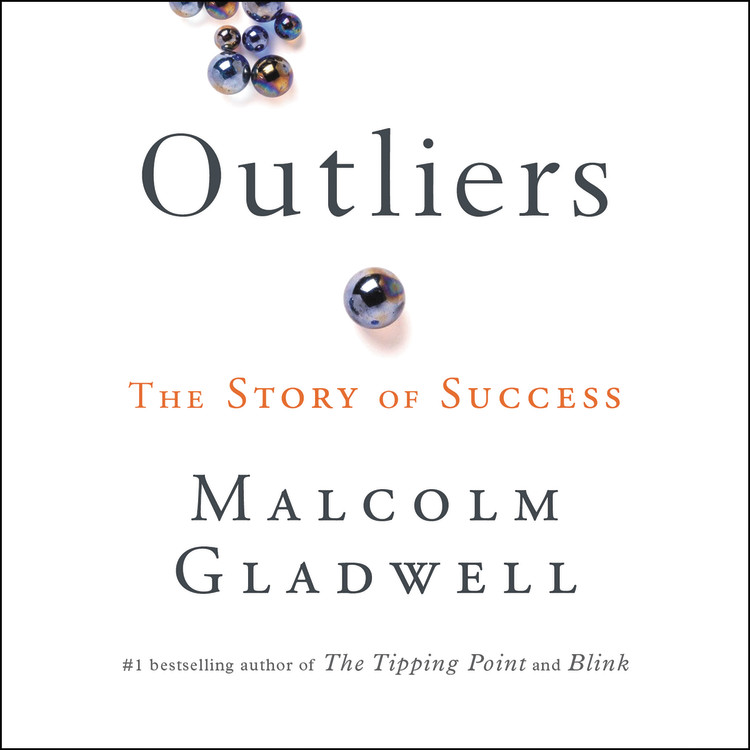
</figure>
]

--

.pull-right.center[
.box-2.medium[**10,000 hours**]

.box-inv-2["the magic number<br>of greatness"]
]

--

.center[
<figure>
  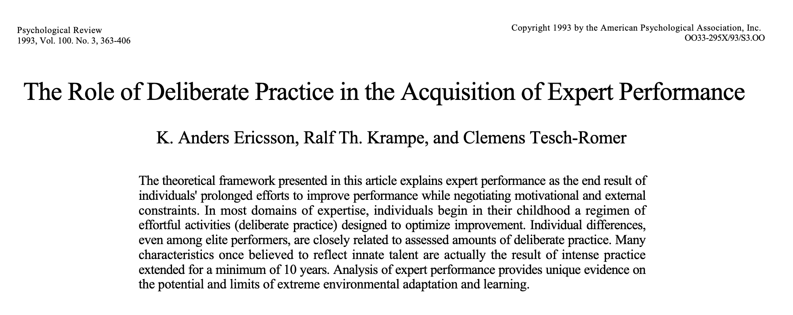
</figure>
]

???

https://doi.org/10.1037/0033-295X.100.3.363

https://graphics8.nytimes.com/images/blogs/freakonomics/pdf/DeliberatePractice(PsychologicalReview).pdf

---

.pull-left.center[
<figure>
  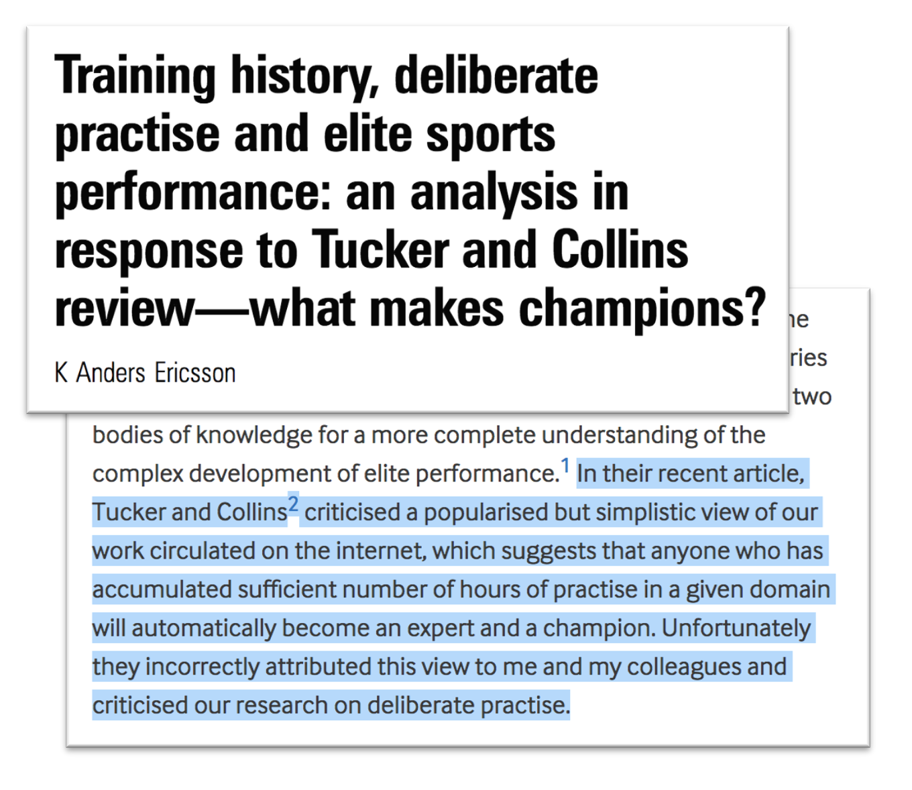
</figure>
]

--

.pull-right.center[
.box-inv-2[“[A] popularized but simplistic view of our work, which suggests that anyone who has accumulated sufficient number of hours of practice in a given domain will automatically become an expert and a champion.”]
]


--

.center[
.box-2[10,000 is average&ensp;•&ensp;Quality matters&ensp;•&ensp;There are other factors]
]


???

https://bjsm.bmj.com/content/47/9/533.long

---

class: title title-2

# Misinterpretation

--

.box-inv-2.medium.sp-after[Be narrative, but not too narrative]

--

.box-inv-2.medium[Temper expectations]

---

class: center middle section-title-inv section-title-inv-2

# Ethos

---

layout: true
class: title title-2

---

# Who can talk about science?

.pull-left.center[
<figure>
  
</figure>
]

--

.pull-right.center[
<figure>
  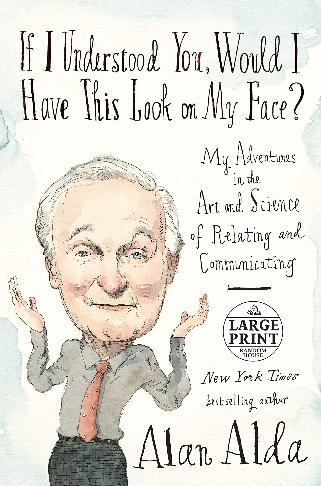
</figure>
]

???

[Resources for telling stories with data](/example/15-example/#telling-stories-with-data)

---

# Science communication

.pull-left.center[
<figure>
  
</figure>
]

???

http://www.emilygraslie.com/

--

.pull-right.center[
<figure>
  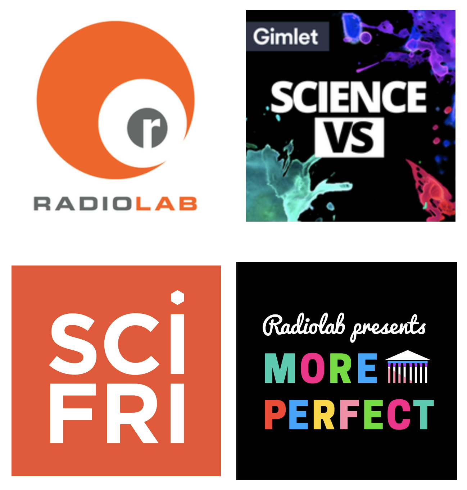
</figure>
]

---

# Ethos

--

.box-inv-2.medium.sp-after[Credentials do not make an expert]

--

.box-inv-2.medium.sp-after[Credentials do not *not* make an expert]

--

.box-inv-2.medium[Credentials ≠ ethos]

---

layout: false
class: center middle section-title-inv section-title-inv-2

# Equity

---

layout: true
class: title title-2

---

# Dumbing down vs. translation

.center[
<iframe width="800" height="450" src="https://www.youtube.com/embed/opqIa5Jiwuw" frameborder="0" allow="accelerometer; autoplay; encrypted-media; gyroscope; picture-in-picture" allowfullscreen></iframe>
]

???

Wired, "Neuroscientist Explains One Concept in 5 Levels of Difficulty", https://www.youtube.com/watch?v=opqIa5Jiwuw

Alvin Stone, ["The arrogance of 'dumbing it down'"](https://www.linkedin.com/pulse/arrogance-dumbing-down-alvin-stone/)

---

# Translation

.pull-left.center[
<figure>
  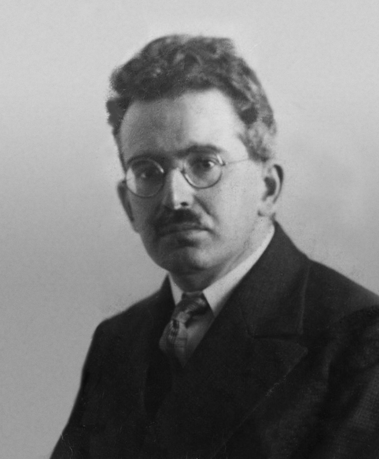
</figure>
]

.pull-right[
.box-inv-2[“…the task of the translator consists in finding that intended effect upon the language into which he is translating which produces in it the echo of the original”]

.box-2.small[Walter Benjamin,<br>*The Task of the Translator*]
]

???

https://en.wikipedia.org/wiki/Walter_Benjamin#/media/File:Walter_Benjamin_vers_1928.jpg

---

layout: false
class: bg-full
background-image: url("img/15/up-goer-five@3x.png")

???

https://xkcd.com/1133/

---

class: center middle

<figure>
  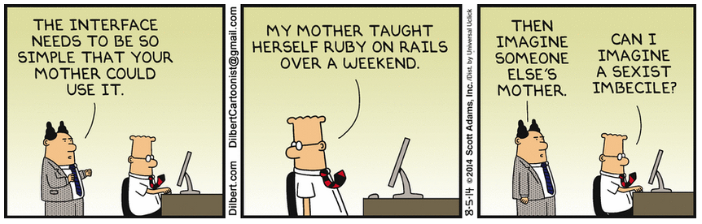
</figure>

???

https://slate.com/human-interest/2014/04/how-to-explain-bitcoin-to-y-our-mom-the-new-york-times-thinks-mothers-are-idiots.html

https://geekfeminism.wikia.org/wiki/So_simple,_your_mother_could_do_it

---

class: center middle

<figure>
  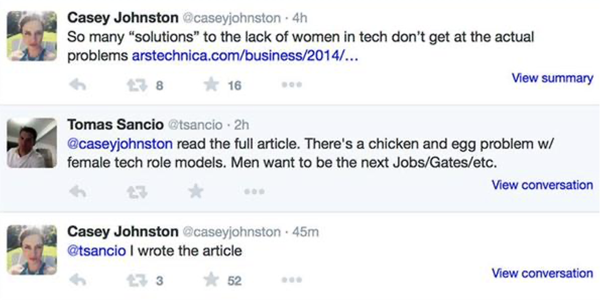
</figure>

???

https://twitter.com/caseyjohnston/status/541246857385893888

https://twitter.com/tsancio/status/541284790314762240

---

class: bg-full
background-image: url("img/15/gender-citation-gap.png")

???

Women engineers publish their papers in journals with higher impact factors than their male peers, but their work receives lower recognition (fewer citations) from the scientific community

---

class: bg-full
background-image: url("img/15/news-gender-balance.png")

???

http://www.womensmediacenter.com/reports/whotalks-cable-news-analysts-gender-in-2016-presidential-election-project-t
28% overall average

---

.pull-left.center[
<figure>
  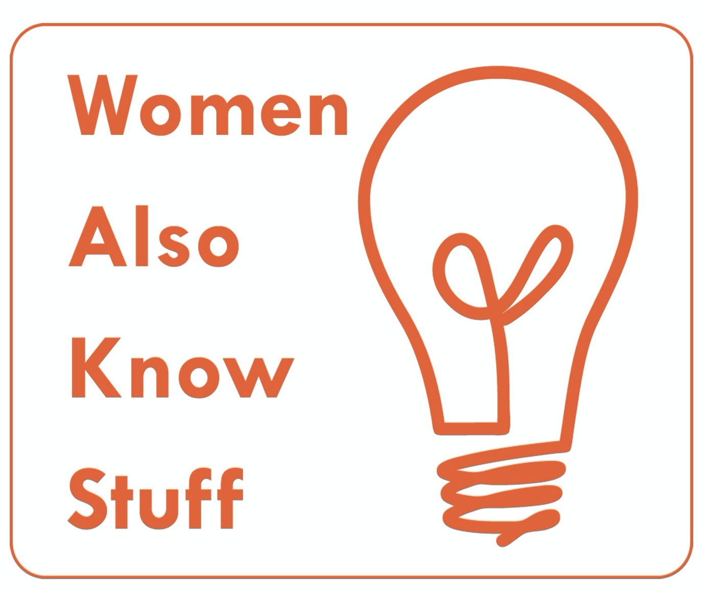
</figure>
]

???

https://womenalsoknowstuff.com/

https://twitter.com/LGBTscholars

https://twitter.com/POCalsoknow

https://twitter.com/AWPARocks

--

.pull-right.center[
<figure>
  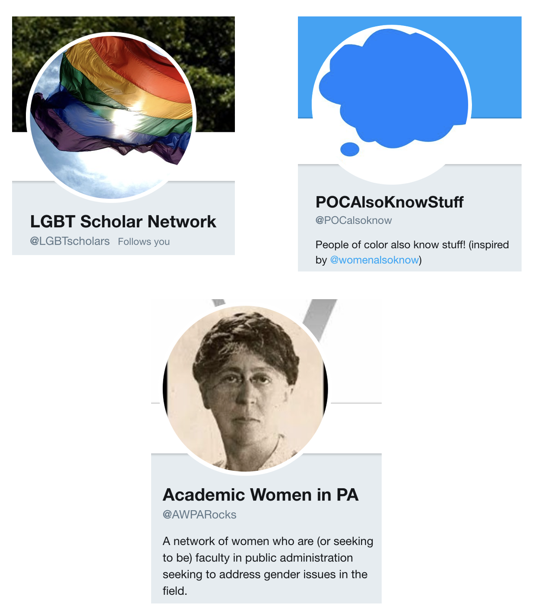
</figure>
]

---

.center[
<figure>
  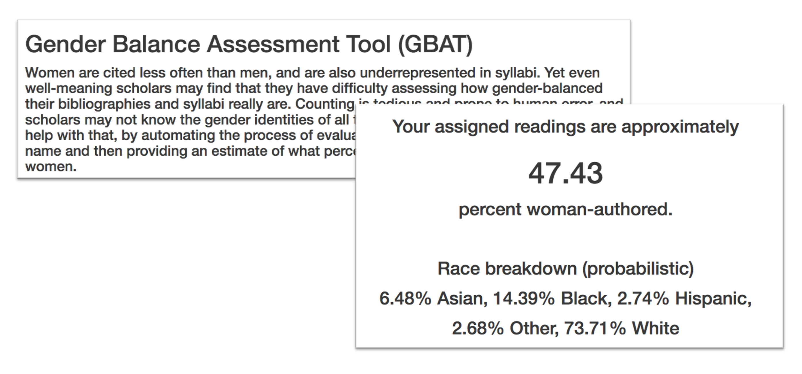
</figure>
]

.box-2[https://jlsumner.shinyapps.io/syllabustool/]

---

class: title title-2

# Equity

--

.box-inv-2.medium.sp-after-half[Don't dumb down your findings]

--

.box-inv-2.medium.sp-after-half[You are a translator]

--

.box-inv-2.medium.sp-after-half[Treat audience with respect]

--

.box-inv-2.medium[Amplify underrepresented voices]

---

layout: false
name: curiosity
class: center middle section-title section-title-5 animated fadeIn

# Curiosity

---

layout: true
class: title title-5

---

# How do I keep learning R?

.box-inv-5.medium[What class should I take next?]

.box-inv-5.medium[What book should I read next?]

---

# How do I keep learning R?

.box-inv-5.medium[~~What class should I take next?~~]

.box-inv-5.medium.sp-after[~~What book should I read next?~~]

--

.box-5.large[Be curious!]

---

# Teaching yourself

.center[
<figure>
  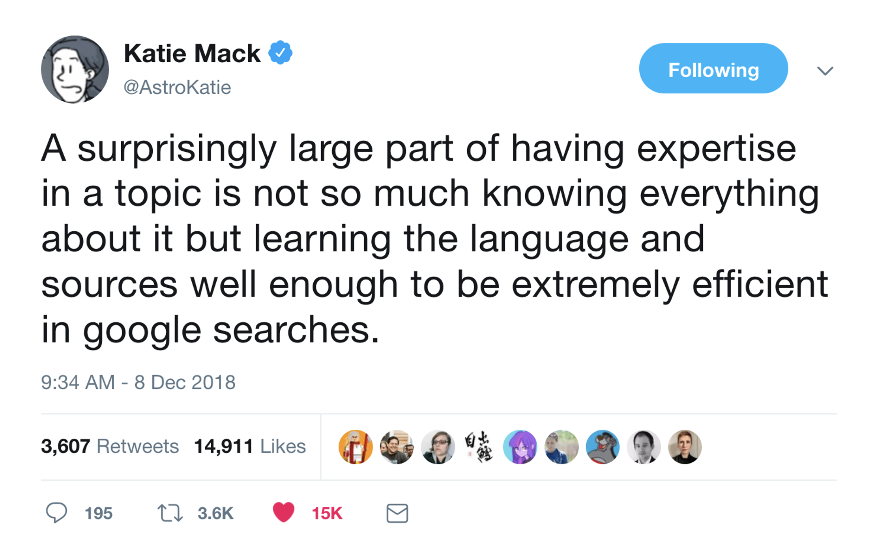
</figure>
]


???

https://twitter.com/AstroKatie/status/1071442842873159681

---

layout: false
class: bg-full
background-image: url("img/15/slate-coding.png")

???

https://slate.com/human-interest/2018/12/against-teaching-kids-to-code-creativity-problem-solving.html

---

class: bg-full
background-image: url("img/15/slate-coding-text.png")


???

https://slate.com/human-interest/2018/12/against-teaching-kids-to-code-creativity-problem-solving.html

---

layout: true
class: title title-5

---

# Two secrets to master R

--

.box-inv-5.large.sp-after[1: Find excuses to use it]

--

.box-inv-5.large[2: Share and work in public]

---

layout: false
class: center middle section-title-inv section-title-inv-5

# Find excuses to use R

---

layout: true
class: title title-5

---

# Playing with R

--

.box-inv-5.medium[Little exploration projects]

--

.box-inv-5.medium[\#TidyTuesday]

--

.box-inv-5.medium[Data play time]

--

.box-inv-5.medium[Actual projects]

---

layout: false

.center[
<figure>
  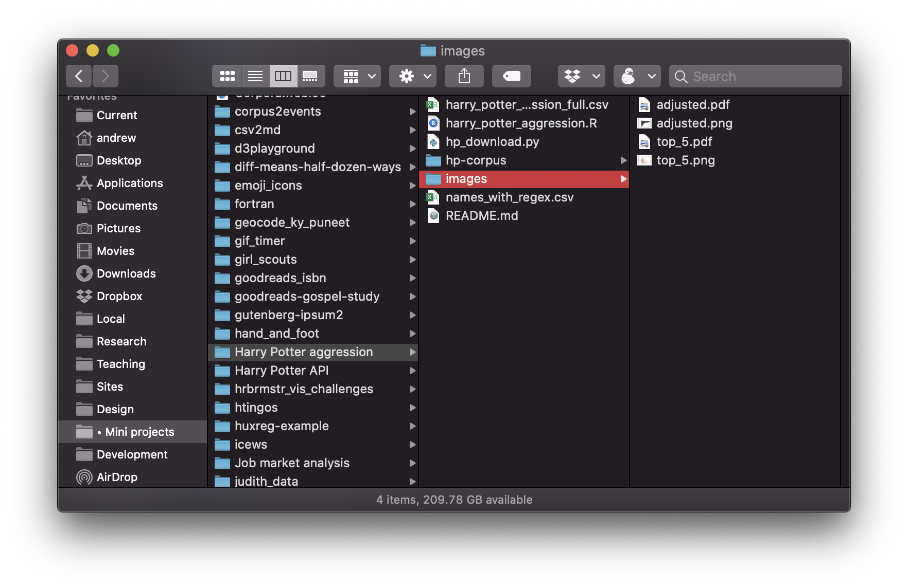
</figure>
]

---

.center[
<figure>
  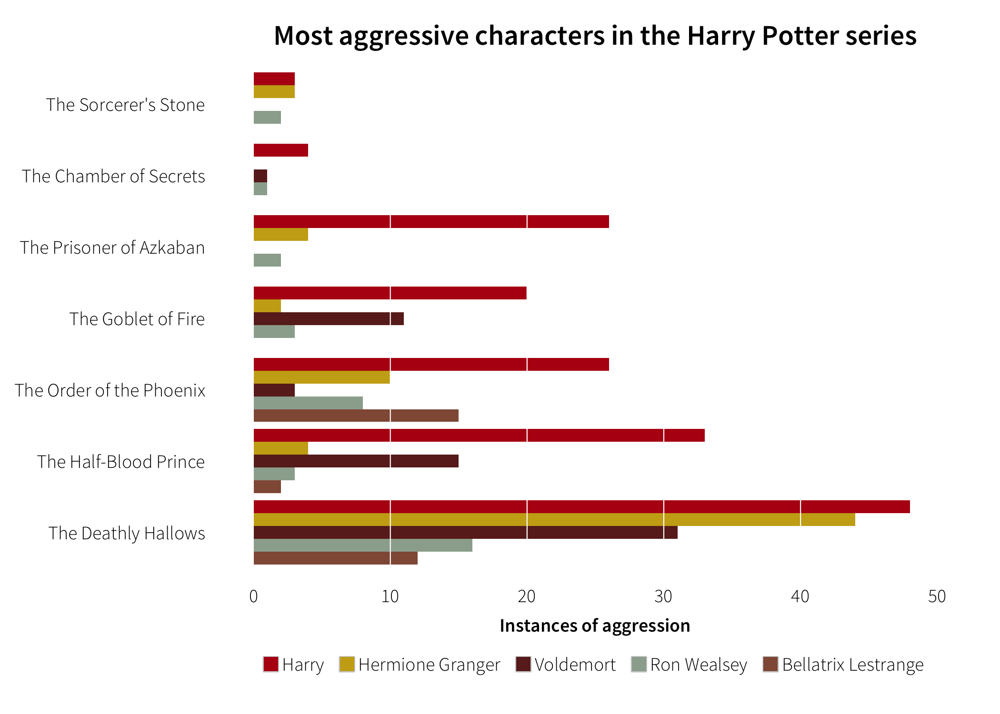
</figure>
]

???

https://github.com/andrewheiss/Harry-Potter-aggression

---

.center[
<figure>
  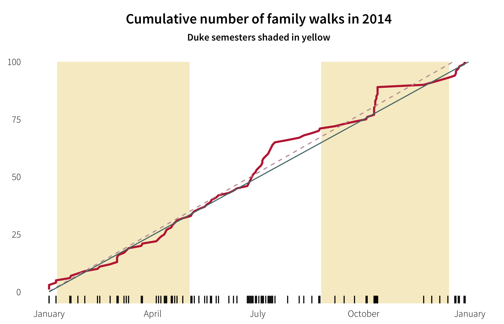
</figure>
]

---

.center[
<figure>
  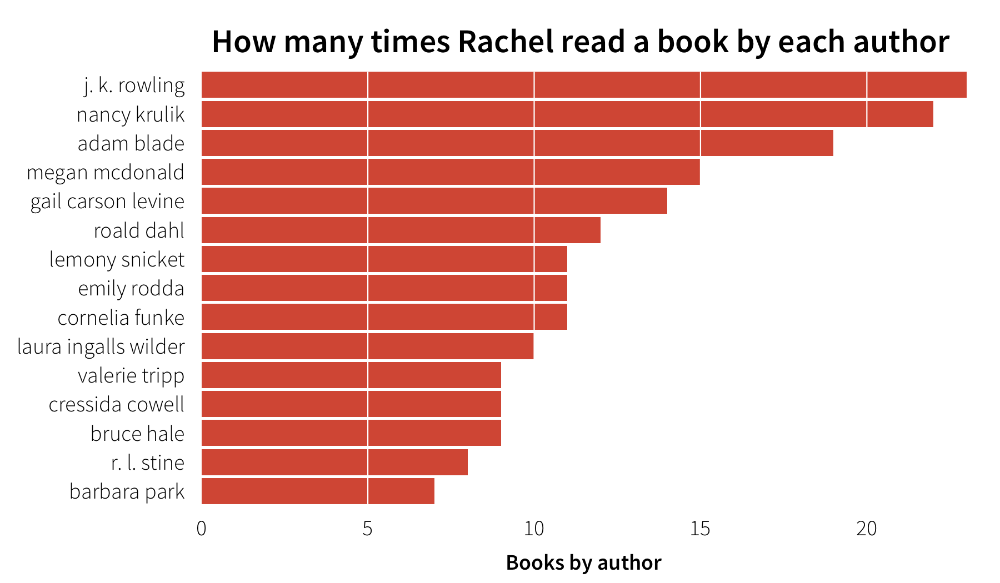
</figure>
]

---

layout: false
class: center middle section-title-inv section-title-inv-5

# Radical transparency &<br>public work

---

class: middle

.box-5.medium[How we normally think of our work and goals]

.center[
<figure>
  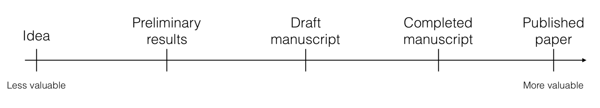
</figure>
]

???

https://rstudio.com/resources/rstudioconf-2019/the-unreasonable-effectiveness-of-public-work/

---

class: middle

.box-5.medium[How we should think of our work and goals]

.center[
<figure>
  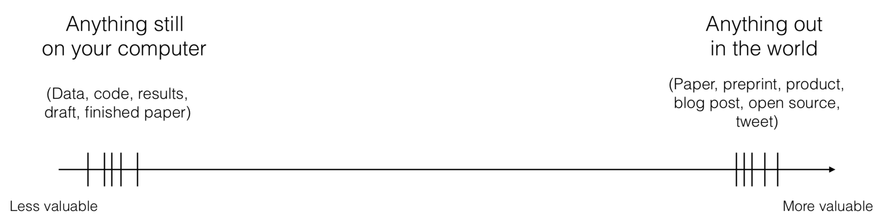
  <figcaption>David Robinson, <a href="https://rstudio.com/resources/rstudioconf-2019/the-unreasonable-effectiveness-of-public-work/" target="_blank">The unreasonable effectiveness of public work"</a></figcaption>
</figure>
]

???

https://rstudio.com/resources/rstudioconf-2019/the-unreasonable-effectiveness-of-public-work/

---

layout: true
class: title title-5

---

# Benefits of working in public

--

.box-inv-5[Build reputation]

--

.box-inv-5[Learn more]

--

.box-inv-5[Grow the community]

--

.box-inv-5[Early feedback on ideas]

--

.box-inv-5[Validation]

---

layout: false
class: bg-full
background-image: url("img/15/blog-rejection-map.png")

???

https://www.andrewheiss.com/blog/2018/12/17/academic-job-market-visualized/

---

class: bg-full
background-image: url("img/15/blog-rejection-website.png")

???

https://www.andrewheiss.com/blog/2018/12/17/academic-job-market-visualized/

---

class: bg-full
background-image: url("img/15/blog-rejection-github.png")

???

https://www.andrewheiss.com/blog/2018/12/17/academic-job-market-visualized/

---

layout: true
class: title title-5

---

# How to work in public

--

.box-inv-5.medium[Tweet, blog, and meet people]

--

.box-inv-5.medium[Play with data in public]

--

.box-inv-5.medium[Teach concepts (for yourself too!)]

---

# Communities

--

.box-inv-5.medium[\#rstats]

--

.box-inv-5.medium[R User Groups]

--

.box-inv-5.medium[\#rladies]

--

.box-inv-5.medium[Rmd websites, blogdown, bookdown]

---

# Play with data in public

.center[
<figure>
  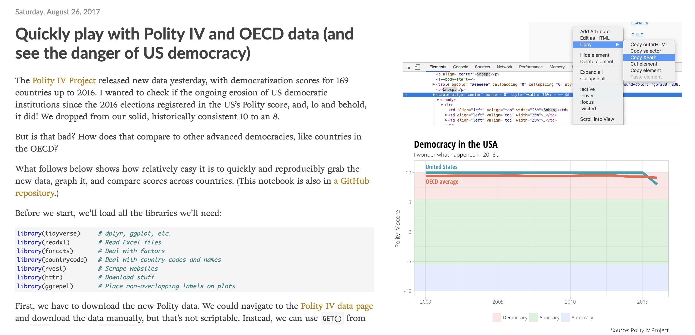
</figure>
]

???

https://www.andrewheiss.com/blog/2017/08/26/quickly-play-with-polity-iv-and-oecd-data-and-see-the-danger-of-us-democracy/

---

layout: false
class: bg-full
background-image: url("img/15/blog-nlp.png")

???

https://www.andrewheiss.com/blog/2018/12/26/tidytext-pos-john/

https://www.andrewheiss.com/blog/2018/12/28/tidytext-pos-arabic/

---

class: title title-5

# Teach a concept

.center[
<figure>
  
</figure>
]

???

https://www.andrewheiss.com/blog/2019/01/29/diff-means-half-dozen-ways/

---

class: bg-full
background-image: url("img/15/blog-chidi.png")

???

https://www.andrewheiss.com/blog/2019/02/16/algebra-calculus-r-yacas/

---

layout: false
class: center middle section-title section-title-5 animated fadeIn

# You are all expert<br>enough now.

---

class: center middle section-title section-title-5 animated fadeIn

# Go make<br>beautiful things!
